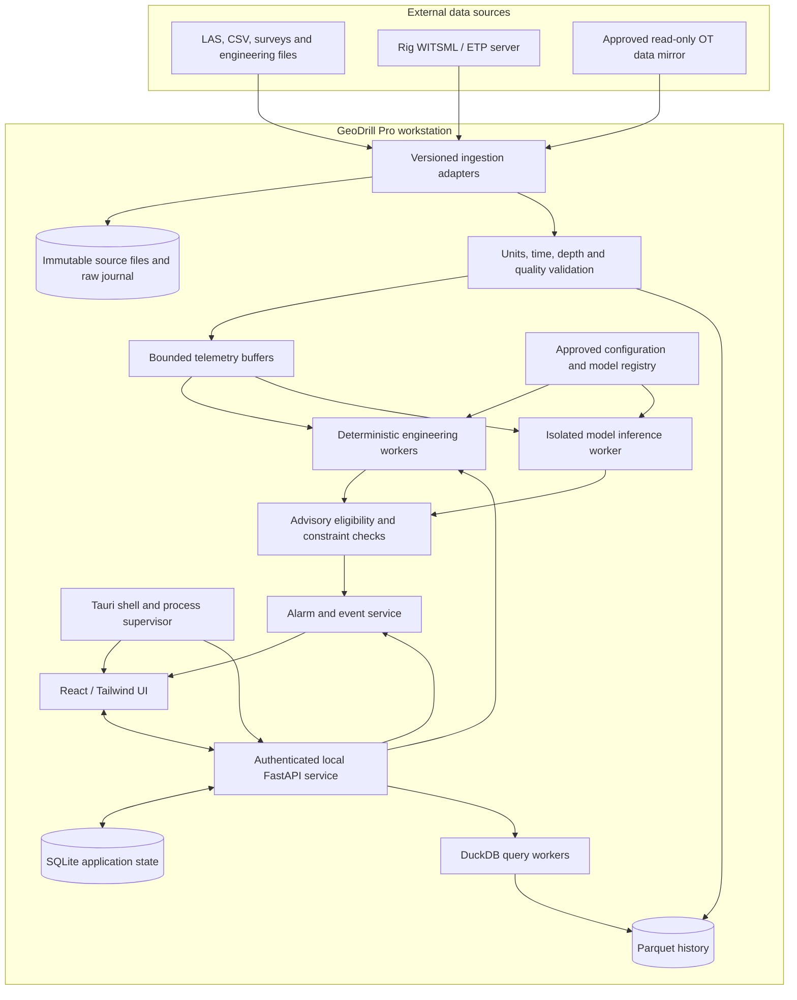
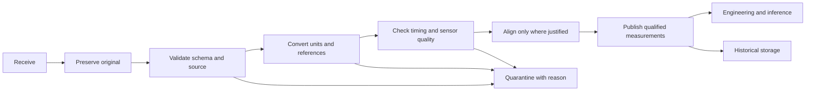
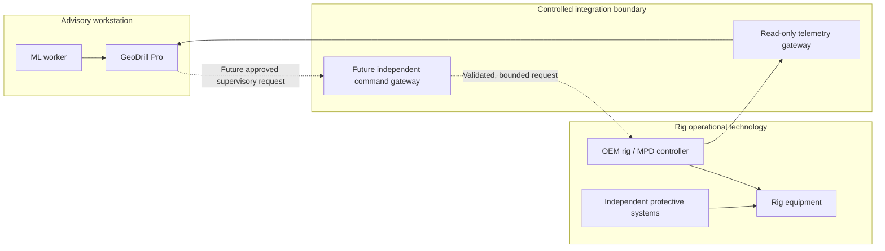

# Part 1 — GeoDrill Pro engineering review and development blueprint  
## Sections 1–5

**Recommendation: proceed with a substantially revised, offline-first engineering and advisory product. Reject the proposed guarantees of error-free operation and the proposed autonomous response to well-control events. Defer equipment control to a separate, independently reviewed integration programme.**

The concept contains useful engineering capabilities, but the supplied specification combines established calculations, empirical correlations, uncertain inverse problems, experimental ML capabilities, and safety-critical control as though they provide equivalent assurance. They do not.

This review covers the complete [GeoDrill Pro specification](<C:/Users/HP/OneDrive/Project Apps/Project Drilling Engineer.md>), including all 17 modules. Statements in that document are treated as claims to evaluate, not instructions to execute.

Throughout this blueprint:

- **Verified reference:** a statement supported by an identified authoritative source.
- **Engineering assessment:** a technical conclusion drawn from the specification and established engineering principles.
- **Proposed requirement:** a recommended implementation or acceptance requirement; it is not evidence of achieved performance.
- **Open item:** information or specialist approval still required before implementation or operational release.

No software, dataset, numerical model, field performance, or safety certification has been validated in this review.

---

## 1. Executive Assessment

### 1.1 Overall feasibility

GeoDrill Pro is feasible as a **modular engineering workstation for data quality assessment, deterministic calculations, historical replay, visualization, and validated advisory analytics**.

It is not currently a defensible specification for autonomous well construction. In particular:

1. Deterministic calculations can be wrong because their inputs, assumptions, correlations, boundary conditions, or implementations are wrong.
2. Many formation and downhole states are incompletely observed.
3. Several proposed modules require proprietary sensor measurements or substantial experimental calibration.
4. A desktop application, an ML runtime, and ordinary industrial communications do not establish a functional-safety architecture.
5. A safe action depends on operational context and approved procedures, not merely on whether a calculated variable lies inside a modelled interval.

The appropriate commercial starting point is a product with a narrow, measurable value proposition: **reliable data handling and auditable engineering decisions for a defined class of wells**.

### 1.2 Strongest aspects

| Aspect | Engineering value | Conditions for retaining it |
|---|---|---|
| Offline-first operation | Useful where connectivity is unreliable or restricted | Local authentication, storage, documentation, licensing, and recovery must work without cloud access |
| Separation of ML and physics in principle | A sound starting intention | Physics must retain its own uncertainty and applicability limits; it cannot “certify” arbitrary ML outputs |
| Common data platform | Reduces repeated ingestion and inconsistent engineering inputs | Establish canonical units, reference systems, provenance, quality flags, and versioned snapshots first |
| Historical replay | Supports verification, training, incident review, and model evaluation | Preserve acquisition times, arrival times, missingness, revisions, and operational context |
| Hydraulics and MSE monitoring | Can provide useful early product value | Start with restricted, validated operating envelopes and distinguish measured from estimated downhole quantities |
| Modular implementation | Supports incremental release and specialist ownership | Each module requires its own model specification, dependencies, evidence, and release status |
| Local analytical tools | Polars, DuckDB, SQLite, and Parquet can support a practical desktop product | Define their different responsibilities and constrain resource use |

### 1.3 Critical weaknesses, safety risks, and architecture risks

| Category | Principal weakness or risk | Required response |
|---|---|---|
| Technical | “Physics constrained” is equated with physically correct | Define assumptions, uncertainty, applicability, and independent verification for each model |
| Technical | Instrument capabilities are attributed to software | Establish actual sensor availability, geometry, bandwidth, calibration, and vendor interfaces |
| Technical | Complex models are described by a single named equation | Write complete model specifications, including closures, boundaries, numerical methods, and failure handling |
| Safety | ML kick detection triggers automatic choke action | Remove this connection from the product baseline |
| Safety | A modelled limit becomes an operational authority | Require approved operating limits and established well-control procedures |
| Safety | A single workstation could influence multiple barriers | Keep protective systems independent and prevent common-cause failures |
| Human factors | Precise-looking graphics and numbers imply certainty | Display quality, age, uncertainty, provenance, applicability, and reasons for abstention |
| Architecture | UI, analytics, ingestion, and control share an undifferentiated local stack | Separate processes, resources, privileges, and OT boundaries |
| Architecture | “10 Hz WITSML” is treated as an inherent data guarantee | Negotiate and verify each source’s actual acquisition and delivery characteristics |
| Architecture | SQLite is ambiguously assigned all history | Use SQLite for transactional state; retain bulk history in immutable columnar files |
| Commercial | Seventeen specialist products are treated as one initial release | Release a narrow foundation, then expand only when data and validation justify it |
| Commercial | Public datasets are presumed sufficient | Perform a dataset suitability and licensing review before assigning any validation role |

### 1.4 Recommended initial product scope

**Proposed MVP:**

- One active well/project per workstation.
- File import, source-data preservation, unit normalization, and data-quality reports.
- Trajectory, hole-section, casing, and formation visualization.
- Historical replay before live operation.
- Read-only connection to one explicitly supported rig data interface.
- Single-phase hydraulics within a documented operating envelope.
- MSE calculations and clearly labelled surface-based proxies.
- Versioned engineering inputs, calculation reports, approvals, and audit records.
- Deterministic advisory thresholds derived from approved operating limits.

The first supported well class should be selected in Phase 0. A reasonable candidate is **conventional drilling with a characterized liquid mud system, adequate surface instrumentation, and no dependence on GeoDrill Pro for well-control protection**.

That is a product-scoping assumption, not a statement that conventional drilling is low risk.

### 1.5 Capability decisions

**Go** means proceed to detailed design and validation. It does not mean approved for field use.

| Capability | Decision | Recommended disposition |
|---|---|---|
| Offline desktop platform and historical replay | **Go** | Build first |
| M1 — Stratigraphy and well geometry | **Go / revise** | Engineering visualization with uncertainty; remove isolation guarantees |
| M2 — Casing and trajectory design | **Revise** | Deterministic checking and constrained candidate comparison; defer optimization |
| M3 — Lithology clustering | **Revise** | Exploratory log electrofacies; interpreted geology requires independent evidence |
| M4 — Thomas–Stieber interpretation | **Go / revise** | Specialist-reviewed petrophysical interpretation with explicit assumptions |
| M5 — EM geosteering inversion | **Defer** | Requires suitable measurements, tool physics, rights, and specialist validation |
| M6 — Hydraulics and pressure window | **Go / revise** | Restricted single-phase implementation first |
| M7 — Thermo-poroelastic stability | **Defer advanced scope** | Start with scenario analysis and verified elastic benchmarks |
| M8 — Cuttings transport | **Revise** | Correlation-based advisory with applicability limits |
| M9 — Surge and swab | **Revise / defer advanced scope** | Offline scenario analysis before operational recommendations |
| M10 — MSE and torque/drag | **Go / revise** | Separate MSE calculation from calibrated torque/drag modelling |
| M11 — Buckling | **Revise** | Screening and engineering analysis; no exact universal WOB limit |
| M12 — BHA dynamics | **Defer** | Offline modelling and instrumented validation first |
| M13 — Bit-life prediction | **Defer** | Begin with bit-run records and survival-analysis baselines |
| M14 — Casing wear and fatigue | **Revise / defer advanced scope** | Separate wear, fatigue, and residual-strength assessments |
| M15 — Early kick detection | **Defer operational ML** | Read-only research and shadow evaluation; preserve existing detection |
| M16 — Gas solubility and multiphase transients | **Defer** | Laboratory-calibrated engineering simulator |
| M17 — Rig and MPD control | **Reject current design** | Redesign as a separate OEM-integrated supervisory programme |
| “Zero-mistake,” zero-latency, exact forecasts | **Reject** | Replace with measurable, bounded claims |
| Autonomous well-control takeover | **Reject** | Outside the recommended GeoDrill Pro product scope |

### 1.6 Standards and governance applicability

These are **candidate applicability areas**, not a claim of compliance. The project needs licensed standards, an edition register, jurisdictional requirements, and a clause-level applicability assessment.

| Area | Relevant reference family | Application to GeoDrill Pro |
|---|---|---|
| Tubular performance | API TR 5C3; ISO/TR 10400; API 5CT | Pipe performance calculations, product properties, and traceability |
| Connections and environment | API 5C5 / applicable ISO connection qualification; ISO 15156 where relevant | Connection qualification, sealing limits, sour-service material constraints |
| Well lifecycle governance | ISO 16530-1 | Governance and well-integrity responsibilities; do not treat it as a well-control procedure |
| Well barriers and facilities | NORSOK D-010 and D-001 where applicable | Barrier philosophy and drilling-facility requirements |
| Fluids and hydraulics | API RP 13D; applicable API RP 13B fluid-testing documents | Rheology, hydraulics methods, and measured fluid properties |
| Well-control equipment and MPD | API Standard 53; applicable API 16-series and RP 92-series documents | Determine applicability by BOP configuration, MPD technique, equipment, and operating mode |
| Functional safety | IEC 61508; IEC 61511 where applicable | Safety lifecycle, allocation of safety functions, independence, verification, and assessment |
| Alarm management | IEC 62682 | Alarm philosophy, rationalization, lifecycle, and performance management |
| Industrial cybersecurity | IEC 62443 family | Asset boundaries, zones/conduits, risk assessment, secure development, and operational controls |
| Drilling data exchange | Energistics WITSML and ETP | Versioned data exchange and interoperability |
| Industrial communication | OPC UA specifications; Modbus specifications and security extensions | Secure communications and interface semantics; neither protocol establishes process safety |
| Personnel and operational practice | IADC competency and well-control programmes; operator procedures | Competence, operational responsibilities, and training |
| Engineering methods | Relevant SPE publications and ISCWSA work | Technical evidence and survey-uncertainty methods; publication is not certification |

**Verified reference:** ISO/TR 10400 explicitly states that it is not a design code, does not prescribe design loads or safety margins, and excludes certain performance aspects such as dynamic loads and connection sealing resistance. Its use alone cannot establish a complete casing design. [ISO/TR 10400 scope](https://www.iso.org/standard/75259.html)

**Verified reference:** ISO 16530-1 addresses well-integrity lifecycle governance and explicitly excludes well control and borehole stability from its scope. [ISO 16530-1 scope](https://www.iso.org/standard/63192.html)

Standards editions require an active register. For example, Standards Norway currently lists D-001:2026 and D-010:2021 with its 2024 corrigendum, while revisions have also been under development. A project must distinguish adopted published requirements from draft documents. [NORSOK drilling standards](https://standard.no/en/sectors/petroleum/norsok-standards/d-drilling)

---

## 2. Claims and Assumptions Audit

Classification applies to the claim **as written**, including any unsupported guarantee attached to an otherwise useful technique.

### 2.1 System and architecture claims

| ID | Original claim | Classification | Technical explanation | Required correction | Evidence or validation needed | Consequence if uncorrected |
|---|---|---|---|---|---|---|
| C01 | “Zero-Mistake” platform | **Unrealistic** | Neither finite testing nor model constraints eliminate all software, sensor, human, or physical failures | State intended use, residual risks, operating envelope, and demonstrated performance | Hazard analysis; verification and validation records; field evidence | Overreliance and invalid safety claims |
| C02 | Software is “mathematically forbidden” from unsafe recommendations | **Unsupported / unsafe** | A recommendation can satisfy an incorrect model or outdated limit | Say recommendations are checked against approved constraints using qualified inputs | Independent constraint verification; uncertainty analysis; fault injection | Unsafe advice receives misleading assurance |
| C03 | Every ML output is constrained by “API standards, thermodynamic laws, and geomechanical limits” | **Partially valid** | These are different types of knowledge; some limits are uncertain and some standards do not define operational envelopes | Enumerate each constraint, source, applicability, uncertainty, and owner | Traceable constraint catalogue and approved design basis | Incomplete checks are mistaken for comprehensive protection |
| C04 | Tauri is highly secure and has minimal RAM footprint | **Partially valid** | Framework choice does not establish application security or total memory demand | Set resource budgets and a threat model; restrict permissions and local interfaces | Penetration testing, dependency review, representative hardware measurements | Local compromise or resource exhaustion |
| C05 | Prohibiting pandas prevents RAM overflow | **Unsupported** | Memory failure depends on algorithms, materialization, concurrency, and workload | Prefer bounded columnar processing; allow justified libraries behind limits | Worst-case import and query tests; process memory limits | False confidence while other components exhaust memory |
| C06 | Gigabyte-scale queries are instantaneous | **Unrealistic** | Parsing, disk I/O, decompression, joins, and aggregation take time | Define benchmark datasets and percentile response targets | Cold/warm cache benchmarks on named hardware | Unachievable acceptance criteria |
| C07 | ONNX bypasses the GIL and ensures zero-latency predictions | **Partially valid / unrealistic** | Native kernels may parallelize, but acquisition, preprocessing, scheduling, inference, and rendering have latency | Measure end-to-end age and latency; control thread pools | Conversion parity and hardware-specific benchmarks | Stale predictions presented as immediate |
| C08 | FastAPI workers stream WITSML at 10 Hz | **Unsupported** | Source sampling, transport version, server configuration, and delivery batching determine availability | Negotiate interface capabilities and preserve native timing | Connector tests with the actual rig server | Interpolated or delayed data mistaken for fresh measurements |
| C09 | D3 displays high-frequency data at 60 fps | **Partially valid** | Rendering rate and signal sampling rate differ; excessive DOM updates can overload the UI | Use bounded buffers and Canvas/WebGL where appropriate; decimate display only | Worst-case rendering and spike-preservation tests | Hidden excursions or UI freezing |
| C10 | Public datasets establish platform and ML readiness | **Unsupported** | Dataset size does not establish label quality, sensor bandwidth, operational representativeness, or rights | Audit each data asset before assigning a validation role | Variable inventory, timing, provenance, quality, labels, licensing | Invalid models and misleading performance claims |

ONNX Runtime documents configurable threading and explicitly notes that parallel execution can hurt performance for some models. That supports benchmarking and resource control, not a zero-latency claim. [ONNX Runtime thread management](https://onnxruntime.ai/docs/performance/tune-performance/threading.html)

### 2.2 Module and operational claims

| ID | Original claim | Classification | Technical explanation | Required correction | Evidence or validation needed | Consequence if uncorrected |
|---|---|---|---|---|---|---|
| C11 | A geological 3D twin “ensures” isolation of aquifers and reactive shales | **Unsupported** | Isolation depends on actual formations, casing placement, cementing, barriers, and verification | Provide planning checks and uncertainty visualization; require barrier review | Formation uncertainty, casing/cement design, execution and integrity evidence | Environmental or barrier failure |
| C12 | RL produces the cheapest mathematically safe casing design | **Unsupported / unsafe** | Cost and safety are incompletely specified; RL offers no inherent feasibility or optimality guarantee | Start with deterministic load-case checking and constrained candidate enumeration | Complete load catalogue, manufacturer data, independent design review | Under-designed casing or infeasible programme |
| C13 | K-means identifies formation facies dynamically | **Partially valid** | Clusters identify similarity in selected measurements, not uniquely geological facies | Label outputs electrofacies or clusters until interpreted and validated | Core/cuttings/image-log correlation and blind-well testing | Incorrect formation interpretation |
| C14 | Thomas–Stieber is a deterministic physics guardrail | **Partially valid** | It is a petrophysical interpretation model with endmember and geometry assumptions | Treat it as an interpretation workflow with alternatives and uncertainty | Core/log calibration and model-applicability review | False porosity confidence |
| C15 | A DNN trained on Maxwell’s equations maps conductivity 100 ft ahead | **Unsupported** | Equations do not supply missing measurements; look-ahead sensitivity depends on tool and formation | Specify actual EM measurements and their observability; qualify distance claims by condition | Vendor forward model, calibration, sensitivity analysis, independent field truth | Incorrect geosteering |
| C16 | Bingham/Herschel–Bulkley models keep ECD between pore pressure and fracture gradient | **Partially valid / unsafe** | Rheology is only part of pressure prediction; the complete well profile, uncertainty, transients, and losses matter | Calculate pressure profiles and margins; qualify all rheological and hydraulic closures | Flow-loop and downhole pressure comparisons | Influx, losses, or formation damage |
| C17 | Cooling produces a shrinking fracture gradient | **Partially valid** | Cooling can promote tensile failure, but the response depends on stress, diffusion, rock properties, fractures, and boundary conditions | Evaluate thermal and poroelastic effects as scenarios; distinguish initiation, propagation, and loss limits | Thermal/mechanical property measurements and field calibration | Incorrect pressure window |
| C18 | Torque/SPP variance warns of imminent cuttings avalanches and pack-offs | **Unsupported** | These signals are affected by many unrelated processes | Produce nonspecific dysfunction indicators unless diagnosis is validated | Labelled transport/pack-off events and confounder testing | Misdiagnosis and inappropriate intervention |
| C19 | Surge/swab computes absolute maximum tripping speeds | **Unsupported / unsafe** | Results depend on mud properties, geometry, motion history, boundary conditions, and pressure uncertainty | Recommend a scenario-specific speed envelope with margins and review | Transient pressure and pipe-motion validation | Swab-induced influx or surge losses |
| C20 | MSE and Isolation Forest identify bit balling or foundering | **Partially valid** | MSE is an energy metric; anomalies are not unique diagnoses | Separate calculation, anomaly detection, and diagnosis | Bit/BHA context and independently labelled dysfunctions | Wrong parameter changes |
| C21 | Dawson–Paslay gives exact sinusoidal and helical WOB limits | **Unsupported** | Idealized buckling models do not directly provide exact surface or bit load limits for every well | Use applicable screening models plus string load distribution and uncertainty | Published benchmark cases and representative experiments | Buckling, lock-up, or mechanical damage |
| C22 | BHA FEA detects severe stick-slip and whirl without downhole sensors | **Unsupported** | A numerical simulation does not establish observability of the actual downhole state | Call this a virtual estimate; validate against downhole measurements | Synchronized surface/downhole measurements across BHAs and formations | Missed damaging vibration |
| C23 | Acoustic data predict IADC dull grade and optimal trip depth | **Unsupported** | Acoustic availability, transmission, labels, censoring, and economics are unspecified | Begin with run records and probabilistic remaining-life analysis | Inspected bits, standardized grading, run histories, valid economic assumptions | Premature trips or bit failure |
| C24 | White–Dawson factors plus nonlinear FEA calculate wear and fatigue | **Partially valid** | Wear factors require calibration; wear and fatigue are different mechanisms | Separate wear accumulation, cyclic damage, corrosion, and residual strength | Material/contact tests, inspection logs, fatigue data | Overestimated casing integrity |
| C25 | ML detects kicks up to ten minutes before pit alarms | **Unsupported** | Lead time depends on event definition, instrumentation, physics, operating state, and baseline tuning | Report distributions and uncertainty for observed events; no fixed lead-time promise | Blind event review, misses, nuisance alarms, latency, matched baseline | Delayed established well-control response |
| C26 | Peng–Robinson predicts exact bubble-point flash depths | **Unsupported** | EOS alone does not supply mixture characterization, kinetics, or the transient pressure–temperature path | Predict a range conditional on calibrated PVT and transport assumptions | Actual mud/gas laboratory measurements and flow-loop data | Underestimated gas expansion |
| C27 | PID maintains constant BHP | **Partially valid** | BHP may be estimated; delays, actuator limits, pressure constraints, and disturbances prevent exact regulation | Specify bounded tracking performance within an authorized envelope | OEM controller validation and hardware-in-the-loop testing | Oscillation, overpressure, or loss of pressure control |
| C28 | MPC writes directly to PLCs over Modbus TCP | **Unsafe as proposed** | Direct application access lacks an independent authority and command-validation boundary | Use an isolated, approved supervisory gateway with default-deny writes | Interface safety case, cybersecurity assessment, OEM testing | Unauthorized or inappropriate actuation |
| C29 | A kick triggers automatic pressure-step scheduling and choke takeover | **Unsafe** | An inferred event cannot select a universal response; inappropriate pressure reduction can worsen an influx | Remove the workflow; follow approved well-control and MPD procedures | A separate, formally governed control programme would be required | Escalation of a well-control event |
| C30 | Limits from Modules 1–16 collectively make Module 17 safe | **Unsupported** | Modules share data, models, assumptions, and failure causes; their outputs are not independent barriers | Allocate independent protection and explicitly analyse common-cause failures | Hazard analysis, protection-layer assessment, functional-safety review | Multiple apparent barriers fail together |

For EM interpretation, a sensor’s depth of investigation is not automatically its useful distance ahead of the bit. Tool sensitivity and formation properties materially affect what can be resolved. [SLB depth-of-investigation definition](https://glossary.slb.com/en/terms/d/depth_of_investigation)

### 2.3 Dataset claims

| Proposed dataset use | Assessment | Required correction |
|---|---|---|
| Volve for lithology and Thomas–Stieber | Potentially useful candidate; suitability of individual wells and curves is unverified | Inventory curves, corrections, depth alignment, core evidence, labels, and permitted uses. Validate deterministic interpretation; do not describe this as “training the logic” |
| Utah FORGE for thermal stability and vibration | Candidate research resource; hard-rock geothermal conditions do not establish transferability to other well classes | Identify actual sensor locations, bandwidth, synchronization, rock properties, and downhole reference measurements |
| Texas RRC for numerical logs and performance testing | The assumption of ready-to-use numerical telemetry is incorrect | RRC’s imaged logs require a separate digitization and quality process if numerical values are needed; use generated, schema-valid numerical workloads for software load tests |

Equinor’s catalogue establishes that Volve is a substantial released field dataset; it does not establish that a selected subset meets a particular model’s requirements. [Equinor Volve data](https://www.equinor.com/energy/volve-data-sharing)

The identified FORGE submission lists surveys, core information, mud/temperature logs, daily reports, and additional drilling data. The listing alone does not verify vibration bandwidth or synchronized downhole truth. [FORGE well 16B(78)-32 data](https://gdr.openei.org/submissions/1516)

RRC states that its imaged well logs are delivered in TIFF format. [RRC imaged records](https://www.rrc.texas.gov/resource-center/research/research-queries/imaged-records/)

---

## 3. Proposed System Architecture

### 3.1 Architecture principle

Use a **modular local application with isolated workers**, rather than either a single all-powerful process or a large distributed microservice installation.

The initial product has no equipment-write authority.

The policy service checks whether an advisory may be displayed as actionable. It is **not designated as a safety instrumented system**.

### 3.2 Component responsibilities

| Component | Recommended responsibility | Boundary |
|---|---|---|
| Tauri shell | Packaging, window lifecycle, restricted native capabilities, worker supervision, controlled file access, update orchestration | No engineering decisions or PLC control |
| React | Project workflows, engineering forms, review screens, alarm presentation, provenance and uncertainty display | Frontend validation is supplementary; authoritative checks occur in services |
| Tailwind | Consistent interface styling, accessible states, density and contrast rules | Colour alone must not communicate severity or validity |
| FastAPI | Local application API, authorization, job submission, result retrieval, streaming to UI | Do not run heavy numerical work in request handlers or the async event loop |
| Rust platform components | Bounded buffers, process lifecycle, durable journaling where justified, parsers or transformations requiring measured performance improvements | Rust does not imply functional-safety certification |
| Python engineering packages | Reference calculations, scientific solvers, calibration, uncertainty studies, model evaluation | Pure functions or explicit state machines; no hidden global engineering state |
| Polars | Typed transformations, quality processing, joins, feature preparation, batch and supported streaming operations | No unbounded accumulation of one growing dataframe |
| DuckDB | Historical queries, aggregations, report extraction, Parquet analytics | Separate analytical workloads from live ingestion and alarm evaluation |
| SQLite | Project state, configuration versions, job metadata, acknowledgements, local identities, model metadata, audit index | Not the primary store for high-volume waveform history |
| Parquet | Immutable normalized historical partitions with schema and provenance metadata | Use manifests and atomic publication; do not expose partially written partitions |
| Physics engine | Versioned deterministic calculations with explicit units, validity envelopes, uncertainty, and diagnostics | No dependency on ML for essential limit evaluation |
| ML inference worker | Approved models, fixed feature transformations, applicability checks, predictions and uncertainty metadata | No network path or credentials for equipment control |
| ONNX Runtime | Deploy models where conversion is supported and parity is demonstrated | Conversion is not automatic qualification; unsupported operators or altered outputs block release |
| D3 | Scales, axes, interaction, annotations, and appropriate rendering coordination | Do not push every raw sample into SVG elements |
| Three.js | Well geometry and geological scene rendering | Display uncertainty and avoid implying unmeasured geometric precision |
| Alarm service | Deterministic alarm state, prioritization, shelving policy, event history, escalation | Separate alarm acknowledgement from recommendation approval |
| Registry | Approved configurations, model bundles, dataset manifests, validation evidence, compatibility metadata | Runtime activation only from approved immutable versions |

Tauri explicitly treats application security as a set of boundaries and configurable capabilities. Those controls need to be designed and tested in the application. [Tauri security documentation](https://v2.tauri.app/security/)

### 3.3 Rust–Python responsibility boundary

Adopt these rules:

1. **Implement a reference model once.** Do not maintain unrelated Rust and Python implementations of the same engineering method.
2. Start most scientific calculations in Python for inspectability and access to scientific libraries.
3. Move a kernel to Rust only when profiling identifies a material bottleneck or deployment requirement.
4. Retain the reference implementation and independent benchmarks for cross-language parity.
5. Exchange versioned, typed messages. Avoid undocumented shared-memory structures.
6. Define error states explicitly: invalid input, unsupported regime, insufficient evidence, nonconvergence, timeout, cancelled, and internal failure.
7. Prevent numerical workers from opening OT communication channels.

### 3.4 Real-time telemetry pipeline

Each measurement must preserve:

- Well, wellbore, run, source, and channel identity.
- Source acquisition time.
- Local receipt time.
- Sequence identifier where available.
- Source unit and normalized unit.
- Source quality and application-derived quality.
- Measured, derived, interpolated, or manually entered status.
- Applicable depth coordinate and reference.
- Calibration and channel-mapping version.
- Clock-synchronization quality.

Processing should follow this sequence:

**Proposed requirements:**

- Preserve native sampling and irregular delivery.
- Support out-of-order and duplicate records without silently overwriting history.
- Keep interpolation flags attached to derived samples.
- Use event time for engineering alignment and monotonic local time for elapsed-time supervision.
- Allocate channel-specific staleness limits from operational requirements.
- Do not resample low-rate measurements to 10 Hz and represent them as new observations.
- Record late corrections as revisions.
- Apply backpressure and bounded queues.
- Under overload, reduce visualization and optional ML workloads first.
- If authoritative processing cannot keep up, declare degraded service and invalidate dependent advisories.
- Preserve extrema and gaps when reducing data for display.

**Verified reference:** WITSML 2.1 uses ETP 1.2. Support for legacy interfaces must be an explicit compatibility decision, not an assumption that all WITSML servers expose identical streaming behaviour. [Energistics developer documentation](https://energistics.org/witsml-developers-users)

### 3.5 Calculation and inference execution

Every calculation request should bind to an immutable snapshot of:

- Engineering inputs.
- Source data and quality.
- Model and correlation versions.
- Unit/reference conversions.
- Operating mode.
- Approved limits.
- Solver settings.
- Requested uncertainty treatment.

Every result should carry:

- Result status and validity interval.
- Values and units.
- Applicability statement.
- Assumptions and omitted effects.
- Input snapshot identifier.
- Model/correlation version.
- Numerical convergence diagnostics.
- Uncertainty or sensitivity results.
- Reasons the result must not support an operational recommendation.

A deterministic calculation can be reproducible without being accurate. Reproducibility and physical validity must be assessed separately.

### 3.6 Data ownership and storage

**SQLite:**

- Use a controlled writer path and transactional updates.
- Evaluate WAL mode and checkpoint behaviour under the supported workload.
- Use consistent backup procedures.
- Keep the live database on a local filesystem.
- Do not operate the live database from a network share or cloud-synchronization folder.
- Export backups through an explicit, verified operation.

SQLite WAL supports concurrent readers and a writer, but still has write-concurrency and deployment constraints; it does not create a multi-writer server database. [SQLite WAL documentation](https://www.sqlite.org/wal.html)

**Parquet and raw records:**

- Preserve raw inputs separately from normalized data.
- Partition according to measured query patterns and file-size targets.
- Avoid both one-file-per-sample and uncontrolled giant files.
- Publish files atomically with checksums and manifest entries.
- Maintain retention policies for raw telemetry, high-frequency waveforms, derived features, and reports.
- Monitor storage capacity and reserve space for critical state and events.

**DuckDB and Polars:**

- Enforce memory, time, and temporary-disk limits.
- Query projected columns and bounded time/depth ranges.
- Avoid unnecessarily materializing entire datasets.
- Test supported operations under datasets larger than RAM.
- Treat out-of-memory and full-disk events as designed failure modes.

### 3.7 Configuration and model registry

The local registry should contain:

| Registry item | Required contents |
|---|---|
| Engineering model | Method identifier, equations/reference, assumptions, validity envelope, implementation version, benchmarks |
| Empirical correlation | Source, coefficient values, original units, calibration population, applicable regime, limitations |
| ML bundle | Model, preprocessing, feature schema, feature order, units, missing-data policy, calibration, output interpretation |
| Validation package | Dataset manifests, split definition, metrics, uncertainty, subgroup performance, known failures |
| Operating limits | Owner, approval, well/run applicability, effective time, expiry, rationale |
| Runtime compatibility | OS, CPU features, package/runtime versions, ONNX opset and execution provider |
| Release identity | Cryptographic digest, signature, approver, activation record, rollback compatibility |

No online self-training or unreviewed parameter adaptation should occur in the initial field product.

### 3.8 Offline deployment and updates

**Proposed deployment requirements:**

- Signed installation bundles containing approved runtimes and dependencies.
- A software bill of materials and pinned dependency versions.
- Offline access to required reference documentation and help.
- Local operation without mandatory cloud authentication.
- Signed model and configuration bundles.
- Controlled transfer of update media with malware screening.
- Update installation during an approved maintenance window.
- Database migration prechecks and verified backups.
- Rollback or recovery procedures that account for schema compatibility.
- No automatic update during active operational use.
- An offline process for certificate expiry, revoked releases, and urgent security advisories.
- Recovery drills for power loss, corrupted configuration, failed migration, and disk failure.

### 3.9 Roles and authorization

| Role | Permitted responsibilities |
|---|---|
| Viewer | View qualified measurements and released reports |
| Analyst | Import data, execute calculations, run simulations |
| Engineer | Create engineering interpretations and draft recommendations |
| Approver | Approve designated engineering configurations and recommendations within assigned competence |
| Driller/operator | Acknowledge operational advisories and follow established operating authority |
| Administrator | Manage installation, accounts, and technical configuration |
| Control integrator — future | Configure separately governed supervisory interfaces |
| Auditor | Inspect immutable histories and evidence packages |

Administrative access must not automatically confer engineering approval authority. Emergency changes require a documented, attributable process.

### 3.10 Cybersecurity and PLC isolation

The dashed path is a future capability and is absent from the MVP.

IEC 62443-3-2 provides a basis for defining the system under consideration, partitioning it into zones and conduits, and assessing their security requirements. [IEC 62443-3-2](https://webstore.iec.ch/en/publication/30727)

Use authenticated local IPC or a loopback-bound service with authenticated sessions, restrictive origins, limited endpoints, and least-privilege access. “Localhost” alone is not an authorization mechanism.

For any future rig interface, prefer an OEM-supported secure interface. Ordinary Modbus TCP must not be assumed to provide authenticated commands. The Modbus Security specification adds TLS and certificate-based mechanisms, but device support and configuration still require verification. [Modbus Security](https://www.modbus.org/news/modbus-security-new-protocol-to-improve-control-system-security)

---

## 4. Safety Architecture

### 4.1 Operational authority levels

| Level | Meaning | Example | GeoDrill Pro status |
|---|---|---|---|
| **1. Monitoring** | Displays measured or calculated state | Flow-out trend, calculated annular pressure | Initial product |
| **2. Prediction** | Estimates an unmeasured state or future outcome | Likelihood of a drilling dysfunction | Only after model validation |
| **3. Advisory recommendation** | Suggests an action for a competent human to assess | Review flow rate because pressure margin is narrowing | Primary intended operational role |
| **4. Supervisory control** | Sends an authorized bounded target to an existing controller | Approved setpoint request to an OEM MPD system | Separate future release |
| **5. Closed-loop control** | Repeatedly computes actuator commands from feedback | Choke regulation within a qualified controller | Outside desktop application scope; separate control-system responsibility |

A recommendation being acknowledged does not authorize control. Supervisory control does not automatically include well-control authority.

### 4.2 Layered barriers

| Layer | Required mechanism | Failure response |
|---|---|---|
| Intended-use boundary | Explicit supported well classes, operations, fluids, equipment, and data sources | Mark unsupported operation; prevent action-oriented recommendations |
| Sensor quality | Range, rate-of-change, flatline, calibration, redundancy, and consistency checks | Mark affected channels invalid or suspect; propagate status |
| Units | Typed quantities and explicit boundary conversion | Reject ambiguous or incompatible units |
| Coordinates | Named MD/TVD references, elevation datum, azimuth convention, CRS, and tool offsets | Block geometry-dependent calculations when unresolved |
| Input ranges | Physical, instrument, and model-applicability checks | Reject or quarantine; never silently clip into a plausible range |
| Staleness | Per-channel age limits and clock-quality checks | Expire dependent results and recommendations |
| Deterministic checks | Equipment limits, approved operating bounds, model constraints, and numerical validity | Inhibit advisory eligibility and explain the violated condition |
| Uncertainty | Measurement and model uncertainty, sensitivity analysis, and applicability checks | Abstain where uncertainty consumes the approved margin |
| Alarm management | Rationalized priority, persistence, deadband, state, shelving, and ownership | Preserve visibility of critical conditions and alarm-system failure |
| Human approval | Identity, competence, scope, expiry, and exact recommendation version | No implied approval from viewing or acknowledgement |
| Independent command validation | Separate process/device and independent permitted-command envelope | Reject invalid, stale, duplicate, mismatched, or unauthorized requests |
| PLC write protection | Disabled write path by default; network and application allowlists | No command transmission |
| Manual override | Existing driller/OEM override independent of GeoDrill Pro | Immediate removal of GeoDrill supervisory authority |
| Audit trail | Attributable, append-only records with tamper evidence and backups | Declare degraded assurance if critical records cannot be persisted |
| Independent protection | Existing barriers, alarms, interlocks, and well-control procedures remain authoritative | GeoDrill failure must not disable them |

**Important distinction:** input checking detects some faults. It does not prove that an apparently plausible sensor value is correct.

### 4.3 Model-based constraint logic

For an operating variable \(x\), let:

- \(x^{-}\), \(x^{+}\): lower and upper bounds of the modelled uncertainty envelope, in the unit of \(x\).
- \(L\), \(U\): approved lower and upper operating limits, in the same unit.
- \(m_L\), \(m_U\): approved additional margins, in the same unit.

An advisory may be eligible only if:

\[
x^{-} \ge L+m_L
\qquad\text{and}\qquad
x^{+} \le U-m_U
\]

This is a **proposed conservative eligibility rule**, not a proof of physical safety. The envelope must include relevant uncertainties and the limits must themselves be justified.

For wellbore pressure, evaluate the condition along the relevant well profile and over the proposed operation. Checking only bottomhole ECD can miss an upper-hole or casing-shoe constraint.

Do not automatically move an infeasible ML recommendation to the nearest apparent limit and call it safe. Either independently recalculate and assess the altered candidate or reject it.

### 4.4 Uncertainty and confidence

Use separate concepts:

- **Measurement uncertainty:** sensor accuracy, calibration, placement, lag, and timing.
- **Parameter uncertainty:** formation stress, friction, rheology, wear coefficient.
- **Model discrepancy:** omitted or approximated physics.
- **Statistical uncertainty:** limited data and estimated model parameters.
- **Applicability:** whether the current case resembles validated conditions.

A high model score or narrow ML interval does not compensate for an unsupported operating regime.

Proposed handling:

1. Carry quality and uncertainty into derived values.
2. Use sensitivity analysis to identify dominant uncertain inputs.
3. Evaluate correlated inputs appropriately.
4. Label scenario ranges separately from statistically calibrated prediction intervals.
5. Suppress action-oriented predictions outside the validated domain.
6. Preserve monitoring and explain the missing evidence.

### 4.5 Alarm management

Each alarm needs:

- A defined abnormal condition.
- Consequence of inaction.
- Required operator response.
- Maximum useful response time.
- Priority based on consequence and urgency.
- Input-quality requirements.
- Activation and clearing logic.
- Persistence, deadband, and suppression rules.
- Shelving authority and expiry.
- Acknowledgement and resolution records.

ML anomaly scores should initially appear as advisory events, not automatically as high-priority safety alarms.

Alarm philosophy and lifecycle should follow the applicable principles of IEC 62682. [IEC 62682](https://webstore.iec.ch/en/publication/65543)

### 4.6 Modes and degradation

| Mode | Behaviour | Entry conditions | Exit or degradation |
|---|---|---|---|
| **Simulation-only** | Uses synthetic/replayed data; visibly watermarked; no live command capability | Default development and training mode | Explicit project/mode transition |
| **Monitoring-only** | Qualified measurements and released calculations | Valid data source and approved channel mapping | Channel failures invalidate dependent outputs |
| **Advisory** | Adds approved recommendation logic | Qualified data, approved limits, validated models, competent user | Reverts to monitoring when any required condition fails |
| **Supervised control — future** | Allows narrowly scoped approved requests through independent gateway | Separate safety and integration release | Revokes GeoDrill authority on fault or override |
| **Degraded** | Shows available trustworthy data and the cause of impairment | Stale data, clock fault, model failure, storage fault, resource overload | Recovery checks and, where required, manual reauthorization |
| **Unavailable** | Declares loss of service | Critical application failure | Established rig systems and procedures continue independently |

For a future control integration, “fail safe” does **not** mean “close the choke,” “open the choke,” “stop the pump,” or “hold the last command” in every case. The appropriate response is operation-specific and must be implemented and validated within the OEM control and safety architecture.

### 4.7 Human approval and command lifecycle

Any future supervisory request must bind approval to:

- Well and equipment identity.
- Current operational mode.
- Target parameter and permitted range.
- Rate-of-change and duration limits.
- Input snapshot and quality.
- Engineering/model versions.
- Operator identity and authority.
- Expiry time.
- Preconditions and termination conditions.

A material change to these items invalidates approval.

The independent gateway must check authority, freshness, sequence, state, limits, equipment readiness, and interface identity. It must distinguish:

1. Request created.
2. Request approved.
3. Request accepted by gateway.
4. Request accepted by controller.
5. Equipment response observed.
6. Request completed, cancelled, rejected, or timed out.

A transport acknowledgement is not proof that the equipment reached its requested state.

### 4.8 Preconditions for any closed-loop capability

All of the following must be satisfied before enabling a closed-loop function:

1. A narrowly defined control objective and operational envelope.
2. Hazard analysis covering normal, abnormal, maintenance, and transition states.
3. Explicit allocation of safety and non-safety functions.
4. Independent protection against hazardous control failure.
5. Approved instrumentation, calibration, redundancy, and timing requirements.
6. A validated plant model or adequately demonstrated robust control design.
7. Bounded execution time, communication delay, and failure response.
8. Actuator limits, saturation handling, interlocks, and safe transfer of authority.
9. Cybersecurity assessment and controlled network architecture.
10. Software verification, simulation, fault injection, and hardware-in-the-loop evidence.
11. OEM acceptance and operator authorization.
12. Competency, procedures, maintenance, and change-management arrangements.
13. Regulatory and third-party assessment where applicable.
14. Controlled field-trial evidence before broader release.

IEC 61511 addresses the lifecycle of safety instrumented systems; invoking the standard or choosing a programming language does not qualify an application as a safety system. Any required safety integrity level must follow hazard and risk assessment rather than being assigned as a marketing attribute. [IEC 61511-1 scope](https://webstore.iec.ch/en/publication/24241)

---

## 5. Module-by-Module Technical Specification

### 5.0 Common requirements and acceptance framework

The following requirements apply to every module and supplement each module’s individual specification.

**Units and references**

- Use SI internally: metres, seconds, kilograms, pascals, kelvin, newtons, newton-metres, cubic metres per second, and radians.
- Preserve original units and conversion provenance.
- Distinguish absolute pressure from gauge pressure.
- Use true vertical depth for hydrostatic head and measured depth for path length where appropriate.
- Explicitly define azimuth reference, elevation datum, coordinate system, sign convention, and tool position.
- Preserve established non-SI instrument scales, such as gamma-ray API units, as explicitly typed source quantities where a meaningful SI conversion does not exist.

**Common result status**

Each output is one of:

`valid`, `conditional`, `insufficient_data`, `outside_applicability`, `stale`, `nonconverged`, or `failed`.

A result without adequate evidence must not default to `valid`.

**Data-frequency convention**

The frequencies below are **proposed acquisition/processing assumptions**. They must be confirmed against actual sources and the physical bandwidth being studied. Polling faster than a source updates does not create additional information.

**Acceptance gates**

| Gate | Proposed requirement |
|---|---|
| **G1 — Contract** | Every required quantity has a defined unit, reference, null rule, provenance, and quality treatment |
| **G2 — Numerical** | Published or independently derived benchmark cases pass approved tolerances; numerical failure is explicit |
| **G3 — Applicability** | Supported and unsupported regimes are machine-readable and tested |
| **G4 — Empirical** | Validation uses independently reviewed measurements with documented uncertainty and permitted use |
| **G5 — Operational** | Error bounds, response time, nuisance alarms, and missed-event criteria are approved for the intended decision |
| **G6 — Safety/UI** | Invalid or stale data cannot produce a valid actionable recommendation; uncertainty and provenance are visible |
| **G7 — Reproducibility** | An immutable input snapshot and version manifest reproduce the reported result within the approved computational tolerance |

For simple closed-form benchmark calculations, an initial relative numerical tolerance of \(10^{-6}\), with a quantity-specific absolute tolerance near zero, is a reasonable **proposed software target**. It is not a field-accuracy claim and is not automatically appropriate for iterative or ill-conditioned models.

For field models, the responsible specialist must approve a **validation envelope** specifying allowable bias, error, interval coverage, and operational margin consumption before examining the final blind test results.

**No operational release may contain an unresolved acceptance limit.** Where this document identifies missing data or an unassigned threshold, that is an explicit release blocker rather than an implied default.

---

### 5.1 Module 1 — Stratigraphy and Well Geometry

**Disposition: go, with a narrower claim.**

| Requested field | Specification |
|---|---|
| **Engineering purpose** | Integrate well trajectory, formation interpretations, hole sections, casing, and relevant subsurface uncertainty |
| **Operational decision supported** | Review planned intersections, section depths, casing placement, and geological uncertainty requiring additional investigation |
| **Required input data** | Wellhead location; coordinate and elevation references; survey MD, inclination, azimuth; survey quality; formation tops and uncertainty; casing/hole geometry; interpreted aquifers, faults, and reactive intervals |
| **Data frequency and quality** | Update on each accepted survey or interpretation revision. Preserve irregular survey spacing. Require explicit north reference, datum, units, and tool-to-bit offsets |
| **Calculated outputs** | 3D trajectory; MD–TVD mapping; formation intersections; section overlays; uncertainty volumes where supported; geometric conflict flags |
| **Governing equations/models** | Minimum-curvature survey interpolation; coordinate transformations; documented geological interpolation; survey uncertainty propagation |
| **Required empirical correlations** | No mandatory empirical drilling correlation. Geological interpolation parameters require interpretation and cross-validation |
| **ML role** | None in the MVP. Later interpretation assistance may propose correlations for expert review |
| **Deterministic safety constraints** | Reject unresolved datums and impossible section geometry. Do not classify unmeasured formations or unverified isolation as confirmed |
| **Dependencies** | Canonical well/survey data, coordinate library, provenance system; supplies geometry to most other modules |
| **Uncertainty sources** | Survey errors, magnetic interference, sparse offsets, uncertain dips, faults, top picks, and interpolation assumptions |
| **Failure modes** | Datum mismatch, reversed axes, MD/TVD confusion, incorrect azimuth reference, false precision in interpolated geology |
| **Verification approach** | Vertical, straight inclined, build, turn, and azimuth-wrap benchmarks; coordinate round-trip tests; independent survey calculation comparisons |
| **Validation dataset** | Survey benchmark wells and operator-approved surveys with known references; interpreted formation datasets with held-out well control |
| **Acceptance criteria** | G1–G3, G6–G7; benchmark coordinates meet approved tolerances; reference errors block calculations; withheld geological prediction errors are reported |
| **Recommended priority** | **P1: foundational MVP** |
| **MVP scope** | Survey import, 2D/3D geometry, formation markers, hole/casing overlays, explicit uncertainty labels |
| **Production scope** | Qualified survey uncertainty, geological scenario ensembles, interpretation versioning, and reviewed collision-analysis integration |
| **What should not be automated** | Confirmation of zonal isolation, final formation picks, aquifer protection approval, or acceptance of collision risk |

For two survey stations:

\[
\beta=\cos^{-1}\!\left[
\cos I_1\cos I_2+\sin I_1\sin I_2\cos(A_2-A_1)
\right]
\]

\[
RF=\frac{2}{\beta}\tan\left(\frac{\beta}{2}\right),
\qquad RF\rightarrow 1\text{ as }\beta\rightarrow0
\]

\[
\begin{bmatrix}\Delta N\\\Delta E\\\Delta V\end{bmatrix}
=
\frac{\Delta MD}{2}RF
\begin{bmatrix}
\sin I_1\cos A_1+\sin I_2\cos A_2\\
\sin I_1\sin A_1+\sin I_2\sin A_2\\
\cos I_1+\cos I_2
\end{bmatrix}
\]

Here \(I\) is inclination from vertical and \(A\) is azimuth from the declared north reference, both in radians; \(\beta\) is dogleg angle in radians; \(\Delta MD\) is measured-depth increment in metres; \(\Delta N,\Delta E,\Delta V\) are north, east, and downward vertical increments in metres; \(RF\) is dimensionless.

Use a stable small-angle implementation and bound floating-point round-off in the inverse-cosine argument. This does not replace survey uncertainty analysis. ISCWSA specifically emphasizes matching error models to the actual surveying tool and its use. [ISCWSA error-model guidance](https://www.iscwsa.net/committees/error-model/)

---

### 5.2 Module 2 — Casing and Trajectory Design Assistant

**Disposition: redesign. Reject RL as the initial design authority.**

| Requested field | Specification |
|---|---|
| **Engineering purpose** | Check candidate casing/liner programmes and trajectories against explicit engineering load cases and constraints |
| **Operational decision supported** | Compare feasible designs and identify governing loads, weak components, and missing evidence |
| **Required input data** | Geometry; pressure/temperature profiles; fluid densities; installation and service load cases; tubular dimensions/grades/tolerances; connection ratings; corrosion/wear allowances; cement/support assumptions; stresses; trajectory constraints; cost and availability |
| **Data frequency and quality** | Event-driven design revisions. Require traceable manufacturer properties and an approved load-case catalogue |
| **Calculated outputs** | Utilization by component and load case; governing failure mode; design margins; feasibility status; candidate cost comparison; trajectory feasibility flags |
| **Governing equations/models** | Applicable tubular burst/collapse/axial methods; thick-wall stress where appropriate; triaxial yield; temperature/environment derating; connection envelopes; minimum-curvature trajectory and torque/drag constraints |
| **Required empirical correlations** | Applicable collapse formulations and qualified derating relationships; vendor connection performance; approved friction and wear assumptions |
| **ML role** | Optional future candidate ranking or proposal generation. Every candidate requires independent deterministic checking |
| **Deterministic safety constraints** | All required load cases must pass approved factors; check pipe body and connections; reject missing ratings, incompatible materials, and infeasible geometry |
| **Dependencies** | M1 geometry; M6 pressure scenarios; M7 stability information; M9 transients; M10–M11 mechanics; M14 wear allowances |
| **Uncertainty sources** | Formation pressure, installation loads, support, temperature, material variation, wear, corrosion, and costs |
| **Failure modes** | Omitted loads; nominal dimensions mistaken for minimum properties; pipe-body pass hiding connection failure; optimization exploiting a missing constraint |
| **Verification approach** | Published examples, manufacturer reference cases, independent casing-software comparison, and adversarial infeasible designs |
| **Validation dataset** | Qualified tubular and connection test evidence plus independently approved design cases; actual available evidence remains an open item |
| **Acceptance criteria** | G1–G7; each approved design covers every mandatory load case; independent review agrees on governing limitations; incomplete cases cannot receive approval |
| **Recommended priority** | **P1 for input management/checking; P2 for expanded design comparison; P3 for optimization research** |
| **MVP scope** | Programme editor and transparent checking of a restricted, documented set of load cases |
| **Production scope** | Broader load catalogue, connection/environment qualification, robust scenario comparison, and constrained optimization |
| **What should not be automated** | Final casing selection, design-factor approval, barrier acceptance, or procurement authorization |

A pipe-body yield check can include von Mises equivalent stress:

\[
\sigma_{\mathrm{VM}}=
\sqrt{
\frac{(\sigma_1-\sigma_2)^2+
(\sigma_2-\sigma_3)^2+
(\sigma_3-\sigma_1)^2}{2}
}
\]

\[
\sigma_{\mathrm{VM}}\le \frac{S_y}{DF_y}
\]

Here \(\sigma_1,\sigma_2,\sigma_3\) are principal stresses in Pa; \(S_y\) is the appropriately qualified yield strength in Pa; \(DF_y\) is an approved dimensionless yield design factor.

This checks a yield criterion only. It does not replace collapse, connection, fatigue, fracture, sealing, or environmental assessments.

Optimization should begin only after feasibility checking is complete:

\[
\min_{\mathbf d} C(\mathbf d)
\quad\text{subject to}\quad
g_j(\mathbf d,\boldsymbol\theta)\le0
\]

Here \(\mathbf d\) is the candidate design; \(C\) is cost in a declared currency and price basis; \(g_j\) are normalized dimensionless constraint functions; \(\boldsymbol\theta\) represents uncertain engineering conditions evaluated over approved scenarios. A minimum in this model is not proof of global real-world optimality.

---

### 5.3 Module 3 — Log Clustering and Electrofacies

**Disposition: revise the interpretation claim.**

| Requested field | Specification |
|---|---|
| **Engineering purpose** | Group intervals with similar log responses and assist geological interpretation |
| **Operational decision supported** | Identify changes requiring petrophysicist/geologist review |
| **Required input data** | Selected GR, density, neutron, resistivity, sonic, or other logs; tool metadata; environmental corrections; depth references; caliper; acquisition quality; interpretation labels where available |
| **Data frequency and quality** | Process at native depth sampling after tool-offset and response-resolution handling. Streaming updates follow actual LWD delivery, not an assumed rate |
| **Calculated outputs** | Cluster identifiers, distances to cluster centres, interval boundaries, stability indicators, missing-feature and applicability flags |
| **Governing equations/models** | K-means or another justified clustering method; standardized features and documented distance metric |
| **Required empirical correlations** | Tool/environment corrections and any conversion from log response to derived petrophysical quantities |
| **ML role** | Unsupervised grouping; optional supervised facies classification only with reviewed labels |
| **Deterministic safety constraints** | No direct control; clusters cannot silently become confirmed lithology; out-of-domain logs must be flagged |
| **Dependencies** | M1 depth/formation context; ingestion and correction pipeline; optional M4 interpretation |
| **Uncertainty sources** | Tool response, washout, fluids, gas, mineral overlap, scaling, cluster count, and geological nonuniqueness |
| **Failure modes** | Cluster-label switching, depth misalignment, gas effects mistaken for lithology, arbitrary scaling dominating results |
| **Verification approach** | Fixed-seed reproducibility, synthetic separated/overlapping clusters, missing-feature tests, and feature-order checks |
| **Validation dataset** | Candidate Volve wells only after curve/label audit; preferred core-, cuttings-, or image-log-labelled wells withheld by well |
| **Acceptance criteria** | G1–G7; stability and interpretation agreement assessed on held-out wells; no unsupported facies labels; performance exceeds a declared baseline for any supervised claim |
| **Recommended priority** | **P2** |
| **MVP scope** | Excluded from the first platform MVP; later exploratory offline clustering |
| **Production scope** | Reviewed cluster-to-facies mappings, domain-shift detection, alternative interpretations, and quantified classification performance |
| **What should not be automated** | Final lithology interpretation, formation-top acceptance, or steering actions |

\[
\min_{\boldsymbol\mu_1,\ldots,\boldsymbol\mu_K}
\sum_{i=1}^{n}\min_k
\left\|\mathbf z_i-\boldsymbol\mu_k\right\|^2
\]

Here \(n\) is sample count; \(K\) is cluster count; \(\mathbf z_i\) is a dimensionless standardized feature vector; \(\boldsymbol\mu_k\) is a dimensionless cluster centre.

Distance to a cluster centre is not a calibrated probability that a geological interpretation is correct.

---

### 5.4 Module 4 — Thomas–Stieber Shaly-Sand Interpretation

**Disposition: retain as a qualified petrophysical model, not a safety guardrail.**

| Requested field | Specification |
|---|---|
| **Engineering purpose** | Evaluate shale-distribution interpretations and their implications for porosity in applicable shaly-sand intervals |
| **Operational decision supported** | Compare net-sand and porosity interpretations; determine where additional petrophysical evidence is needed |
| **Required input data** | Corrected porosity-sensitive logs; GR or another justified shale indicator; clean-sand and shale endpoints; fluid/mineral assumptions; core and image-log evidence where available |
| **Data frequency and quality** | Depth-domain processing at qualified log resolution; preserve environmental corrections, borehole quality, and endpoint versions |
| **Calculated outputs** | Admissible shale-distribution scenarios, sand fraction, interpreted porosity components, crossplots, residuals, and ambiguity flags |
| **Governing equations/models** | Approved Thomas–Stieber model variants with explicitly defined volumetric bases; use limiting-case volume balances for verification |
| **Required empirical correlations** | Shale-indicator calibration, density/neutron/sonic corrections, endpoint estimation, and fluid effects |
| **ML role** | Optional endpoint suggestion for expert review; unnecessary for the core calculation |
| **Deterministic safety constraints** | Volume fractions and porosities must remain physically admissible; ambiguous cases remain ambiguous; no automatic conversion to drilling limits |
| **Dependencies** | Qualified logs, M1 depth context, optional M3 clusters |
| **Uncertainty sources** | Shale mineralogy, bound-water definition, log resolution, thin laminations, endpoint variability, and gas effects |
| **Failure modes** | Treating gamma ray as a universal clay-volume measurement; confusing shale and clay; applying incompatible porosity definitions |
| **Verification approach** | Pure-endmember and mixture limits; reproduction of the selected published model’s worked cases; independent petrophysical implementation |
| **Validation dataset** | Intervals with compatible core porosity, mineralogy, and image/log information; Volve suitability remains unverified |
| **Acceptance criteria** | G1–G7; accepted model variants reproduce reference cases; all outputs identify bulk-rock versus sand-normalized quantities; core comparison meets preapproved interpretation tolerances |
| **Recommended priority** | **P2** |
| **MVP scope** | Excluded from first MVP; subsequent reviewed crossplot and laminated-case interpretation |
| **Production scope** | Verified laminated/dispersed/structural model variants, uncertainty propagation, and alternative interpretation comparison |
| **What should not be automated** | Selection of shale topology without sufficient evidence, reserve classification, or safety-critical operating limits |

For a **simple laminated two-endmember mixture**, a useful verification identity is:

\[
\phi_t=(1-V_{\mathrm{sh}})\phi_s+V_{\mathrm{sh}}\phi_{\mathrm{sh}}
\]

If the chosen effective-porosity convention excludes the shale-associated porosity contribution:

\[
\phi_{e,\mathrm{bulk}}
=
\phi_t-V_{\mathrm{sh}}\phi_{\mathrm{sh}}
=
(1-V_{\mathrm{sh}})\phi_s
\]

All quantities are dimensionless fractions. \(V_{\mathrm{sh}}\) is bulk shale volume fraction; \(\phi_s\) is clean-sand porosity; \(\phi_{\mathrm{sh}}\) is shale-endmember porosity; \(\phi_t\) is total bulk porosity; \(\phi_{e,\mathrm{bulk}}\) is the defined effective porosity on a bulk-rock basis.

These identities are **not the complete Thomas–Stieber model** and do not establish connected porosity for every shale topology. The exact dispersed and structural formulations, definitions, and worked examples must be acquired and reviewed before implementation. Published applications show the method as an interpretation of log crossplots rather than an unconditional physical constraint. [Shale-distribution crossplot study](https://journals.agh.edu.pl/geol/article/view/301)

---

### 5.5 Module 5 — Electromagnetic Inversion and Geosteering Support

**Disposition: defer until an instrument and data partnership exists.**

| Requested field | Specification |
|---|---|
| **Engineering purpose** | Infer resistivity/conductivity structure from qualified directional EM measurements |
| **Operational decision supported** | Assess possible bed boundaries and steering alternatives |
| **Required input data** | Actual EM amplitude/phase or vendor measurement channels; frequencies; transmitter/receiver geometry; tool orientation; borehole/mud properties; calibration; noise covariance; geological priors |
| **Data frequency and quality** | Native tool cadence and telemetry latency; preserve measurement geometry, downhole acquisition time, and tool-to-bit separation |
| **Calculated outputs** | Alternative earth models; boundary-distance estimates; conductivity/resistivity distributions; uncertainty; misfit; sensitivity and nonuniqueness indicators |
| **Governing equations/models** | Maxwell-based forward response for the actual tool; regularized inversion; anisotropy and dimensionality only where supported |
| **Required empirical correlations** | Vendor calibration, environmental corrections, sensor-noise model, and any geological prior |
| **ML role** | Optional surrogate forward model, initialization, or accelerated inverse proposal; verify by an independent forward-response check |
| **Deterministic safety constraints** | No inversion without supported measurements; bound claims by observability; do not issue automatic steering commands |
| **Dependencies** | M1 geometry, qualified tool interface, specialist forward solver, geological context |
| **Uncertainty sources** | Nonuniqueness, noise, anisotropy, boundary geometry, priors, borehole effects, and model simplification |
| **Failure modes** | Plausible but wrong inversion; prior domination; incorrect tool geometry; extrapolation beyond training; mistaken look-around/look-ahead interpretation |
| **Verification approach** | Analytic or trusted forward-model benchmarks, reciprocity/symmetry where applicable, mesh convergence, and synthetic inversion tests |
| **Validation dataset** | Vendor-approved tool measurements and independent boundary evidence; synthetic sets supplement but cannot replace field validation |
| **Acceptance criteria** | G1–G7; forward-model residuals and boundary errors meet approved limits; intervals are calibrated on blind cases; no fixed 100-ft claim without condition-specific evidence |
| **Recommended priority** | **P3: specialist research/integration** |
| **MVP scope** | No native inversion; optional display of imported vendor results with provenance |
| **Production scope** | Tool-specific qualified inversion and expert steering review workflow |
| **What should not be automated** | Steering execution, reservoir-boundary confirmation, or extrapolated distance claims |

A defensible inverse formulation is:

\[
\hat{\mathbf m}
=
\arg\min_{\mathbf m}
\left[
\left\|\mathbf W\left(\mathbf F(\mathbf m)-\mathbf d\right)\right\|^2
+\lambda R(\mathbf m)
\right]
\]

Here \(\mathbf m\) contains explicitly typed formation parameters, such as conductivity in S/m and boundary positions in m; \(\mathbf F\) is the actual tool’s EM forward model; \(\mathbf d\) is the measured response; \(\mathbf W\) scales residuals by measurement uncertainty so the residual norm is dimensionless; \(R\) is a dimensionless regularization term; \(\lambda\) is dimensionless.

A low residual does not prove that the inferred earth model is unique.

---

### 5.6 Module 6 — Hydraulics and Pressure-Window Assessment

**Disposition: core capability, with restricted initial scope.**

| Requested field | Specification |
|---|---|
| **Engineering purpose** | Calculate pressure losses and wellbore pressure profiles, and compare them with approved pressure limits |
| **Operational decision supported** | Review circulation conditions, mud properties, and available pressure margins |
| **Required input data** | Well/string geometry; flow rate; density and rheology versus pressure/temperature where relevant; eccentricity assumptions; roughness; bit/nozzle data; surface backpressure; temperature profile; PP/FG/loss limits; downhole pressure where available |
| **Data frequency and quality** | Surface channels at verified native rate; initially process qualified 1–10 Hz data where available. Mud tests update when measured, with age shown. PWD may be delayed or lower rate |
| **Calculated outputs** | Segment pressure losses; static/dynamic pressure profiles; explicitly defined equivalent density; uncertainty; minimum pressure margins and limiting locations |
| **Governing equations/models** | Hydrostatics, continuity, momentum balance, qualified non-Newtonian pipe/annulus flow models |
| **Required empirical correlations** | Friction factor, transition, eccentricity, roughness, temperature/pressure effects, and cuttings corrections where included |
| **ML role** | Later residual monitoring or bounded parameter estimation; never replacement of pressure-limit calculations |
| **Deterministic safety constraints** | Check the entire relevant profile, equipment ratings, model applicability, and uncertainty; invalidate during unsupported multiphase or transient regimes |
| **Dependencies** | M1 geometry, approved PP/FG inputs, mud records; later M7–M9 and M16 |
| **Uncertainty sources** | Rheology, density, temperature, geometry, cuttings loading, friction closures, and pressure limits |
| **Failure modes** | MD used for hydrostatic head; wrong pressure reference; stale mud properties; inappropriate rheology; unmodelled gas or losses |
| **Verification approach** | Hydrostatic limits, Newtonian benchmarks, reference non-Newtonian cases, zero-flow limits, and conservation checks |
| **Validation dataset** | Instrumented flow-loop cases and matched surface/PWD records covering the declared fluid and geometry envelope |
| **Acceptance criteria** | G1–G7; bias and prediction error stay within preallocated pressure-error budgets; numerical uncertainty is subordinate to those budgets; unsupported states abstain |
| **Recommended priority** | **P1** |
| **MVP scope** | Single-phase, steady-state calculations and historical replay in a declared envelope |
| **Production scope** | Qualified thermal/density corrections, eccentricity, cuttings effects, live advisory evaluation, and later transient integration |
| **What should not be automated** | Mud-weight changes, pump changes, pressure-limit approval, or MPD/well-control actions |

For yielded fluid, the Herschel–Bulkley relation is:

\[
\tau=\tau_y+K|\dot\gamma|^n
\]

Here \(\tau\) is shear-stress magnitude in Pa; \(\tau_y\) is yield stress in Pa; \(\dot\gamma\) is shear rate in s\(^{-1}\); \(K\) has units Pa·s\(^{n}\); \(n\) is dimensionless. The unyielded condition must be treated separately. Bingham behaviour is the \(n=1\) case with plastic viscosity \(K\) in Pa·s.

For steady single-phase circulation to depth \(z\):

\[
P(z)=P_s+\int_0^z \rho(\zeta)g\,d\zeta+\Delta P_{\mathrm{ann}}(z)
\]

Here \(P(z)\) and surface boundary pressure \(P_s\) use the same pressure reference in Pa; \(z,\zeta\) are downward TVD in m; \(\rho\) is density in kg/m³; \(g\) is gravitational acceleration in m/s²; \(\Delta P_{\mathrm{ann}}\) is the positive annular friction contribution in Pa for the stated flow direction.

Define the displayed equivalent density explicitly:

\[
\rho_{\mathrm{eq}}(z)=\frac{P(z)-P_{\mathrm{ref}}}{gz}
\qquad z>0
\]

The reference \(P_{\mathrm{ref}}\), in Pa, determines whether the result includes surface backpressure. Displaying an ambiguous “ECD” value is unacceptable.

API RP 13D is the relevant hydraulics/rheology reference family; the exact adopted edition and methods must be recorded. [API standards register](https://www.api.org/products-and-services/standards/standards-plan)

---

### 5.7 Module 7 — Thermo-Poroelastic Wellbore Stability

**Disposition: staged specialist capability.**

| Requested field | Specification |
|---|---|
| **Engineering purpose** | Evaluate stress redistribution and possible tensile or shear failure around a borehole |
| **Operational decision supported** | Review mud-pressure and thermal scenarios and identify uncertain stability constraints |
| **Required input data** | Stress tensor; pore pressure; trajectory; elastic properties; strength parameters; Biot coefficient; permeability/diffusivity; thermal expansion and transport properties; fluid and formation temperature history; boundary conditions |
| **Data frequency and quality** | Formation properties update by approved interpretation; thermal/pressure boundary histories at qualified source cadence; solver update rate determined by convergence and decision timescale |
| **Calculated outputs** | Stress/pressure/temperature fields; failure indices; scenario-dependent stability bounds; sensitivities and applicability flags |
| **Governing equations/models** | Elastic Kirsch benchmarks; coupled heat transfer, pore-pressure diffusion, and mechanical equilibrium; selected tensile/shear criteria |
| **Required empirical correlations** | Log-to-strength/property transforms; heat-transfer coefficients; fracture/loss interpretation; shale chemical effects if explicitly modelled |
| **ML role** | Optional calibrated property-estimation support; no independent authority to set the pressure window |
| **Deterministic safety constraints** | Declared stress convention and boundaries; physical parameter checks; reject unsupported anisotropy, plasticity, or fractured-media assumptions |
| **Dependencies** | M1 trajectory/geology, M6 hydraulics, laboratory and geomechanical interpretation |
| **Uncertainty sources** | Stress magnitude/orientation, strength, permeability, thermal history, anisotropy, fractures, and chemical interaction |
| **Failure modes** | Treating elastic stress as complete stability prediction; wrong stress sign; equating fracture initiation with loss pressure; uncalibrated property transforms |
| **Verification approach** | Kirsch and thermal diffusion benchmarks; manufactured solutions where feasible; mesh/time-step convergence; independent solver comparison |
| **Validation dataset** | Rock laboratory tests, breakouts/fractures from image logs, temperature histories, and appropriately interpreted formation tests |
| **Acceptance criteria** | G1–G7; limiting cases and convergence pass; uncertainty and observed failure evidence are consistent within approved bounds; unsupported rock classes are blocked |
| **Recommended priority** | **P2 for elastic scenarios; P3 for coupled HPHT capability** |
| **MVP scope** | No operational stability limit generation; display approved externally supplied bounds |
| **Production scope** | Qualified scenario models with formation-specific calibration and expert approval |
| **What should not be automated** | Final mud-window selection, stress interpretation, fracture-test interpretation, or response to observed instability |

For a dry, isotropic, elastic vertical-borehole benchmark aligned with principal horizontal stresses:

\[
\sigma_{\theta\theta}(a,\theta)
=
S_H+S_h-2(S_H-S_h)\cos(2\theta)-P_w
\]

Here compression is positive; \(S_H,S_h\) are far-field horizontal stresses in Pa; \(P_w\) is borehole pressure in Pa; \(a\) is borehole radius in m; \(\theta\) is circumferential angle from the \(S_H\) direction in radians; \(\sigma_{\theta\theta}\) is hoop stress in Pa.

This benchmark excludes poroelastic coupling and is not a complete field model.

A restricted thermoelastic stress estimate is:

\[
\Delta\sigma_{\theta,T}
\approx
\frac{E\alpha_T\Delta T}{1-\nu}
\]

Here \(E\) is Young’s modulus in Pa; \(\alpha_T\) is thermal expansion coefficient in K\(^{-1}\); \(\Delta T=T_{\mathrm{wall}}-T_{\mathrm{initial}}\) in K; \(\nu\) is Poisson’s ratio. Under the stated compression-positive convention, cooling gives a negative contribution. Actual coupled behaviour requires the appropriate thermal and hydraulic boundary-value problem. [Poro-thermoelastic borehole study](https://www.sciencedirect.com/science/article/abs/pii/S0375650510000258)

---

### 5.8 Module 8 — Cuttings Transport and Hole-Cleaning Advisory

**Disposition: revise; avoid universal critical-velocity claims.**

| Requested field | Specification |
|---|---|
| **Engineering purpose** | Estimate cuttings accumulation and transport conditions within qualified operating regimes |
| **Operational decision supported** | Identify conditions requiring review of hole cleaning and operating practice |
| **Required input data** | Geometry/inclination; flow; mud rheology/density; ROP; cuttings size/shape/density; RPM; pipe motion; eccentricity; transport history; solids returns; torque/SPP context |
| **Data frequency and quality** | Surface trends at verified 1–10 Hz where available; cuttings observations at their actual lower cadence; preserve transport lag |
| **Calculated outputs** | Superficial velocity; estimated cuttings concentration/bed inventory; scenario-specific transport indicators; unexplained solids-balance residuals |
| **Governing equations/models** | Solids conservation plus qualified settling/bed-transport or mechanistic models |
| **Required empirical correlations** | Settling velocity, hindered settling, bed erosion/deposition, inclination, rotation, and eccentricity effects |
| **ML role** | Optional detection of deviations from expected behaviour; diagnosis requires independent validation |
| **Deterministic safety constraints** | Flow recommendations remain within M6 pressure and equipment limits; no single “safe transport velocity” outside correlation applicability |
| **Dependencies** | M1, M6, M10, qualified drilling-state recognition |
| **Uncertainty sources** | Cuttings properties, bed geometry, transport lag, rheology, washout, and unmeasured solids returns |
| **Failure modes** | Torque changes mislabelled as cuttings; unsupported horizontal-hole correlation; ignored history; falsely precise bed height |
| **Verification approach** | Solids conservation, zero-generation limits, vertical-settling benchmarks, and correlation implementation checks |
| **Validation dataset** | Instrumented flow loops across inclination/rheology ranges, plus field cases with defensible cleaning-event labels |
| **Acceptance criteria** | G1–G7; conservation and applicability pass; transport errors meet preapproved bounds; event detection reports misses and nuisance alerts by operation |
| **Recommended priority** | **P2** |
| **MVP scope** | Excluded from first MVP; later display of qualified velocity and cleaning indicators |
| **Production scope** | Calibrated bed-transport scenarios and advisory evaluation with uncertainty |
| **What should not be automated** | Pump-rate increases, reaming/backreaming sequences, or diagnosis of impending pack-off |

For a concentric circular annulus:

\[
A_{\mathrm{ann}}=\frac{\pi}{4}(D_h^2-D_p^2),
\qquad
v_{\mathrm{sup}}=\frac{Q}{A_{\mathrm{ann}}}
\]

Here \(D_h,D_p\) are hole and pipe diameters in m; \(A_{\mathrm{ann}}\) is area in m²; \(Q\) is volumetric flow in m³/s; \(v_{\mathrm{sup}}\) is superficial velocity in m/s.

A solids-volume balance is:

\[
\frac{dV_c}{dt}
=
Q_{c,\mathrm{in}}+Q_{c,\mathrm{gen}}-Q_{c,\mathrm{out}}
\]

Here \(V_c\) is cuttings volume in the control volume in m³; the \(Q_c\) terms are solids volumetric rates in m³/s; \(t\) is time in s.

Neither equation determines a universal minimum cleaning velocity. Transport closures and geometry/history are essential.

---

### 5.9 Module 9 — Surge and Swab Simulation

**Disposition: offline engineering first.**

| Requested field | Specification |
|---|---|
| **Engineering purpose** | Estimate pressure transients caused by pipe movement and related flow changes |
| **Operational decision supported** | Review tripping plans, motion profiles, and pressure-margin sensitivity |
| **Required input data** | Well/string geometry; pipe displacement and motion history; acceleration; fluid compressibility/rheology/gel behaviour; temperature; boundaries; fill practices; restrictions; PP/FG and equipment limits |
| **Data frequency and quality** | Motion and pressure acquisition must resolve relevant transients; verify source bandwidth and synchronization. Planning scenarios use explicit motion profiles |
| **Calculated outputs** | Pressure versus depth/time; limiting locations; scenario-specific acceptable motion envelopes; uncertainty; convergence diagnostics |
| **Governing equations/models** | Transient continuity and momentum with appropriate moving boundaries and rheology; reduced models only within declared scope |
| **Required empirical correlations** | Friction, gel-break behaviour, restrictions, and eccentric annular flow |
| **ML role** | None required. Later residual checking cannot replace the transient model |
| **Deterministic safety constraints** | Pressure constraints apply throughout the operation and well; acceleration and pauses matter as well as speed |
| **Dependencies** | M1, M6, approved pressure limits; M16 for separately qualified multiphase scope |
| **Uncertainty sources** | Rheology, compressibility, gel strength, geometry, actual motion, and open/closed flow boundaries |
| **Failure modes** | Incorrect displacement boundary; neglected gel breaking; coarse time steps; “maximum speed” applied to another well state |
| **Verification approach** | Static and slow-motion limits; conservation; simplified analytic transients; time-step/grid convergence; independent solver comparison |
| **Validation dataset** | Synchronized pipe motion and downhole pressure from controlled tests; matched field trips with known fill and fluid conditions |
| **Acceptance criteria** | G1–G7; peak-pressure and timing errors meet allocated budgets; uncertainty does not consume the approved margin; no universal speed output |
| **Recommended priority** | **P2** |
| **MVP scope** | No live tripping guidance; later offline screening with explicit exclusions |
| **Production scope** | Qualified transient scenarios and reviewed motion envelopes |
| **What should not be automated** | Hoisting commands, tripping speed execution, fill decisions, or well-control response |

For a fixed one-dimensional segment:

\[
\frac{\partial(\rho A)}{\partial t}
+
\frac{\partial(\rho A u)}{\partial s}=0
\]

Here \(\rho\) is fluid density in kg/m³; \(A\) is flow area in m²; \(u\) is signed axial velocity in m/s; \(s\) is axial coordinate in m; \(t\) is time in s.

Momentum conservation, compressibility, rheology, and the correct pipe-motion boundary conditions complete the model. The equation alone does not calculate tripping limits.

---

### 5.10 Module 10 — Mechanical Specific Energy and Torque/Drag

**Disposition: core capability, split into two independently qualified submodules.**

| Requested field | Specification |
|---|---|
| **Engineering purpose** | Quantify drilling energy per removed rock volume and estimate string loads/friction |
| **Operational decision supported** | Review efficiency changes and mechanical load departures |
| **Required input data** | WOB, torque, rotational speed, ROP, bit size; sensor locations; motor/RSS context; trajectory; string properties; hookload; fluid density; friction assumptions |
| **Data frequency and quality** | Qualified native surface channels, initially 1–10 Hz where available; synchronized windows; explicit drilling-state and low-ROP gating |
| **Calculated outputs** | MSE; surface-energy proxy where necessary; torque/drag profiles; hookload predictions; residual trends; uncertainty |
| **Governing equations/models** | Teale energy balance; soft-string equilibrium initially; stiff-string extensions where justified |
| **Required empirical correlations** | Friction coefficients, buoyancy treatment, motor contribution, contact assumptions, and bit/formation baselines |
| **ML role** | Optional anomaly ranking; an Isolation Forest score is not a diagnosis |
| **Deterministic safety constraints** | Reject invalid area, speed, or near-zero ROP division; label surface proxies; respect equipment/string limits independently of optimization |
| **Dependencies** | M1 geometry; BHA/string and bit records; M6 fluid conditions |
| **Uncertainty sources** | Surface/downhole load difference, motor power, friction, off-bottom contamination, sensor bias, and actual hole geometry |
| **Failure modes** | Infinite MSE near zero ROP; surface torque treated as bit torque; different drilling modes mixed; friction fit hiding geometry errors |
| **Verification approach** | Analytical energy cases, unit conversion, straight-string equilibrium, independent load calculations |
| **Validation dataset** | Instrumented bit-load data and calibrated pickup/slack-off/rotating measurements across defined operating states |
| **Acceptance criteria** | G1–G7; MSE reproduces reference calculations; proxy status is unavoidable; torque/drag residuals meet state-specific approved tolerances |
| **Recommended priority** | **P1 for MSE; P2 for calibrated torque/drag** |
| **MVP scope** | MSE/proxy trends, data-quality gates, and historical comparisons |
| **Production scope** | Qualified torque/drag, calibrated mechanical baselines, and reviewed dysfunction advisories |
| **What should not be automated** | WOB/RPM changes or final diagnosis of balling, foundering, or sticking |

\[
\mathrm{MSE}
=
\frac{W}{A_b}
+
\frac{T_b\omega_b}{A_b v}
\]

Here \(W\) is axial force at the bit in N; \(A_b\) is bit cutting area in m²; \(T_b\) is torque at the bit in N·m; \(\omega_b\) is bit angular speed in rad/s; \(v\) is ROP in m/s; MSE is J/m³, equivalent to Pa.

The formula requires a meaningful positive penetration rate. Surface values produce a surface-based proxy unless downhole energy losses and motor contributions are appropriately resolved. [Teale’s original specific-energy paper](https://www.sciencedirect.com/science/article/pii/0148906265900227)

A local Coulomb friction approximation is:

\[
dF_f=\mu\,dN
\]

Here \(dF_f\) and \(dN\) are friction and normal-contact force increments in N; \(\mu\) is a dimensionless calibrated friction coefficient. This is one constitutive relation within a string equilibrium model, not the entire torque/drag solution.

---

### 5.11 Module 11 — Buckling and Load-Transfer Assessment

**Disposition: revise; remove exact-limit wording.**

| Requested field | Specification |
|---|---|
| **Engineering purpose** | Assess susceptibility to sinusoidal/helical buckling and its effect on load transfer |
| **Operational decision supported** | Review string/BHA design and compression scenarios |
| **Required input data** | Trajectory; hole clearance; string stiffness and dimensions; buoyed weight; effective axial loads; contact/friction; rotation; boundary conditions |
| **Data frequency and quality** | Recalculate on geometry/string revisions; quasi-static updates may use qualified operational windows where appropriate |
| **Calculated outputs** | Model-specific critical-load estimates, buckling-mode indicators, sensitivity, load-transfer changes, and unsupported-regime flags |
| **Governing equations/models** | Applicable confined-rod buckling models; nonlinear beam/contact analysis for advanced cases; effective-force treatment |
| **Required empirical correlations** | Friction/contact parameters and any experimentally calibrated post-buckling relationship |
| **ML role** | Not required |
| **Deterministic safety constraints** | Do not equate surface WOB, bit WOB, and local compression; use only valid model geometry and boundary assumptions |
| **Dependencies** | M1, M10, string/BHA records; M12 for dynamic interactions |
| **Uncertainty sources** | Contact, friction, hole tortuosity/clearance, actual stiffness, compression distribution, and dynamic loading |
| **Failure modes** | Misapplied idealized threshold; omitted tool joints; wrong effective-force sign; treating helical onset as identical to sinusoidal onset |
| **Verification approach** | Selected published benchmark problems; straight-hole limits; nonlinear solver convergence; independent structural analysis |
| **Validation dataset** | Laboratory confined-pipe tests and instrumented field cases with defensible buckling evidence |
| **Acceptance criteria** | G1–G7; thresholds reproduce the selected formulation’s cases; model applicability is enforced; load uncertainty is shown |
| **Recommended priority** | **P2** |
| **MVP scope** | No operational WOB limit; later offline screening |
| **Production scope** | Qualified geometry-dependent buckling and post-buckling analysis |
| **What should not be automated** | Hard WOB enforcement based solely on this module |

For nonlinear stability analysis, an equilibrium loss of stability may be examined through:

\[
\det\!\left[\mathbf K_t(F)\right]=0
\]

Here \(F\) is a specified compressive-load parameter in N; \(\mathbf K_t\) is the consistently assembled tangent stiffness matrix at equilibrium. Its entries follow the translational/rotational degrees of freedom and their corresponding units.

This is a general stability condition, not a substitute for selecting the correct confined-string formulation. The Dawson–Paslay model and later helical/post-buckling models require their own assumptions, coefficients, and benchmark evidence. Published helical-buckling work explicitly formulates a constrained elastic tube under specified loading rather than a universal WOB rule. [Helical buckling study](https://www.sciencedirect.com/science/article/pii/S0020746299000670)

---

### 5.12 Module 12 — BHA Dynamics and Virtual State Estimation

**Disposition: defer operational diagnosis; build offline and validate with instruments.**

| Requested field | Specification |
|---|---|
| **Engineering purpose** | Simulate axial, torsional, and lateral BHA dynamics and estimate only observable states |
| **Operational decision supported** | Compare BHA designs and operating scenarios; investigate measured dysfunction |
| **Required input data** | Detailed BHA geometry/materials; connections; stabilizers; contacts; damping; bit/rock interaction; mud effects; surface excitations; high-rate downhole measurements for validation |
| **Data frequency and quality** | Sampling must exceed the bandwidth required for each target mode with anti-alias filtering. Low-rate surface telemetry cannot establish high-frequency downhole vibration |
| **Calculated outputs** | Mode shapes/frequencies, simulated response, estimated states with uncertainty, observability and validity indicators |
| **Governing equations/models** | Coupled structural dynamics with nonlinear contact, bit interaction, and torsional/axial/lateral coupling |
| **Required empirical correlations** | Damping, friction, bit–rock laws, fluid effects, and contact restitution/stiffness as appropriate |
| **ML role** | Optional reduced-order surrogate or state estimator trained and tested against instrumented data |
| **Deterministic safety constraints** | Modelled vibration must not be presented as measured vibration; unsupported modes remain unavailable |
| **Dependencies** | M1, M10–M11, BHA configuration, high-rate data pipeline |
| **Uncertainty sources** | Damping, contact, bit interaction, borehole geometry, excitation, and sensor observability |
| **Failure modes** | Numerically stable but physically wrong model; aliasing; parameter nonidentifiability; false whirl diagnosis |
| **Verification approach** | Modal benchmarks, energy behaviour, time-step convergence, contact tests, and independent dynamics models |
| **Validation dataset** | Synchronized surface and downhole axial/torsional/lateral measurements across independent BHAs and operating conditions; FORGE remains a candidate pending audit |
| **Acceptance criteria** | G1–G7; mode/state error and event metrics meet preapproved bounds; out-of-configuration performance is tested; surface-only claims require explicit observability evidence |
| **Recommended priority** | **P3** |
| **MVP scope** | No virtual vibration diagnosis; display actual instrument measurements if available |
| **Production scope** | Qualified BHA-specific simulation and bounded virtual estimation |
| **What should not be automated** | Parameter changes based on unvalidated virtual states or suppression of real vibration alarms |

\[
\mathbf M\ddot{\mathbf q}
+
\mathbf C\dot{\mathbf q}
+
\mathbf K\mathbf q
=
\mathbf f_{\mathrm{ext}}
+
\mathbf f_{\mathrm{contact}}
+
\mathbf f_{\mathrm{bit}}
\]

Here \(\mathbf q\) contains translations in m and rotations in rad; dots denote time derivatives; generalized force vectors contain N and N·m as appropriate. The mass, damping, and stiffness matrices use corresponding consistent units; for a translational degree of freedom these are kg, N·s/m, and N/m.

The matrices and force laws may depend on state. “4D” should mean time-dependent 3D results, not an additional assurance claim.

---

### 5.13 Module 13 — Bit Condition and Trip-Planning Advisory

**Disposition: defer prediction; first establish reliable bit-run records.**

| Requested field | Specification |
|---|---|
| **Engineering purpose** | Estimate bit-condition uncertainty and compare continuation/trip scenarios |
| **Operational decision supported** | Plan inspections, evaluate performance deterioration, and review trip timing |
| **Required input data** | Bit identity/design; runs and formations; loads/RPM/ROP; drilling mode; energy history; vibration where measured; inspected dull grade; photos; failure reason; trip cost/time; operational constraints |
| **Data frequency and quality** | Features from qualified operating windows; inspection labels at bit recovery; acoustic features only from verified sensors and bandwidth |
| **Calculated outputs** | Condition probabilities or survival curves; remaining-life intervals where justified; scenario costs and sensitivities |
| **Governing equations/models** | Cumulative exposure and reliability/survival models; explicit decision-cost model |
| **Required empirical correlations** | Bit/formation wear relationships and inspected-condition mapping |
| **ML role** | Survival or competing-risk models are credible baselines; neural networks only if data volume and comparative performance justify them |
| **Deterministic safety constraints** | Manufacturer limits and operational procedures remain independent; uncertainty cannot be converted to guaranteed remaining footage |
| **Dependencies** | M1, M3 where qualified, M10, M12 measured features, bit records |
| **Uncertainty sources** | Censoring, subjective grades, varying bit designs, formation changes, hidden damage, and economics |
| **Failure modes** | Training on post-run information unavailable at prediction time; treating planned trips as failures; poor transfer between bit families |
| **Verification approach** | Label/time leakage tests, censoring handling, feature reproducibility, and survival-model reference cases |
| **Validation dataset** | Multiple complete bit runs with standardized inspected grades and independent wells; no qualifying dataset supplied |
| **Acceptance criteria** | G1–G7; calibrated survival/condition estimates; better decision performance than a declared baseline on held-out wells; label disagreement and censoring reported |
| **Recommended priority** | **P3** |
| **MVP scope** | Bit records, inspection records, and descriptive run comparison only |
| **Production scope** | Qualified condition-risk and economic scenario advisory |
| **What should not be automated** | POOH authorization or continuation beyond equipment/operational limits |

Cumulative mechanical input can be represented as:

\[
E_m(t)=\int_0^t
\left[T_b(\xi)\omega_b(\xi)+W(\xi)v(\xi)\right]\,d\xi
\]

Here \(E_m\) is energy in J; \(T_b\) is bit torque in N·m; \(\omega_b\) is angular speed in rad/s; \(W\) is bit force in N; \(v\) is penetration speed in m/s; \(t,\xi\) are time in s.

A survival model may use:

\[
S(t\mid\mathbf x)
=
\exp\left[-\int_0^t h(u\mid\mathbf x)\,du\right]
\]

Here \(S\) is dimensionless survival probability; \(h\) is hazard rate in s\(^{-1}\); \(u\) is time in s; \(\mathbf x\) contains documented covariates.

Mechanical energy is an exposure feature, not a direct measurement of wear. Use the applicable current IADC bit/BHA grading guidance for labels rather than assuming one scalar grade describes all damage. [IADC Advanced Rig Technology resources](https://iadc.org/committees/advanced-rig-technology/)

---

### 5.14 Module 14 — Casing Wear, Fatigue, and Residual Strength

**Disposition: separate the mechanisms and qualify each.**

| Requested field | Specification |
|---|---|
| **Engineering purpose** | Estimate contact wear, track cyclic exposure, and assess their implications for remaining casing capacity |
| **Operational decision supported** | Review inspection needs, operating exposure, and design allowances |
| **Required input data** | Casing/string geometry; contact loads; RPM and motion history; hardbanding/tool-joint properties; mud/abrasives; wear coefficients; material fatigue data; temperature/corrosion; wall-thickness inspections |
| **Data frequency and quality** | Integrate qualified operational windows; update material/calibration data and inspection results by revision; preserve unobserved intervals |
| **Calculated outputs** | Wear-volume/depth scenarios; thickness profiles; fatigue-damage indicators; updated capacity assessment; uncertainty |
| **Governing equations/models** | Calibrated contact-wear model; separately specified fatigue accumulation; residual-strength model accounting for geometry and damage |
| **Required empirical correlations** | Wear coefficients for actual material/fluid/contact combinations; S–N data and stress corrections |
| **ML role** | Optional coefficient estimation or inspection anomaly support; unnecessary for the core mechanics |
| **Deterministic safety constraints** | No universal wear coefficient; no integrity certification from predicted thickness alone; reject unsupported fatigue material data |
| **Dependencies** | M2, M10–M12, material records, inspections |
| **Uncertainty sources** | Contact force, wear factor, localization, hardband condition, abrasives, corrosion, and missing cycles |
| **Failure modes** | Confusing wear with fatigue; applying laboratory factors outside scope; averaging away localized grooves; double-counting damage |
| **Verification approach** | Wear-law dimensional tests, zero-contact limits, benchmark fatigue spectra, contact convergence, and capacity checks |
| **Validation dataset** | Material-specific wear tests and before/after casing inspections; relevant fatigue tests; matched field exposure histories |
| **Acceptance criteria** | G1–G7; thickness/error bounds validated against inspection uncertainty; capacity assessment separately reviewed; unobserved exposure increases uncertainty |
| **Recommended priority** | **P2 for exposure accounting; P3 for validated predictions** |
| **MVP scope** | Casing records and exposure history; no remaining-life guarantee |
| **Production scope** | Calibrated wear, separately qualified fatigue, inspection reconciliation, and reviewed residual-strength assessment |
| **What should not be automated** | Barrier acceptance, remaining-life certification, or continued-operation authorization |

One possible calibrated wear-law form is:

\[
V_w=k_wF_NL
\]

Here \(V_w\) is wear volume in m³; \(F_N\) is normal contact force in N; \(L\) is sliding distance in m; \(k_w\) is a wear coefficient in m²/N. Other wear-efficiency conventions use different definitions and units; they must not be interchanged.

A separate linear fatigue accumulation approximation is:

\[
D=\sum_i\frac{n_i}{N_i}
\]

Here \(D\) is dimensionless damage index; \(n_i\) is applied cycle count at stress condition \(i\); \(N_i\) is the corresponding failure cycle count from qualified fatigue data.

This approximation does not capture every sequence, corrosion, mean-stress, or crack-growth effect. \(D=1\) is not a guaranteed physical failure time. Experimental casing-wear work demonstrates the need to obtain coefficients from the relevant test conditions. [Casing-wear experimental study](https://journals.sagepub.com/doi/10.1177/1687814016656535)

---

### 5.15 Module 15 — Influx and Loss Anomaly Detection

**Disposition: research/shadow mode first; no well-control takeover.**

| Requested field | Specification |
|---|---|
| **Engineering purpose** | Identify unexplained flow/inventory behaviour and evaluate whether additional detection value exists beyond established alarms |
| **Operational decision supported** | Prompt timely operator review under approved procedures |
| **Required input data** | Calibrated flow-in/out; active pit volumes; transfers; pump status/strokes; SPP; pipe motion; temperature; gas measurements and lag; operational state; MPD/riser context; event records |
| **Data frequency and quality** | Prefer verified 1–10 Hz flow/pressure data where available, with actual sensor response and delay characterized; pit/gas measurements retain their native timing |
| **Calculated outputs** | Balance residuals; quality-qualified anomaly events; event probabilities only if calibrated; affected evidence; lead-time and uncertainty metadata |
| **Governing equations/models** | Mass/volume balance and expected operational response; supervised event models only after reliable labels exist |
| **Required empirical correlations** | Meter calibration; thermal/compressibility effects; transfer models; gas lag; vessel/riser effects where applicable |
| **ML role** | Optional classification or residual forecasting. XGBoost needs explicitly time-causal features; its name does not make it a time-series detector |
| **Deterministic safety constraints** | Preserve existing alarms; no automatic pressure reduction, shut-in selection, or choke actuation; unknown balance is not “no influx” |
| **Dependencies** | Qualified telemetry, M6, drilling-state model, alarm framework; M16 for separate gas scenarios |
| **Uncertainty sources** | Meter bias, unrecorded transfers, storage effects, heave, ballooning/breathing, compressibility, and ambiguous event onset |
| **Failure modes** | False positives during connections/transfers; missed small influx; late data; false certainty from class imbalance; training leakage |
| **Verification approach** | Balance sign/unit tests, injected faults, causal replay, event matching, and alarm-state tests |
| **Validation dataset** | Independently adjudicated positive and negative event records with calibrated instrumentation, including confounding operations; no suitable corpus verified |
| **Acceptance criteria** | G1–G7; preregistered event sensitivity, false alarms per operating hour, detection-delay distribution, and uncertainty; comparison with properly configured existing alarms |
| **Recommended priority** | **P3 operational analytics; data capture can begin in P1** |
| **MVP scope** | Read-only flow/pit trends and transparent deterministic residuals; no early-kick performance claim |
| **Production scope** | Controlled shadow evaluation followed by explicitly authorized advisory use |
| **What should not be automated** | Well-control diagnosis, shut-in procedure selection, kill schedule, choke takeover, or suppression of established alarms |

For a defined circulating-system control volume:

\[
r_m=
\dot m_{\mathrm{in}}
-\dot m_{\mathrm{out}}
+\dot m_{\mathrm{transfer}}
-\frac{dM}{dt}
\]

Here \(r_m\) is a mass-balance residual in kg/s; \(\dot m_{\mathrm{in}},\dot m_{\mathrm{out}}\) are declared boundary mass flows in kg/s; \(\dot m_{\mathrm{transfer}}\) is signed known transfer into the control volume in kg/s; \(M\) is contained mass in kg; \(t\) is time in s.

The expected residual is zero only when the control volume, flows, inventory, and storage effects are adequately represented. An unexplained residual is not uniquely an influx.

For evaluation:

\[
\Delta t_{\mathrm{lead}}
=
t_{\mathrm{baseline\ alarm}}
-
t_{\mathrm{candidate\ alarm}}
\]

All times are in s on a common reference. Positive lead time means the candidate alarm occurred earlier. Report missed events and false alarms as well as lead times; reporting only successfully detected events would bias the claim.

---

### 5.16 Module 16 — Gas Solubility and Multiphase Transients

**Disposition: specialist simulator; defer operational prediction.**

| Requested field | Specification |
|---|---|
| **Engineering purpose** | Model gas dissolution, exsolution, expansion, and transport for a characterized fluid system |
| **Operational decision supported** | Evaluate engineering scenarios and understand uncertainty in gas behaviour |
| **Required input data** | Actual base-fluid and gas composition; mud formulation; PVT measurements; temperature/pressure histories; gas inventory; geometry; flow; phase behaviour; mass-transfer assumptions |
| **Data frequency and quality** | Laboratory properties are versioned inputs; transient boundaries use qualified synchronized data; numerical time steps follow solver stability and convergence |
| **Calculated outputs** | Phase fractions/compositions; gas solubility; pressure/temperature profiles; conditional exsolution onset ranges; transient gas-volume scenarios |
| **Governing equations/models** | Qualified EOS and phase-equilibrium calculation coupled to mass, momentum, and energy balances; nonequilibrium transfer where necessary |
| **Required empirical correlations** | Binary interaction parameters, pseudo-component characterization, slip, heat/mass transfer, viscosity, and interfacial behaviour |
| **ML role** | Optional surrogate within a validated domain; it must reproduce qualified thermodynamic and transport behaviour |
| **Deterministic safety constraints** | Positive/normalized compositions, physical phase states, conservation, convergence; no exact flash-depth output or automatic well-control action |
| **Dependencies** | M1, M6, M9, actual fluid characterization, gas measurements |
| **Uncertainty sources** | Composition, calibration, mixing rules, nucleation/transfer kinetics, temperature, gas inventory, and slip |
| **Failure modes** | Treating SBM as a pure liquid; incorrect EOS root; wrong composition basis; equilibrium assumption applied to rapid transients |
| **Verification approach** | EOS reference cases, phase stability tests, flash material balance, limiting cases, and solver convergence |
| **Validation dataset** | Actual mud/gas PVT and solubility measurements across the intended pressure/temperature/composition range plus appropriate multiphase flow-loop tests |
| **Acceptance criteria** | G1–G7; PVT and transient errors meet preapproved bounds; conservation and phase stability pass; unsupported mixtures abstain |
| **Recommended priority** | **P3** |
| **MVP scope** | No native gas-solubility predictor; import reviewed external study results if needed |
| **Production scope** | Laboratory-calibrated scenario simulator with quantified applicability |
| **What should not be automated** | Well-control schedules, pressure reduction, choke actions, or a claimed exact gas-emergence depth |

The Peng–Robinson EOS has the form:

\[
P=
\frac{RT}{v-b}
-
\frac{a(T)}
{v(v+b)+b(v-b)}
\]

Here \(P\) is absolute pressure in Pa; \(T\) is temperature in K; \(R\) is molar gas constant in J/(mol·K); \(v\) is molar volume in m³/mol; \(b\) is co-volume in m³/mol; \(a(T)\) has units Pa·m\(^6\)/mol².

For mixtures, component characterization, mixing rules, and calibrated interaction parameters are required. Phase equilibrium also requires equality of component fugacities between phases:

\[
f_i^{L}=f_i^{V}
\]

Here \(f_i^L,f_i^V\) are component fugacities in Pa.

The EOS is an established thermodynamic model; the required drilling-fluid calibration and transient coupling are additional work. [Peng and Robinson’s original EOS paper](https://pubs.acs.org/iecfa7/article/15/1/59/1747271/A-New-Two-Constant-Equation-of-State)

---

### 5.17 Module 17 — Supervisory Rig Integration and Control Research

**Disposition: reject the original autonomous implementation; redesign separately.**

| Requested field | Specification |
|---|---|
| **Engineering purpose** | Eventually exchange narrowly scoped supervisory requests with an approved OEM control system |
| **Operational decision supported** | Allow authorized operators to apply reviewed targets within a validated operating envelope |
| **Required input data** | OEM interface specification; controller state; qualified sensors; actual actuator limits/dynamics; equipment readiness; operating mode; approved limits; command authority; timing and failure requirements |
| **Data frequency and quality** | Determined by control-system analysis and OEM requirements. Desktop telemetry cadence must not be assumed adequate for an inner control loop |
| **Calculated outputs** | In research: simulated tracking and constraint performance. In future supervisory use: bounded requests, acceptance/rejection reasons, and independently observed outcomes |
| **Governing equations/models** | Qualified plant model; selected PID/MPC or existing OEM controller; explicit constraints, delays, disturbance handling, and mode transitions |
| **Required empirical correlations** | Choke characteristics, actuator dynamics, friction/deadband, hydraulic response, and plant identification |
| **ML role** | No direct actuator authority. Initially limited to advisory information outside the control loop |
| **Deterministic safety constraints** | Independent gateway, default-deny writes, bounded requests, approved modes, expiry, rate limits, interlocks, manual override, and independent protection |
| **Dependencies** | Entire Section 4 safety case; qualified sensors and OEM controller; only individually released supporting modules |
| **Uncertainty sources** | Plant variation, estimated BHP, transport/execution delay, actuator wear, disturbances, and state-estimation error |
| **Failure modes** | Wrong register or scale; stale command; duplicate/replayed command; saturation; instability; lost authority state; conflicting controllers |
| **Verification approach** | Software/model-in-the-loop, hardware-in-the-loop, protocol conformance, fault injection, timing analysis, cybersecurity tests, and manual takeover tests |
| **Validation dataset** | OEM test facility and representative hardware, followed by a formally governed controlled trial; historical data alone are insufficient |
| **Acceptance criteria** | G1–G7 plus every Section 4.8 prerequisite; no unapproved writes; verified authority transitions; process-specific failure responses and tracking bounds demonstrated |
| **Recommended priority** | **P4: separate control programme** |
| **MVP scope** | No writes; read-only equipment-status display if approved |
| **Production scope** | Potentially supervised setpoint requests to qualified OEM systems; closed-loop execution remains in its designated controller |
| **What should not be automated** | Autonomous kick response, universal choke schedules, bypassing interlocks, or unreviewed WOB/RPM control |

For simulation, a generic PID representation is:

\[
u(t)
=
K_Pe(t)
+
K_I\int_0^t e(\xi)\,d\xi
+
K_D\frac{de}{dt}
\]

For a normalized actuator request \(u\), dimensionless, and pressure error \(e\) in Pa:

- \(K_P\): Pa\(^{-1}\)
- \(K_I\): Pa\(^{-1}\)·s\(^{-1}\)
- \(K_D\): s·Pa\(^{-1}\)
- \(t,\xi\): s

The control direction, filtering, anti-windup, saturation, rate limits, mode transfer, state estimation, and failure behaviour remain essential. This equation is not an implementation specification or authorization to operate a choke.

MPC would additionally require a validated prediction model, state estimator, feasible constraints, objective, horizon, disturbance treatment, and demonstrated solver timing. Constraint satisfaction in the optimizer is conditional on its model and inputs; it is not a physical safety guarantee.

**Module 17 must not inherit approval merely because Modules 1–16 produce outputs. Each dependency must be individually qualified, and protective functions must remain independent of the advisory application.**

---

**End of Sections 1–5.**

Shall I continue with **Sections 6–9: Data Contracts, Software Repository Design, API Design, and Verification and Validation**?
