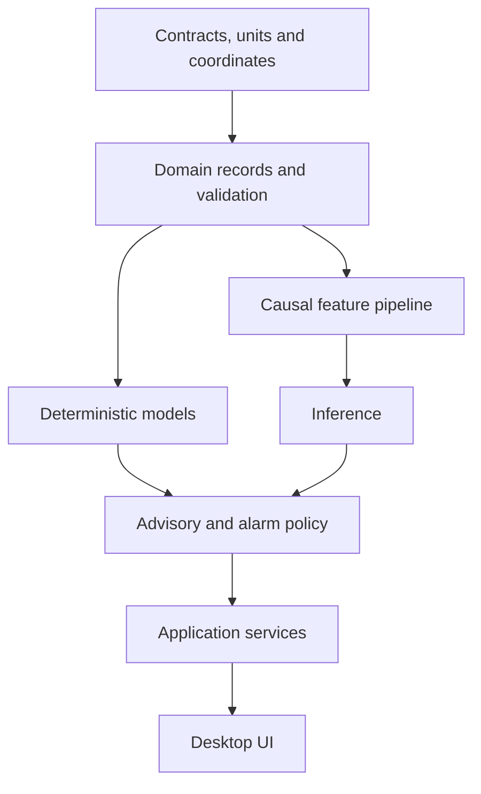
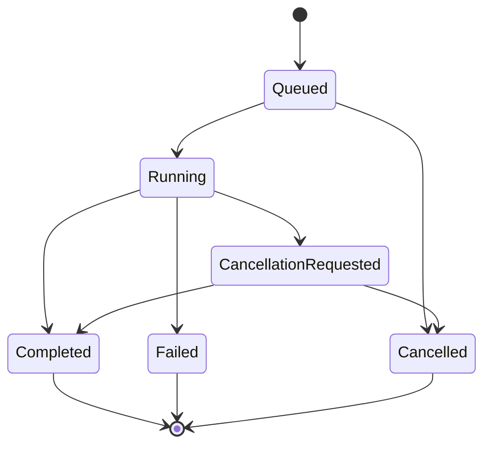

# Part 2 — GeoDrill Pro engineering review and development blueprint  
## Sections 6–9

**The implementation baseline remains an offline-first monitoring, engineering-calculation, and advisory platform.** The contracts below preserve the separation between measurements, interpretations, predictions, recommendations, approvals, and equipment commands.

These are **proposed implementation requirements**. They do not establish that any calculation, model, dataset, interface, or control function has passed validation.

A fundamental rule applies throughout:

> A valid measurement outside an operating limit must remain visible and capable of triggering an alarm. It must not be discarded merely because the operating condition is undesirable.

---

## 6. Data Contracts

### 6.1 Contract conventions

#### 6.1.1 Types, units, references, and missing values

| Convention | Proposed requirement |
|---|---|
| Numeric quantities | Use finite `float64` values for engineering quantities. Do not permit JSON `NaN`, positive infinity, or negative infinity |
| Identifiers | Use UUIDs for internal identity. Preserve external identifiers separately; an API/UWI identifier is not the database primary key |
| Exact integers | Use integers for counts. Encode integers exceeding JavaScript’s exact numeric range as decimal strings in JSON |
| Timestamps | Exchange explicit UTC timestamps with a declared precision. Preserve original source timestamp and timezone information in provenance |
| Timestamp storage | Store using a declared integer or timestamp representation with sufficient precision. Storage precision must not imply equivalent clock accuracy |
| Duration | Seconds internally |
| Geometry | Metres internally; inclination and azimuth in radians |
| Pressure | Pascals, with explicit absolute, gauge, or differential meaning |
| Temperature | Kelvin for absolute temperature; kelvin for temperature differences |
| Rotation | Radians per second internally; retain direction convention |
| Concentration | State whether a fraction is by mass, mole, or volume and identify its reference conditions |
| `null` | Means unavailable, unknown, invalid, withheld, or not applicable, as explicitly identified by a reason |
| Zero | A physical or numerical value. It must never mean “missing” |
| Boolean unknown | Use `null` or an explicit `unknown` enum state; never silently convert to `false` |
| Estimated values | Carry `origin=estimated` and method provenance; never silently replace a measurement |
| Source corrections | Append a new revision referencing the superseded record; preserve the original |
| Time-varying validity | Separate when something happened, when the application learned it, and when it was considered applicable |
| Schema changes | Version schemas independently from application and model versions |
| Unrecognized fields | Reject in authoritative contracts or preserve in a namespaced extension container; never silently use them |

**Null-rule notation used below:**

- **R:** Required for an accepted canonical record.
- **C:** Required when the stated condition applies.
- **O:** Optional; `null` requires a recorded reason when the value is expected but unavailable.

An incomplete import may remain in a staging area. It cannot be promoted to an approved engineering input merely because it was successfully parsed.

**Range notation:**

- **Finite:** A finite numerical value; additional quality checks may apply.
- **Instrument bounds:** The configured measuring range and diagnostic rules of the identified instrument.
- **Model bounds:** The approved applicability domain of the identified calculation or model.
- **Operating bounds:** Approved operational constraints. Crossing them generates a condition to assess; it does not make a measurement intrinsically invalid.

#### 6.1.2 Common record envelope

Every persisted domain record inherits the following envelope.

| Field | Meaning | Type | Unit | Valid range or constraint | Null rule | Source / frequency / quality |
|---|---|---|---|---|---|---|
| `record_id` | Identity of this immutable revision | UUID | — | Unique | R | Application / each record / identity validation |
| `entity_id` | Stable identity across revisions | UUID | — | Resolves within entity type | R | Application / entity creation / identity validation |
| `schema_version` | Contract version | String | — | Supported version | R | Contract registry / each record / compatibility check |
| `project_id` | Owning project | UUID | — | Existing project | R | Application / each record / authorization check |
| `well_id` | Associated well | UUID | — | Existing well in project | C: well-scoped record | Registry / each record / referential integrity |
| `wellbore_id` | Associated borehole or branch | UUID | — | Belongs to `well_id` | C: wellbore-scoped record | Registry / each record / referential integrity |
| `recorded_at` | Time this revision became known locally | UTC timestamp | — | Valid timestamp | R | Local service / each record / clock-quality attached |
| `effective_from` | Beginning of applicability | UTC timestamp | — | Before `effective_to`, if present | C: time-effective configuration | Source or approver / revision / governance check |
| `effective_to` | End of applicability | UTC timestamp | — | After `effective_from` | O | Source or approver / revision / governance check |
| `supersedes_record_id` | Earlier revision replaced by this one | UUID | — | Same logical entity; no cycles | O | Application / revision / lineage check |
| `provenance_ref` | Source and transformation history | Immutable reference | — | Resolvable | R | Ingestion or authoring service / each record / provenance check |
| `field_meta` | Per-field quality, timing, and uncertainty | Map keyed by field path | — | Keys must identify actual fields | R | Quality service / each record / schema validation |
| `content_digest` | Digest of canonical record content | Hex string | — | Approved digest format | R | Application / each revision / integrity check |
| `review_status` | Governance status | Enum | — | `draft`, `reviewed`, `approved`, `withdrawn`, `not_required` | R | Workflow service / change event / authorization check |

A digest can detect content changes. It does not prove who created a record or whether its content is correct. Authentication, signatures where required, access control, and evidence review serve different purposes.

#### 6.1.3 Field quality and provenance

Each important numerical field uses this metadata structure, either directly or by reference to an immutable shared channel definition.

| Field | Meaning | Type | Unit | Constraint | Null rule | Source / frequency / quality |
|---|---|---|---|---|---|---|
| `quality_state` | Current data-quality classification | Enum | — | `good`, `suspect`, `bad`, `unknown` | R | Quality service / observation or revision / rule version recorded |
| `quality_flags` | Specific reasons | Array of enums | — | Versioned vocabulary | R; empty permitted | Source and quality service / observation / preserve both |
| `origin` | Nature of value | Enum | — | `measured`, `entered`, `interpreted`, `calculated`, `estimated`, `interpolated`, `simulated` | R | Producer / each field / consistency check |
| `source_ref` | Instrument, file, laboratory, person, or model | Immutable reference | — | Resolvable | R | Producer / observation or revision / provenance validation |
| `observed_at` | Physical acquisition or observation time | UTC timestamp | — | Valid time | C: observations | Source / native cadence / clock-quality check |
| `received_at` | Local arrival time | UTC timestamp | — | Valid time | C: ingested observations | Ingestion service / arrival / trusted local timestamp |
| `clock_uncertainty_s` | Estimated timing uncertainty | `float64` | s | ≥ 0 | O; unknown must remain unknown | Time service or source / clock update / diagnostic |
| `sample_interval_s` | Actual or declared sample interval | `float64` | s | > 0 | O: irregular/event data | Source metadata or derived / channel revision / timing check |
| `null_reason` | Reason for missing value | Enum | — | `not_measured`, `unavailable`, `invalid`, `not_applicable`, `withheld`, `unknown` | C: expected value is null | Producer / observation / completeness check |
| `uncertainty_ref` | Uncertainty method and parameters | Immutable reference | — | Compatible quantity and basis | O | Calibration/model registry / revision / method review |
| `conversion_ref` | Unit/reference conversion applied | Immutable reference | — | Supported transformation | C: transformed values | Ingestion / observation or batch / conversion test |

Examples of quality flags include `stale`, `out_of_instrument_range`, `clock_unsynchronized`, `calibration_expired`, `flatline`, `source_gap`, `interpolated`, `manual_entry`, `out_of_model_domain`, and `conflicting_sources`.

**Quality is not approval.** A correctly transmitted measurement can be uncalibrated; an approved interpretation can remain uncertain.

#### 6.1.4 Shared referenced objects

The following referenced contracts are required alongside the domain records:

| Object | Required contents |
|---|---|
| `ImmutableRef` | Object type, `record_id`, content digest |
| `SourceDefinition` | Source identity, owner, source type, acquisition location, external identifier, access/licensing reference, calibration reference where applicable |
| `CoordinateDefinition` | CRS definition, axis order, axis units, vertical datum, north reference, transformation version |
| `UncertaintyDefinition` | Quantity, uncertainty type, method, parameters, units, correlation assumptions, applicability, evidence |
| `InputSnapshot` | Ordered immutable input references, relevant time bounds, conversion/configuration/model versions, digest |
| `EngineeringLimitSet` | Quantity-specific limits, location/state applicability, margins, authority, approval, effective interval, rationale |
| `MaterialPropertySet` | Material/grade identity, density, elastic and strength properties, temperature/environment dependence, manufacturer/test evidence |
| `DatasetManifest` | Files and hashes, variables, units, sampling, quality, labels, permitted use, inclusion/exclusion rules, lineage |

Uncertainty types must distinguish standard uncertainty, confidence intervals, prediction intervals, quantiles, engineering bounds, and scenario ranges.

---

### 6.2 Well metadata

**Record:** `WellMetadata`

| Field | Meaning | Type | Unit | Valid range or constraint | Null rule | Source / frequency / quality |
|---|---|---|---|---|---|---|
| `well_name` | Human-readable well name | String | — | Nonempty | R | Operator registry / revision / identity check |
| `external_well_ids` | UWI/API/operator identifiers with namespaces | Array of `{namespace, value}` | — | Unique within namespace | O | Operator/regulator / revision / source verification |
| `operator_ref` | Responsible operating entity | Reference | — | Registered organization | R | Operator / revision / governance |
| `jurisdiction_code` | Governing jurisdiction | String | — | Controlled jurisdiction registry | R | Project authority / revision / governance |
| `well_type` | Intended well function | Enum | — | Approved vocabulary, including `other` with explanation | R | Operator / revision / governance |
| `environment` | Surface environment | Enum | — | `onshore`, `offshore_fixed`, `offshore_floating`, `other` | R | Operator / revision / governance |
| `coordinate_ref` | Coordinate and vertical-reference definition | Reference | — | Complete, supported definition | R | Survey authority / revision / geometry validation |
| `wellhead_easting_m` | Wellhead projected easting | `float64` | m | Finite; CRS area of use | R | Survey / revision / geometry validation |
| `wellhead_northing_m` | Wellhead projected northing | `float64` | m | Finite; CRS area of use | R | Survey / revision / geometry validation |
| `surface_elevation_m` | Ground or declared surface elevation | `float64` | m | Finite; declared vertical datum | R | Survey / revision / geometry validation |
| `md_zero_elevation_m` | Elevation of the MD/TVD zero reference | `float64` | m | Finite; same datum | R | Survey/rig reference / revision / geometry validation |
| `rig_floor_elevation_m` | Rig-floor elevation | `float64` | m | Finite | C: rig-floor-referenced data | Rig/survey / revision / geometry validation |
| `seabed_elevation_m` | Seabed elevation | `float64` | m | Finite | C: offshore geometry calculations | Survey / revision / geometry validation |
| `gravity_m_s2` | Adopted gravitational acceleration | `float64` | m/s² | > 0; approved geographic/model basis | R | Engineering configuration / revision / reviewed assumption |
| `design_basis_ref` | Approved intended-use and design basis | Reference | — | Valid for project | C: engineering approval | Engineering authority / revision / governance |

A well may contain multiple `Wellbore` records. Each requires `wellbore_name`, `parent_wellbore_id` where branched, `branch_origin_md_m` where applicable, and its trajectory reference. Data from different sidetracks must never be joined solely because their measured depths match.

---

### 6.3 Trajectory surveys

**Record:** `SurveyStation`, grouped within a versioned `TrajectoryRevision`.

| Field | Meaning | Type | Unit | Valid range or constraint | Null rule | Source / frequency / quality |
|---|---|---|---|---|---|---|
| `trajectory_ref` | Owning trajectory revision | Reference | — | Same wellbore | R | Survey workflow / station / lineage |
| `station_sequence` | Position within ordered survey set | Integer | — | ≥ 0; unique in revision | R | Survey workflow / station / ordering |
| `survey_time` | Time survey was acquired | UTC timestamp | — | Valid timestamp | O: historical files may lack it | Survey source / station / timing |
| `md_m` | Measured depth from declared origin | `float64` | m | ≥ 0; station ordering validated | R | Survey tool/provider / station / geometry |
| `inclination_rad` | Angle from downward vertical | `float64` | rad | \(0\le I\le\pi\) | R | Survey tool / station / instrument and geometry |
| `azimuth_rad` | Direction from declared north | `float64` | rad | \(0\le A<2\pi\) | C: direction is defined and needed | Survey tool / station / north-reference check |
| `north_reference` | Azimuth reference | Enum | — | `true`, `grid`, `magnetic` | R | Survey provider / revision / geometry |
| `magnetic_correction_ref` | Magnetic/declination correction | Reference | — | Valid location and date | C: magnetic conversion | Survey provider / revision / correction validation |
| `tvd_m` | Derived vertical depth from MD origin | `float64` | m | Finite; trajectory-consistent | O before calculation | Geometry engine / revision / derived |
| `north_offset_m` | Offset from trajectory origin | `float64` | m | Finite | O before calculation | Geometry engine / revision / derived |
| `east_offset_m` | Offset from trajectory origin | `float64` | m | Finite | O before calculation | Geometry engine / revision / derived |
| `survey_tool_ref` | Tool and configuration | Reference | — | Identified tool/configuration | C: uncertainty evaluation | Provider / run or station / provenance |
| `error_model_ref` | Survey uncertainty model | Reference | — | Matches tool and use | C: uncertainty/collision analysis | Provider/engineer / revision / reviewed applicability |
| `position_covariance_m2` | Position covariance in declared N/E/down basis | 3×3 numeric matrix | m² | Symmetric positive semidefinite | O | Uncertainty engine / station / derived |
| `acceptance_status` | Survey acceptance | Enum | — | `pending`, `accepted`, `rejected` | R | Authorized survey reviewer / event / governance |

A mathematically vertical segment does not justify inventing an observed azimuth. The geometry engine must handle the limiting case explicitly.

---

### 6.4 Hole sections

**Record:** `HoleSection`

| Field | Meaning | Type | Unit | Valid range or constraint | Null rule | Source / frequency / quality |
|---|---|---|---|---|---|---|
| `section_name` | Section label | String | — | Nonempty | R | Well programme / revision / metadata |
| `state_basis` | Planned or actual geometry | Enum | — | `planned`, `as_drilled`, `interpreted` | R | Engineer / revision / governance |
| `top_md_m` | Section beginning | `float64` | m | ≥ 0 | R | Programme/drilling record / revision / geometry |
| `bottom_md_m` | Section end | `float64` | m | > `top_md_m` | R | Programme/drilling record / revision / geometry |
| `nominal_diameter_m` | Nominal hole diameter | `float64` | m | > 0 | R | Bit/programme / revision / engineering |
| `diameter_profile_ref` | Measured/interpreted diameter versus depth | Reference | — | Same interval and depth reference | O | Caliper/interpretation / survey or revision / measurement or interpretation |
| `section_type` | Geometrical operating context | Enum | — | `open_hole`, `cased_interval`, `riser`, `other` | R | Engineer / revision / geometry |
| `roughness_m` | Adopted hydraulic roughness | `float64` | m | ≥ 0; model applicability | O; required by selected model | Engineering assumption / revision / reviewed |
| `geometry_uncertainty_ref` | Hole-size/shape uncertainty | Reference | — | Compatible interval | O | Measurement/engineer / revision / uncertainty review |
| `completion_time` | Time section reached recorded extent | UTC timestamp | — | Valid timestamp | O | Drilling record / event / provenance |

Nominal bit diameter must not silently replace a measured washout profile.

---

### 6.5 Casing and liner programmes

**Record:** `TubularInterval`, grouped within a `CasingProgrammeRevision`.

| Field | Meaning | Type | Unit | Valid range or constraint | Null rule | Source / frequency / quality |
|---|---|---|---|---|---|---|
| `programme_ref` | Programme revision | Reference | — | Same wellbore | R | Engineering workflow / revision / governance |
| `string_name` | Casing/liner string identity | String | — | Nonempty | R | Programme / revision / metadata |
| `string_type` | Tubular purpose | Enum | — | `conductor`, `casing`, `liner`, `tieback`, `other` | R | Engineer / revision / engineering |
| `state_basis` | Planned or installed | Enum | — | `planned`, `installed`, `verified_as_built` | R | Engineer/operations / event / governance |
| `top_md_m` | Interval top | `float64` | m | ≥ 0 | R | Design/tally / revision / geometry |
| `bottom_md_m` | Interval bottom | `float64` | m | > top | R | Design/tally / revision / geometry |
| `outside_diameter_m` | Pipe-body OD | `float64` | m | > 0 | R | Manufacturer/tally / revision / traceability |
| `inside_diameter_m` | Adopted pipe-body ID | `float64` | m | \(0<ID<OD\) | R | Manufacturer/tally / revision / traceability |
| `nominal_wall_m` | Nominal wall thickness | `float64` | m | > 0; dimension consistency | R | Manufacturer / revision / traceability |
| `minimum_wall_m` | Qualified minimum initial wall | `float64` | m | \(0<t_{\min}\le t_{\mathrm{nom}}\) | C: strength calculations | Manufacturer/inspection / revision / evidence |
| `linear_mass_kg_m` | Pipe mass per length | `float64` | kg/m | > 0 | R | Manufacturer / revision / evidence |
| `material_ref` | Grade and material properties | Reference | — | Qualified property set | R | Manufacturer / revision / engineering |
| `connection_ref` | Connection type and performance | Reference | — | Applicable size/grade/configuration | C: complete design evaluation | Manufacturer / revision / qualification |
| `hanger_ref` | Liner hanger/tieback arrangement | Reference | — | Compatible assembly | C: applicable string | OEM/programme / revision / engineering |
| `cement_programme_ref` | Cement and isolation design | Reference | — | Same string/interval | C: isolation assessment | Cementing engineer / revision / approval |
| `wear_allowance_m` | Adopted loss allowance | `float64` | m | ≥ 0; below physical wall | C: assessed design basis | Engineer / revision / approved assumption |
| `load_case_set_ref` | Required load cases | Reference | — | Complete for intended evaluation | C: design approval | Engineer / revision / independent review |
| `design_factor_set_ref` | Approved design factors | Reference | — | Quantity- and failure-mode-specific | C: design approval | Operator authority / revision / governance |
| `inspection_ref` | Installed-condition evidence | Reference | — | Traceable inspection | O | Inspection provider / event / measurement |

Cementing and verified zonal isolation require additional execution and integrity records. A casing-geometry record alone cannot establish either.

---

### 6.6 BHA components

**Record:** `BHAComponent`, grouped within a versioned `BHAAssembly`.

| Field | Meaning | Type | Unit | Valid range or constraint | Null rule | Source / frequency / quality |
|---|---|---|---|---|---|---|
| `assembly_ref` | BHA configuration/run | Reference | — | Existing assembly revision | R | BHA engineer / revision / governance |
| `component_type` | Bit, collar, stabilizer, motor, RSS, tool, etc. | Enum | — | Controlled vocabulary | R | Tally/OEM / revision / metadata |
| `serial_number` | Physical component identifier | String | — | Manufacturer namespace | O; required for traceable critical tools | Tally/OEM / installation / traceability |
| `sequence_from_bit` | Assembly ordering | Integer | — | ≥ 0; unique within assembly | R | Tally / revision / geometry |
| `lower_end_offset_m` | Lower-end distance upward from bit datum | `float64` | m | ≥ 0; consistent assembly | R | Tally / revision / geometry |
| `length_m` | Component length | `float64` | m | > 0 | R | Tally/OEM / revision / measurement |
| `body_od_m` | Body OD | `float64` | m | > 0 | R | OEM/tally / revision / engineering |
| `bore_id_m` | Internal flow-bore diameter | `float64` | m | ≥ 0 and < body OD | C: flow/mechanical models | OEM / revision / engineering |
| `contact_od_m` | Effective contact/stabilizer OD | `float64` | m | > 0; geometry-consistent | C: contact models | OEM/measurement / revision / engineering |
| `mass_kg` | Component mass | `float64` | kg | > 0 | R | OEM/tally / revision / evidence |
| `material_ref` | Mechanical material properties | Reference | — | Valid for component | C: structural model | OEM / revision / evidence |
| `stiffness_profile_ref` | Axial/bending/torsional stiffness representation | Reference | — | Declared axes and units | C: nonuniform advanced model | OEM/structural engineer / revision / validated model |
| `connection_ref` | End-connection properties | Reference | — | Compatible connections | C: load evaluation | OEM / revision / evidence |
| `operating_limits_ref` | Qualified component envelope | Reference | — | Correct serial/configuration if relevant | R for operational advice | OEM/operator / revision / approval |
| `sensor_offsets_ref` | Sensor positions/orientations relative to bit | Reference | — | Compatible assembly | C: instrumented tools | OEM/tally / revision / geometry |

Do not infer a proprietary tool’s stiffness from its outside diameter alone.

---

### 6.7 Bit records and dull assessments

**Record:** `BitRun`

| Field | Meaning | Type | Unit | Valid range or constraint | Null rule | Source / frequency / quality |
|---|---|---|---|---|---|---|
| `bit_asset_ref` | Physical bit identity | Reference | — | Traceable bit | R | Bit register / run / identity |
| `manufacturer` | Manufacturer | String | — | Nonempty | R | Vendor record / revision / provenance |
| `model_code` | Bit design/model | String | — | Vendor-defined | R | Vendor record / revision / provenance |
| `bit_type` | Fixed cutter, roller cone, etc. | Enum | — | Controlled vocabulary | R | Vendor / revision / engineering |
| `diameter_m` | Nominal bit diameter | `float64` | m | > 0 | R | Vendor/measurement / run / engineering |
| `nozzle_area_m2` | Total applicable nozzle flow area | `float64` | m² | > 0 | C: nozzle hydraulics | Assembly record / revision / verification |
| `bha_ref` | BHA used for run | Reference | — | Same wellbore/run | R | Tally / run / lineage |
| `run_in_time` | Beginning of run | UTC timestamp | — | Valid timestamp | R | Operations / event / provenance |
| `run_out_time` | End of run | UTC timestamp | — | ≥ run-in time | O: active run | Operations / event / provenance |
| `start_md_m` | Starting drilled depth for run | `float64` | m | ≥ 0 | R | Drilling record / run / geometry |
| `end_md_m` | Ending drilled depth | `float64` | m | ≥ start for ordinary drilling run | O: active run | Drilling record / update / geometry |
| `operating_limits_ref` | Approved bit envelope | Reference | — | Applicable bit/configuration | R for advice | Vendor/operator / revision / governance |
| `dull_assessment_ref` | Post-run inspected condition | Reference | — | Corresponding recovered bit | O | Inspector / recovery / reviewed observation |
| `pull_reason_code` | Reason the run ended | Enum | — | Versioned operational taxonomy | O: active run | Operations/engineer / event / label review |

**Record:** `DullAssessment`

| Field | Meaning | Type | Unit | Valid range or constraint | Null rule | Source / frequency / quality |
|---|---|---|---|---|---|---|
| `grading_system` | IADC or other approved system | Enum/string | — | Registered system | R | Inspector / assessment / taxonomy validation |
| `grading_version` | Exact grading edition/schema | String | — | Supported version | R | Inspector / assessment / taxonomy validation |
| `grade_fields` | Structured grades required by that edition | Versioned typed object | — | Valid codes for bit type and edition | R | Inspector / assessment / reviewed labels |
| `gauge_loss_m` | Measured gauge loss, when available | `float64` | m | ≥ 0 | O | Measurement / inspection / calibration |
| `evidence_refs` | Photos, measurements, inspection notes | Array of references | — | Accessible and attributable | R; minimum evidence policy applies | Inspector / assessment / provenance |
| `inspector_id` | Responsible assessor | UUID | — | Authorized identity | R | Authentication service / assessment / identity |

The `grade_fields` object must be generated from the adopted grading schema. It must not be an unrestricted dictionary or a single invented “wear score.”

---

### 6.8 Mud properties

**Record:** `MudPropertySample`

| Field | Meaning | Type | Unit | Valid range or constraint | Null rule | Source / frequency / quality |
|---|---|---|---|---|---|---|
| `mud_system_ref` | Fluid formulation/batch identity | Reference | — | Existing fluid system | R | Mud engineer / sample / traceability |
| `sample_location` | Flowline, suction, laboratory, etc. | Enum | — | Controlled location | R | Sampler / sample / provenance |
| `sample_time` | Physical sampling time | UTC timestamp | — | Valid timestamp | R | Sampler / sample / timing |
| `test_temperature_k` | Temperature during measurement | `float64` | K | > 0; method range | R for temperature-dependent properties | Instrument/lab / test / calibration |
| `test_pressure_abs_pa` | Absolute test pressure | `float64` | Pa | > 0; method range | R for pressure-dependent properties | Instrument/lab / test / calibration |
| `density_kg_m3` | Measured fluid density | `float64` | kg/m³ | > 0; instrument range | C: density observation | Instrument/lab / test / measurement |
| `rheology_model` | Fitted model family | Enum | — | `none`, `bingham`, `power_law`, `herschel_bulkley`, approved extension | R | Rheology workflow / fit / applicability |
| `yield_stress_pa` | Fitted yield stress | `float64` | Pa | ≥ 0 | C: model uses yield stress | Fit / test or revision / derived |
| `consistency_pa_s_n` | Herschel–Bulkley/power-law consistency | `float64` | Pa·s\(^{n}\) | > 0 | C: model requires it | Fit / test or revision / derived |
| `flow_index` | Rheological exponent \(n\) | `float64` | 1 | > 0; approved fit domain | C: applicable model | Fit / revision / derived |
| `plastic_viscosity_pa_s` | Bingham plastic viscosity | `float64` | Pa·s | > 0 | C: Bingham model | Fit / revision / derived |
| `rheometer_observations_ref` | Raw shear-rate/shear-stress data | Reference | — | Units, geometry, test procedure present | C: fitted rheology approval | Lab/instrument / test / provenance |
| `gel_measurements_ref` | Gel strength with rest times and procedure | Reference | — | Explicit elapsed times and method | O; required by gel-sensitive model | Lab / test / measurement |
| `phase_composition_ref` | Oil/water/solids composition and basis | Reference | — | Fractions consistent with stated method | C: composition-dependent model | Lab/formulation / test or revision / evidence |
| `pvt_model_ref` | Density/compressibility/thermal model | Reference | — | Qualified formulation and domain | C: PVT-dependent calculation | Laboratory/engineer / revision / validation |
| `test_method_ref` | Procedure and edition | Reference | — | Identified method | R | Laboratory / test / traceability |
| `validity_policy_ref` | Age and applicability policy | Reference | — | Approved by mud/engineering authority | R for operational use | Engineering configuration / revision / governance |

Because \(K\)’s dimensions depend on \(n\), the consistency value and exponent form one versioned model fit. Changing the exponent while retaining the old consistency value is invalid.

---

### 6.9 Formation tops

**Record:** `FormationTopInterpretation`

| Field | Meaning | Type | Unit | Valid range or constraint | Null rule | Source / frequency / quality |
|---|---|---|---|---|---|---|
| `formation_code` | Formation identity | String | — | Controlled project stratigraphy | R | Geological register / revision / taxonomy |
| `interpretation_basis` | Planned, correlated, or observed interpretation | Enum | — | Controlled vocabulary | R | Geologist / revision / provenance |
| `top_md_m` | Interpreted intersection along this wellbore | `float64` | m | ≥ 0 | C: along-well pick | Geologist/log interpretation / revision / interpreted |
| `top_tvd_m` | Corresponding TVD | `float64` | m | Finite; consistent reference | C: depth comparison | Geometry/interpretation / revision / derived |
| `depth_lower_m` | Lower numerical depth bound | `float64` | m | ≤ central estimate | O; paired with upper | Interpretation / revision / uncertainty |
| `depth_upper_m` | Upper numerical depth bound | `float64` | m | ≥ lower bound | O; paired with lower | Interpretation / revision / uncertainty |
| `bound_basis` | Scenario, confidence interval, or other basis | Enum | — | Approved uncertainty vocabulary | C: bounds present | Interpreter / revision / method review |
| `dip_rad` | Formation dip magnitude | `float64` | rad | \(0\le d\le\pi/2\) | O | Geological interpretation / revision / interpreted |
| `dip_azimuth_rad` | Dip direction | `float64` | rad | \(0\le a<2\pi\) | C: nonzero dip used | Interpretation / revision / coordinate check |
| `hazard_tags` | Aquifer/reactive/loss-prone/etc. interpretations | Array of enums | — | Each tag has evidence | O | Geologist/engineer / revision / review |
| `evidence_refs` | Logs, cuttings, cores, seismic, offsets | Array of references | — | Traceable | R | Interpreter / revision / provenance |
| `interpreter_id` | Responsible interpretation author | UUID | — | Authorized identity | R | Workflow / revision / governance |

A geological hazard tag must carry an evidence level. A suspected aquifer is not equivalent to a confirmed aquifer, and neither alone establishes isolation.

---

### 6.10 Pore pressure and fracture/loss constraints

**Record:** `PressureConstraintPoint`, grouped into a versioned profile.

| Field | Meaning | Type | Unit | Valid range or constraint | Null rule | Source / frequency / quality |
|---|---|---|---|---|---|---|
| `profile_ref` | Owning interpreted/approved profile | Reference | — | Same wellbore and reference system | R | Engineer / revision / governance |
| `constraint_kind` | Physical meaning | Enum | — | `pore_pressure`, `fracture_initiation`, `fracture_propagation`, `loss_onset`, `test_demonstrated_pressure`, other approved kind | R | Engineer / revision / interpretation |
| `md_m` | Position along wellbore | `float64` | m | ≥ 0 | C: localized along well | Survey/interpretation / revision / geometry |
| `tvd_m` | Vertical depth from declared reference | `float64` | m | Finite | R | Survey/interpretation / revision / geometry |
| `pressure_abs_pa` | Central absolute pressure estimate or observed test pressure | `float64` | Pa | > 0 | C: central estimate available | Test/interpretation / event or revision / measurement or interpreted |
| `lower_bound_pa` | Lower pressure bound | `float64` | Pa | > 0; ≤ upper | O; paired | Interpretation / revision / uncertainty |
| `upper_bound_pa` | Upper pressure bound | `float64` | Pa | ≥ lower | O; paired | Interpretation / revision / uncertainty |
| `bound_basis` | Meaning of bounds | Enum | — | Scenario, engineering bound, quantile, confidence interval | C: bounds provided | Interpreter / revision / method review |
| `probability_level` | Probability associated with statistical bounds | `float64` | 1 | \(0<p<1\) | C: probabilistic bounds | Statistical interpretation / revision / calibration |
| `test_or_method_ref` | Measurement/test or interpretation method | Reference | — | Exact method and conditions | R | Engineer/provider / revision / provenance |
| `temperature_k` | Temperature associated with constraint | `float64` | K | > 0 | O; required if method needs it | Measurement/model / revision / quality |
| `applicable_operation` | Operation/state for which limit applies | Enum/set | — | Approved operation vocabulary | R | Engineering authority / revision / governance |
| `margin_policy_ref` | Separately approved operating margins | Reference | — | Correct quantity/state | C: advisory limit use | Operator authority / revision / approval |
| `evidence_status` | Estimate, measured, interpreted, approved limit | Enum | — | Controlled states | R | Workflow / revision / governance |

A formation integrity test may demonstrate that a pressure was sustained under specified conditions. It must not automatically be stored as a measured fracture pressure.

Equivalent-density or gradient displays should be derived from the pressure and explicitly stated depth/reference convention. Preserve the pressure-based record as the primary engineering quantity.

---

### 6.11 Real-time drilling telemetry

Use a **channel-definition plus observation** model. Do not create a different wide-table schema every time the rig adds a sensor.

**Record:** `ChannelDefinition`

| Field | Meaning | Type | Unit | Valid range or constraint | Null rule | Source / frequency / quality |
|---|---|---|---|---|---|---|
| `channel_code` | Canonical physical quantity | Enum/string | — | Registered channel dictionary | R | Mapping configuration / revision / approval |
| `source_channel_id` | Original channel mnemonic/identifier | String | — | Unique within source | R | Rig interface / revision / mapping verification |
| `source_unit` | Original unit | String | — | Recognized or quarantined | R | Source metadata / revision / dimensional check |
| `canonical_unit` | Internal unit | String | — | Fixed by quantity definition | R | Unit registry / revision / dimensional check |
| `measurement_location` | Surface/downhole/tool/location | Typed object | — | Defined position/reference | R | Rig/OEM mapping / revision / engineering |
| `sign_convention` | Direction of positive value | Enum/string | — | Defined for directional quantities | C | Mapping / revision / engineering review |
| `nominal_sample_period_s` | Source-declared cadence | `float64` | s | > 0 | O: event-driven source | Source / revision / timing |
| `instrument_min` | Lower measuring-range bound | `float64` | Canonical unit | < upper | O; unknown flagged | Calibration/OEM / revision / evidence |
| `instrument_max` | Upper measuring-range bound | `float64` | Canonical unit | > lower | O; unknown flagged | Calibration/OEM / revision / evidence |
| `calibration_ref` | Calibration and validity evidence | Reference | — | Applicable instrument | O; required by use policy | Calibration provider / event / evidence |
| `staleness_limit_s` | Approved maximum usable age | `float64` | s | > 0 | C: live decision support | Engineering configuration / revision / approval |
| `source_priority_policy_ref` | Arbitration among duplicate sources | Reference | — | Explicit, state-dependent if necessary | C: multiple sources | Engineer / revision / approval |

**Record:** `TelemetryObservation`

| Field | Meaning | Type | Unit | Valid range or constraint | Null rule | Source / frequency / quality |
|---|---|---|---|---|---|---|
| `channel_ref` | Immutable channel definition | Reference | — | Resolvable | R | Adapter / sample / mapping check |
| `source_epoch_id` | Source boot/session identity | String/UUID | — | Changes on sequence reset | C: sequence-based source | Source/adapter / session / continuity |
| `source_sequence` | Source sequence number | Exact integer | — | ≥ 0 within epoch | O | Source / sample / duplicate and gap checks |
| `value` | Normalized observation | `float64` or typed enum/boolean | Channel-defined | Physical/instrument checks; preserve excursions | O with reason | Instrument/source / native cadence / field quality |
| `source_value_ref` | Original payload location | Reference | — | Resolvable raw record | R | Ingestion / sample / provenance |
| `operating_state_ref` | State known at this time | Reference | — | Same wellbore/time context | O; absence constrains use | State service / event / derived or measured |
| `depth_context_ref` | Sensor/bit/hole depth alignment | Reference | — | Explicit observation times and offsets | C: depth-based use | Alignment service / sample or window / derived |

Acquisition time, receipt time, timing uncertainty, source, and quality are supplied through the common field metadata.

**Initial channel dictionary**

| Channel code | Meaning | Type | Internal unit | Valid range and null handling | Source / cadence / quality |
|---|---|---|---|---|---|
| `bit_md` | Current bit depth | `float64` | m | ≥ 0; null if unknown | Rig depth system / native, commonly seconds-scale / depth calibration |
| `hole_md` | Drilled hole extent | `float64` | m | ≥ 0; reconcile with bit depth and operation | Rig system / native or event / geometry checks |
| `block_position` | Block height relative to declared datum | `float64` | m | Finite; geometry range | Position sensor / native / calibration and sign |
| `pipe_axial_velocity` | Downward-positive pipe velocity | `float64` | m/s | Signed; instrument range | Sensor/derived / native / derivative noise and timing |
| `hookload` | Surface measured hook load | `float64` | N | Instrument range; physically implausible values flagged | Load sensor / native / calibration |
| `surface_wob` | Surface-derived WOB estimate | `float64` | N | Signed; compressive positive | Rig calculation / native / derived provenance |
| `downhole_wob` | Measured downhole axial bit load | `float64` | N | Signed by approved convention | Downhole tool / actual telemetry cadence / tool quality |
| `surface_torque` | Surface rotation torque | `float64` | N·m | Signed | Top-drive sensor / native / calibration |
| `downhole_torque` | Torque at identified downhole location | `float64` | N·m | Signed | Downhole tool / native telemetry / location and tool quality |
| `surface_angular_speed` | Surface rotational speed | `float64` | rad/s | Signed | Encoder / native / direction check |
| `bit_angular_speed` | Bit rotational speed, measured or estimated | `float64` | rad/s | Signed; origin must distinguish estimate | Downhole tool/model / available cadence / origin and uncertainty |
| `rop` | Rate of advancing drilled depth | `float64` | m/s | Definition/window required; low/negative values gate MSE | Rig/derived / declared window / state and timing |
| `standpipe_pressure_gauge` | SPP relative to identified pressure reference | `float64` | Pa | Instrument bounds; reference required | Pressure sensor / native / calibration |
| `annular_pressure_abs` | Absolute pressure at known annular location | `float64` | Pa | > 0 | Downhole/surface pressure source / native / location, reference, quality |
| `mud_temperature` | Temperature at identified location | `float64` | K | > 0; instrument range | Temperature sensor / native / calibration |
| `gamma_ray` | Tool gamma-ray response | `float64` | Declared API scale | Tool range; no invented SI conversion | LWD/MWD / native depth/time cadence / environmental quality |
| `bulk_density` | Formation bulk-density response | `float64` | kg/m³ | > 0; tool domain | LWD/wireline / native / borehole corrections |
| `neutron_porosity_response` | Tool-calibrated neutron response | `float64` | Fraction | May extend outside 0–1 on an apparent-porosity scale | LWD/wireline / native / lithology-scale and tool metadata |

An apparent neutron-porosity response is not automatically a physically bounded true porosity.

---

### 6.12 Gas and flow measurements

Gas/flow channels inherit the telemetry contracts and add the following context.

| Field | Meaning | Type | Unit | Valid range or constraint | Null rule | Source / frequency / quality |
|---|---|---|---|---|---|---|
| `flow_basis` | Actual volume, standard volume, or mass | Enum | — | Explicit supported basis | R for flow | Meter/source / channel revision / dimensional review |
| `reference_temperature_k` | Reference temperature for normalized volume | `float64` | K | > 0 | C: reference-volume measurement | Source specification / revision / metrology |
| `reference_pressure_abs_pa` | Reference pressure for normalized volume | `float64` | Pa | > 0 | C: reference-volume measurement | Source specification / revision / metrology |
| `composition_basis` | Mole, mass, or volume fraction | Enum | — | Explicit basis | R for concentration | Gas system / revision / metrology |
| `sample_location_ref` | Extraction/measurement location | Reference | — | Identified point | R | Mud-logging/rig system / revision / geometry |
| `transport_lag_s` | Estimated sampling/transport delay | `float64` | s | ≥ 0 | O; unknown retained | Lag model/measurement / update / uncertainty |
| `lag_method_ref` | Lag model or measurement method | Reference | — | Applicable to operating state | C: lag correction | Mud-logging provider / revision / validation |
| `calibration_ref` | Meter/analyser calibration | Reference | — | Applicable instrument | C: quantitative use | Calibration provider / event / evidence |

| Channel code | Meaning | Type | Unit | Valid range and null handling | Source / cadence / quality |
|---|---|---|---|---|---|
| `flow_in_actual` | Actual volumetric flow into defined system | `float64` | m³/s | Signed by declared direction; null if unavailable | Inlet meter / native / calibration |
| `flow_out_actual` | Actual volumetric return flow | `float64` | m³/s | Signed; not interchangeable with a paddle percentage | Return meter / native / calibration |
| `mass_flow_in` | Incoming mass rate | `float64` | kg/s | Signed | Mass meter / native / calibration |
| `mass_flow_out` | Outgoing mass rate | `float64` | kg/s | Signed | Mass meter / native / calibration |
| `active_pit_volume` | Active-system inventory volume | `float64` | m³ | ≥ 0; tank calibration required | Pit system / native / tank mapping |
| `transfer_flow` | Known transfer into defined control volume | `float64` | m³/s | Signed, positive inward | Transfer meter/record / native or event / measured vs entered |
| `total_gas_fraction` | Total reported gas fraction | `float64` | 1 | 0–1 on declared basis | Gas analyser / actual cadence / calibration and lag |
| `methane_fraction` | Methane fraction in identified gas sample | `float64` | 1 | 0–1 on declared basis | Gas analyser / actual cadence / calibration |
| `hydrogen_sulfide_fraction` | H₂S fraction at identified measurement point | `float64` | 1 | 0–1; detection limits preserved | Gas analyser / actual cadence / calibration and detection-limit flags |

Below-detection-limit results need a censoring flag and detection limit. They must not be converted into confirmed zero concentration.

Imported gas measurements do not replace independent rig gas-detection or personnel-protection systems.

---

### 6.13 Surface equipment status

**Record:** `EquipmentStatusObservation`

| Field | Meaning | Type | Unit | Valid range or constraint | Null rule | Source / frequency / quality |
|---|---|---|---|---|---|---|
| `equipment_ref` | Physical equipment identity | Reference | — | Registered asset | R | OEM/rig mapping / observation / identity |
| `equipment_type` | Pump, choke, top drive, drawworks, etc. | Enum | — | Controlled vocabulary | R | Asset register / revision / metadata |
| `operating_mode` | Current mode | Enum | — | `manual`, `automatic`, `maintenance`, `unknown`, approved extensions | R | Controller / change or heartbeat / source quality |
| `availability_state` | Equipment readiness | Enum | — | `available`, `unavailable`, `degraded`, `unknown` | R | Controller / change or heartbeat / source quality |
| `running` | Running indication | Boolean | — | `true`/`false` | O; unknown is null | Controller / native or change / source quality |
| `local_remote_state` | Location of authority | Enum | — | OEM-mapped states plus `unknown` | C: controllable equipment | Controller / change / mapping validation |
| `active_authority_ref` | Current command authority/lease | Reference | — | Valid current authority | C: future supervisory use | OEM/gateway / event / security validation |
| `interlock_states` | Named interlocks with explicit unknown state | Typed map of enums | — | Registered interlock names | C: relevant equipment | Controller / native/change / completeness |
| `actual_position_fraction` | Observed actuator travel | `float64` | 1 | 0–1 after qualified mapping | C: position-equipped actuator | Feedback sensor / native / calibration |
| `fault_codes` | Active OEM faults | Array of strings | — | OEM versioned vocabulary | R; empty only if known | Controller / change / source completeness |
| `heartbeat_age_s` | Age of latest qualified status | `float64` | s | ≥ 0 | R for live display | Gateway / periodic / timing |
| `interface_mapping_ref` | Approved register/node mapping | Reference | — | Correct device/firmware | R | Integrator / revision / reviewed configuration |

Choke travel fraction is not hydraulic flow coefficient. A separate characterized relationship is required.

---

### 6.14 Alarms and events

Use append-only events to construct alarm state. Do not overwrite the history of activation, acknowledgement, shelving, and return to normal.

**Record:** `AlarmEvent`

| Field | Meaning | Type | Unit | Valid range or constraint | Null rule | Source / frequency / quality |
|---|---|---|---|---|---|---|
| `alarm_instance_id` | One alarm occurrence | UUID | — | Stable through lifecycle | R | Alarm service / activation / identity |
| `alarm_definition_ref` | Versioned rationalized alarm | Reference | — | Approved definition | R for operational alarm | Alarm registry / event / governance |
| `event_type` | Lifecycle transition | Enum | — | `activated`, `updated`, `returned_normal`, `acknowledged`, `shelved`, `unshelved`, `disabled`, `enabled` | R | Alarm service / transition / state-machine check |
| `event_time` | Time transition occurred | UTC timestamp | — | Valid time | R | Alarm/source / transition / clock quality |
| `priority` | Rationalized urgency/consequence class | Enum | — | Project alarm philosophy | R | Definition / event / approved mapping |
| `condition_code` | Detected abnormal condition | Enum/string | — | Registered definition | R | Alarm engine / event / rule identity |
| `message` | Operator-facing explanation | String | — | Bounded, sanitized text | R | Definition/template / event / presentation review |
| `input_snapshot_ref` | Evidence used to trigger event | Reference | — | Reproducible | R | Alarm engine / event / lineage |
| `trigger_value` | Triggering quantity, where meaningful | Typed quantity | Defined by alarm | Physical quantity-compatible | O | Calculation/measurement / event / inherited quality |
| `response_procedure_ref` | Approved response information | Reference | — | Current for operation | C: actionable alarm | Operator authority / revision / governance |
| `execution_mode` | Simulation, shadow, or operational context | Enum | — | Explicit supported mode | R | Session policy / event / isolation |
| `suppression_reason` | Why alarm visibility/evaluation changed | Enum/string | — | Authorized reason | C: suppression/shelving | User/policy / event / audit |
| `shelved_until` | Shelving expiry | UTC timestamp | — | After shelving event; policy-bounded | C: shelving | Authorized user / event / policy |
| `correlation_id` | Related event chain | UUID | — | Valid identity | O | Event service / event / lineage |

General `SystemEvent` records additionally cover source disconnection, stale channels, configuration activation, model abstention, storage failure, restart, and recovery.

---

### 6.15 Model predictions

**Record:** `ModelPrediction`

| Field | Meaning | Type | Unit | Valid range or constraint | Null rule | Source / frequency / quality |
|---|---|---|---|---|---|---|
| `model_bundle_ref` | Exact approved model and preprocessing | Reference | — | Immutable registered bundle | R | Inference service / prediction / signature and compatibility |
| `input_snapshot_ref` | Exact inputs | Reference | — | Reproducible | R | Inference service / prediction / lineage |
| `target_code` | Predicted quantity/event | Enum/string | — | Model target registry | R | Model manifest / prediction / semantic validation |
| `issued_at` | Time prediction was produced | UTC timestamp | — | Valid time | R | Inference service / prediction / timing |
| `knowledge_cutoff_at` | Latest arrival time allowed in features | UTC timestamp | — | ≤ issue time | R | Feature pipeline / prediction / causality |
| `last_observation_at` | Latest required physical observation | UTC timestamp | — | Valid source time | R for time-series model | Inputs / prediction / timing quality |
| `horizon_s` | Forecast horizon | `float64` | s | ≥ 0; model domain | R; zero for current-state estimate | Request/model / prediction / applicability |
| `result_kind` | Numeric estimate, probability, or classification | Enum | — | Declared by model | R | Model manifest / prediction / contract |
| `estimate` | Numeric point estimate | `float64` | Target-defined SI unit | Finite; target domain | C: numeric output | Model / prediction / result validity |
| `class_probabilities` | Probability per declared class | Array of `{class_code, probability}` | 1 | Each 0–1; sum within declared numerical tolerance | C: probabilistic classifier | Model/calibrator / prediction / calibration status |
| `interval_lower` | Lower prediction bound | `float64` | Target unit | ≤ upper | O; paired | Model/uncertainty method / prediction / calibration |
| `interval_upper` | Upper prediction bound | `float64` | Target unit | ≥ lower | O; paired | Model/uncertainty method / prediction / calibration |
| `interval_level` | Nominal interval probability | `float64` | 1 | \(0<p<1\) | C: probabilistic interval | Model manifest / prediction / calibration |
| `uncertainty_method_ref` | Meaning and derivation of uncertainty | Reference | — | Approved method | C: uncertainty output | Registry / prediction / evidence |
| `applicability_status` | Whether case is supported | Enum | — | `in_domain`, `borderline`, `out_of_domain`, `unknown` | R | Applicability checks / prediction / rule version |
| `result_status` | Validity or abstention | Enum | — | Part 1 result-status vocabulary | R | Inference service / prediction / contract |
| `abstention_reasons` | Why no usable output was issued | Array of enums | — | Registered reasons | C: nonvalid output | Inference service / prediction / diagnostics |
| `expires_at` | End of action-oriented validity | UTC timestamp | — | > issue time when actionable | C: live advisory use | Policy service / prediction / freshness policy |
| `execution_mode` | Simulation, shadow, or advisory | Enum | — | Authorized mode | R | Session policy / prediction / isolation |

A raw anomaly score belongs in a separately named score field with its own scale. It must not be labelled “probability” unless calibration supports that meaning.

---

### 6.16 Engineering recommendations

**Record:** `EngineeringRecommendation`

| Field | Meaning | Type | Unit | Valid range or constraint | Null rule | Source / frequency / quality |
|---|---|---|---|---|---|---|
| `recommendation_type` | Review, investigate, compare scenario, proposed parameter change | Enum | — | Approved recommendation catalogue | R | Advisory service/engineer / event / policy |
| `input_snapshot_ref` | Evidence at generation | Reference | — | Immutable | R | Advisory service / event / lineage |
| `supporting_result_refs` | Calculations and predictions used | Array of references | — | Valid/relevant results | R | Advisory service / event / dependency checks |
| `proposed_action_code` | Human-readable action category | Enum | — | Explicitly approved vocabulary | R | Engineer/rule / event / policy |
| `target_parameter` | Quantity under consideration | Enum | — | Registered engineering quantity | C: parameter proposal | Engineer/rule / event / dimensional check |
| `proposed_value` | Proposed target | `float64` | Parameter-defined unit | Within qualified candidate domain | C: numerical target | Engineer/model / event / constraint check |
| `proposed_lower` | Lower proposed range | `float64` | Parameter unit | ≤ upper | C: range proposal | Engineer/model / event / constraint check |
| `proposed_upper` | Upper proposed range | `float64` | Parameter unit | ≥ lower | C: range proposal | Engineer/model / event / constraint check |
| `limit_set_ref` | Approved limits applied | Reference | — | Applicable current set | C: actionable operational proposal | Policy service / event / governance |
| `constraint_evaluation_ref` | Detailed checks and uncertainty treatment | Reference | — | Complete for action category | R | Physics/policy service / event / verified checks |
| `rationale` | Engineering explanation | String | — | Bounded text with evidence links | R | Engineer/advisory service / event / review |
| `required_role` | Competence/authority needed | Enum/reference | — | Authorization policy | R | Policy service / event / governance |
| `workflow_status` | Review state | Enum | — | `draft`, `pending_review`, `approved`, `rejected`, `expired`, `invalidated`, `withdrawn` | R | Workflow / event / transition validation |
| `valid_from` | Beginning of applicability | UTC timestamp | — | Valid time | R | Policy / event / freshness |
| `expires_at` | End of applicability | UTC timestamp | — | > valid-from | R for live recommendation | Policy / event / freshness |
| `invalidation_conditions_ref` | Changes requiring reassessment | Reference | — | Defined conditions | R | Engineering policy / revision / governance |
| `execution_mode` | Simulation/shadow/advisory | Enum | — | Authorized mode | R | Session / event / isolation |

An approved recommendation remains an engineering record. It is not an equipment command.

---

### 6.17 User acknowledgements and approvals

**Record:** `UserAcknowledgement`

| Field | Meaning | Type | Unit | Valid range or constraint | Null rule | Source / frequency / quality |
|---|---|---|---|---|---|---|
| `target_ref` | Exact alarm/recommendation revision acknowledged | Reference | — | Resolvable | R | Request/service / action / revision check |
| `actor_id` | Authenticated person | UUID | — | Active identity | R; server-derived | Authentication service / action / identity |
| `actor_role_snapshot_ref` | Authority held at action time | Reference | — | Valid role snapshot | R | Authorization service / action / audit |
| `acknowledged_at` | Local recorded action time | UTC timestamp | — | Valid timestamp | R; server-derived | Service / action / timing |
| `acknowledgement_kind` | What user confirms | Enum | — | `seen`, `understood`, `review_started` | R | User / action / workflow |
| `comment` | Optional explanation | String | — | Bounded/sanitized | O | User / action / attributable |
| `session_id` | Authenticated session | UUID | — | Valid session | R | Service / action / audit |
| `client_action_id` | Retry/deduplication identity | UUID | — | Unique per user action | R | Client / action / idempotency |

**Separate record:** `EngineeringApproval`

It requires the same identity and target binding, plus:

| Field | Meaning | Type | Unit | Valid range or constraint | Null rule | Source / frequency / quality |
|---|---|---|---|---|---|---|
| `decision` | Approval decision | Enum | — | `approve`, `reject` | R | Authorized approver / action / policy |
| `approval_scope_ref` | What the approval authorizes | Reference | — | Explicit well/operation/action scope | R | Policy/approver / action / governance |
| `evidence_digest` | Evidence reviewed | Hex string | — | Matches current target package | R | Service / action / integrity |
| `conditions` | Additional approval conditions | Array of typed conditions | — | Machine-readable where enforceable | R; empty permitted | Approver / action / review |
| `expires_at` | Approval expiry | UTC timestamp | — | Policy-valid | C: time-bound operational approval | Policy / action / freshness |

Acknowledgement and approval use different endpoints, permissions, and audit event types.

---

### 6.18 Control commands

**Status: future interface contract; simulation-only in the initial product.**

The MVP contains no live PLC-write implementation or credentials. These fields define the evidence and restrictions a later integration would need.

**Record:** `SupervisoryCommandRequest`

| Field | Meaning | Type | Unit | Valid range or constraint | Null rule | Source / frequency / quality |
|---|---|---|---|---|---|---|
| `command_id` | Unique request identity | UUID | — | Unique | R | Authorized request service / action / identity |
| `target_equipment_ref` | Exact physical target | Reference | — | Allowlisted asset/interface | R | Configuration / action / security and mapping |
| `command_type` | Approved supervisory operation | Enum | — | Explicit gateway allowlist | R | Request / action / authorization |
| `parameter_code` | Target quantity | Enum | — | Supported by command type | R | Request / action / semantics |
| `target_value` | Requested value | `float64` | Parameter-defined SI unit | Approved command envelope | R | Approved recommendation / action / constraints |
| `max_rate_per_s` | Permitted target rate of change | `float64` | Parameter unit/s | > 0; approved envelope | C: rate-limited command | Limit policy / action / constraints |
| `max_duration_s` | Maximum request duration | `float64` | s | > 0; bounded | R | Policy / action / constraints |
| `recommendation_ref` | Underlying approved recommendation | Reference | — | Current exact revision | R | Workflow / action / lineage |
| `approval_ref` | Human approval and authority | Reference | — | Valid scope and evidence | R | Approval service / action / authorization |
| `input_snapshot_ref` | Data used for request | Reference | — | Fresh and qualified | R | Request service / action / freshness |
| `limit_set_ref` | Independent permitted envelope | Reference | — | Current for equipment/mode | R | Gateway configuration / action / independent check |
| `required_mode` | Required equipment/process mode | Enum | — | Approved mode | R | Safety/integration design / action / state validation |
| `precondition_set_ref` | Readiness and process preconditions | Reference | — | All evaluable | R | Integration design / action / independent check |
| `authority_lease_ref` | Current exclusive authority | Reference | — | Valid and unexpired | R | Gateway/OEM / action / authority |
| `issued_at` | Request creation time | UTC timestamp | — | Trusted timing | R | Request service / action / clock check |
| `expires_at` | Deadline after which request is rejected | UTC timestamp | — | > issue time; policy-bounded | R | Policy / action / freshness |
| `sequence_number` | Monotonic request sequence within authority session | Exact integer | — | Strictly increasing | R | Gateway/session / action / replay protection |
| `idempotency_key` | Retry identity | UUID/string | — | Bound to identical content | R | Client/service / action / deduplication |
| `expected_state_digest` | State against which request was approved | Hex string | — | Revalidated before use | R | State service / action / concurrency check |
| `request_digest` | Integrity of full request | Hex string | — | Matches canonical request | R | Service / action / integrity |
| `authorization_proof_ref` | Authenticated request proof | Reference | — | Valid for designated gateway | R in future live use | Security service / action / authentication |
| `execution_mode` | Simulation or separately authorized live mode | Enum | — | `simulation` in MVP | R | Deployment policy / action / hard enforcement |

A separate `CommandLifecycleEvent` records `created`, `validated`, `rejected`, `accepted_by_gateway`, `accepted_by_controller`, `response_observed`, `completed`, `cancelled`, `expired`, or `outcome_unknown`.

**Mandatory semantics:**

- Retry must not create an additional actuation.
- A communications acknowledgement is not proof of physical completion.
- A timeout with uncertain equipment state must produce `outcome_unknown`, not automatic success or an unconditional retry.
- Approval validity must be checked again at dispatch.
- Old offline requests must never execute automatically when connectivity returns.
- Loss of reliable timing or authority inhibits new commands.
- Process-specific fault response belongs to the approved control architecture.

---

### 6.19 Explicit boundary conversions

Examples of required conversion rules:

\[
L_{\mathrm{m}}=0.3048L_{\mathrm{ft}}
\]

\[
F_{\mathrm{N}}=4.4482216152605F_{\mathrm{lbf}}
\]

\[
P_{\mathrm{Pa}}\approx6894.757293168P_{\mathrm{psi}}
\]

\[
\omega_{\mathrm{rad/s}}=\frac{2\pi}{60}N_{\mathrm{rpm}}
\]

\[
\rho_{\mathrm{kg/m^3}}
=
\frac{0.45359237}{0.003785411784}
\rho_{\mathrm{lbm/US\,gal}}
\]

\[
T_{\mathrm{K}}=(T_{\mathrm{^\circ F}}-32)\frac{5}{9}+273.15
\]

\[
P_{\mathrm{abs}}=P_{\mathrm{gauge}}+P_{\mathrm{reference}}
\]

Here each subscript identifies the quantity’s unit. \(P_{\mathrm{reference}}\) must be the appropriate measured or explicitly assumed pressure reference in Pa.

**Implementation requirements:**

1. Distinguish US gallons from Imperial gallons.
2. Distinguish pound mass from pound force.
3. Convert absolute temperatures differently from temperature differences.
4. Preserve gauge/absolute/differential pressure semantics.
5. Preserve original units and raw values.
6. Test conversions in both directions.
7. Never infer a unit from a numerical magnitude alone.
8. Do not convert a sensor percentage into physical flow without a qualified transfer function.

---

## 7. Software Repository Design

### 7.1 Recommended monorepo structure

The following is a **proposed repository layout**, not a claim that these files have been created.

```text
geodrill-pro/
├── README.md
├── CONTRIBUTING.md
├── SECURITY.md
├── CODEOWNERS
├── pyproject.toml
├── Cargo.toml
├── package.json
├── dependency-lockfiles/
│
├── apps/
│   └── desktop/
│       ├── src/                     # React application
│       ├── src-tauri/               # Tauri shell and restricted native commands
│       ├── public/
│       └── tests/
│
├── services/
│   ├── api/                         # FastAPI application and authorization
│   ├── ingestion/                   # Source-adapter process
│   ├── engineering_worker/          # Calculation job host
│   ├── inference_worker/            # Approved inference job host
│   └── reporting_worker/            # Report/export job host
│
├── packages/
│   ├── python/
│   │   ├── domain/
│   │   ├── units/
│   │   ├── coordinates/
│   │   ├── data_quality/
│   │   ├── physics/
│   │   │   ├── trajectory/
│   │   │   ├── tubulars/
│   │   │   ├── petrophysics/
│   │   │   ├── em_inversion/
│   │   │   ├── hydraulics/
│   │   │   ├── geomechanics/
│   │   │   ├── cuttings_transport/
│   │   │   ├── surge_swab/
│   │   │   ├── mse/
│   │   │   ├── torque_drag/
│   │   │   ├── buckling/
│   │   │   ├── bha_dynamics/
│   │   │   ├── casing_wear/
│   │   │   ├── fatigue/
│   │   │   └── multiphase/
│   │   ├── features/
│   │   ├── advisory/
│   │   ├── alarms/
│   │   ├── storage/
│   │   └── audit/
│   │
│   ├── rust/
│   │   ├── supervisor/
│   │   ├── telemetry_buffer/
│   │   ├── durable_journal/
│   │   └── validated_kernels/
│   │
│   └── typescript/
│       ├── contracts/
│       ├── api_client/
│       ├── visualization/
│       └── ui_components/
│
├── adapters/
│   ├── las/
│   ├── csv/
│   ├── witsml21_etp12/
│   ├── witsml_legacy/
│   ├── vendor_imports/
│   └── ot_readonly/
│
├── contracts/
│   ├── jsonschema/
│   ├── openapi/
│   ├── streaming/
│   ├── channel_dictionary/
│   ├── error_codes/
│   ├── examples/
│   └── compatibility/
│
├── database/
│   ├── migrations/
│   ├── schema/
│   ├── repositories/
│   └── recovery_tests/
│
├── ml/
│   ├── dataset_manifests/
│   ├── labeling/
│   ├── training/
│   ├── evaluation/
│   ├── calibration/
│   ├── conversion/
│   ├── model_cards/
│   └── registry_manifests/
│
├── simulation/
│   ├── scenarios/
│   ├── signal_generators/
│   ├── replay/
│   ├── fault_injection/
│   ├── plant_models/
│   └── hil_interfaces/
│
├── integration/
│   ├── interface_specifications/
│   ├── readonly_conformance/
│   └── supervisory_simulation/
│
├── config/
│   ├── schemas/
│   ├── defaults/
│   ├── correlation_catalogue/
│   ├── alarm_definitions/
│   ├── operating_envelopes/
│   └── deployment_profiles/
│
├── tests/
│   ├── unit/
│   ├── dimensional/
│   ├── property/
│   ├── numerical_benchmarks/
│   ├── regression/
│   ├── contract/
│   ├── integration/
│   ├── replay/
│   ├── performance/
│   ├── security/
│   ├── end_to_end/
│   └── fixtures/
│
├── docs/
│   ├── requirements/
│   ├── architecture/
│   ├── decisions/
│   ├── engineering_models/
│   ├── safety/
│   ├── cybersecurity/
│   ├── standards_register/
│   ├── verification/
│   ├── validation/
│   ├── operations/
│   └── user_guides/
│
├── deployment/
│   ├── packaging/
│   ├── signing/
│   ├── installers/
│   ├── offline_updates/
│   ├── backup_restore/
│   └── qualification/
│
└── tools/
    ├── schema_generation/
    ├── dependency_audit/
    ├── evidence_packaging/
    └── developer_utilities/
```

### 7.2 Directory responsibilities and ownership

| Directory | Responsibility | Required boundary |
|---|---|---|
| `apps/desktop` | User workflows, visualization, local application lifecycle | No engineering authority based solely on frontend checks |
| `services/api` | Authentication, authorization, commands to application services, job tracking | No long-running solver execution in HTTP request handlers |
| `services/ingestion` | Source connections, raw preservation, normalization orchestration | Cannot approve engineering limits or access equipment-write interfaces |
| `services/engineering_worker` | Execute released deterministic calculations | No model training and no PLC access |
| `services/inference_worker` | Load approved model bundles and produce qualified predictions | No dynamic code download, self-training, or equipment authority |
| `services/reporting_worker` | Generate reproducible reports from immutable snapshots | Clearly label historical, simulated, conditional, and expired outputs |
| `packages/python/domain` | Domain entities and invariants | No UI or transport dependencies |
| `units` and `coordinates` | Centralized dimensional/reference transformations | Every change requires broad impact analysis |
| `data_quality` | Quality checks and propagation | Cannot silently repair evidence or conceal excursions |
| `physics` | Model implementations with explicit assumptions and validity | Modules depend on shared contracts, not one another’s private internals |
| `features` | Causal feature extraction shared by training and inference | Identical feature semantics across environments |
| `advisory` | Recommendation eligibility and evidence assembly | Does not provide protective-system certification |
| `alarms` | Alarm definitions, state transitions, and rationalization metadata | Separate acknowledgement, shelving, and approval |
| `storage` | Persistence, manifests, retrieval, and snapshots | Centralized ownership of mutable state |
| `audit` | Attributable events and integrity evidence | No routine destructive history editing |
| `packages/rust` | Process supervision, bounded data movement, selected performance kernels | Port kernels only with reference-parity evidence |
| `packages/typescript` | Generated contracts, typed client, reusable UI/visual components | Generated code is not manually edited |
| `adapters` | Source-specific parsing and mappings | Canonical semantics are owned by `contracts`, not individual vendors |
| `contracts` | Authoritative schemas and compatibility policy | Breaking changes require explicit migration and release review |
| `database` | SQLite schemas, migrations, repository patterns, recovery tests | Migrations do not silently reinterpret historical engineering values |
| `ml` | Training and evaluation workflows and approved manifests | Raw proprietary datasets and credentials are not committed |
| `simulation` | Test signals, independent scenarios, replay, fault injection | Simulation artefacts cannot be mistaken for operational data |
| `integration` | Interface definitions and isolated integration tests | No live-write implementation in the MVP |
| `config` | Versioned nonsecret configuration and reviewed engineering policies | Site-specific approvals remain separate from generic defaults |
| `docs` | Requirements, models, decisions, safety evidence, operational instructions | Every released capability links to its evidence |
| `deployment` | Offline installation, update, signing, backup, and hardware qualification | Signing keys are external to source control |
| `tools` | Development and evidence automation | Tools cannot bypass release approval or silently alter benchmarks |

A folder for a deferred module is a reserved boundary, not a commitment to implement all 17 modules immediately.

### 7.3 Dependency rules

Recommended allowed dependency direction:



Additional rules:

- Physics packages must not import ML packages to evaluate essential engineering constraints.
- Feature extraction must not depend on future labels or post-event data.
- UI code must not be the source of truth for operating limits.
- Adapters must not invent missing channel semantics.
- Simulation packages must not be imported into production paths except through explicitly enabled, isolated interfaces.
- A module consumes another module’s **versioned result contract**, not its internal object structure.
- Avoid circular dependencies by orchestrating coupled models in an explicit calculation workflow.

### 7.4 Schema authority and code generation

Use one authoritative schema definition for each contract, with generated or mechanically checked representations in Python, Rust, and TypeScript.

Recommended arrangement:

1. JSON Schema definitions in `contracts/jsonschema`.
2. A pinned OpenAPI description for HTTP operations.
3. A separate streaming-message specification.
4. Generated transport types and client code.
5. Handwritten domain validators for cross-field engineering invariants.
6. Golden valid/invalid examples shared across all languages.
7. Compatibility tests against prior supported schema versions.

OpenAPI describes HTTP interfaces and schemas; it does not validate physical units, engineering applicability, or process safety. Those remain application requirements. A pinned supported version should be selected rather than treating “latest” as an uncontrolled dependency. [OpenAPI specification](https://spec.openapis.org/oas/v3.1.1.html)

### 7.5 Storage and concurrency design

**SQLite**

- One application-owned transactional write path.
- Short transactions.
- Explicit retry policy for ordinary lock contention.
- Transactional outbox for events that must accompany state changes.
- Consistent backup and recovery procedures.
- No direct database access from the frontend.
- No live database inside a synchronized or network-shared directory.

**Parquet**

- Immutable partitions.
- Temporary write followed by validation and atomic publication.
- Checksums and a publication manifest.
- Orphan-file reconciliation after interruption.
- Schema version included in metadata.
- Raw, normalized, and derived data stored separately.

**DuckDB**

- Prefer separate read-oriented query workers over immutable data.
- Centralize any persistent DuckDB metadata writes.
- Do not design around multiple uncontrolled processes writing the same database.
- Evaluate the pinned release’s documented concurrency behaviour. [DuckDB concurrency documentation](https://duckdb.org/docs/current/connect/concurrency)

**Polars**

- Inspect execution plans for critical pipelines.
- Test memory use for the actual operations.
- Streaming support does not imply that every operation remains out of memory: the documentation notes that some operations may fall back to in-memory execution. [Polars streaming documentation](https://docs.pola.rs/user-guide/concepts/streaming/)

### 7.6 Build and release controls

Each release should include:

- Application, schema, model, configuration, and database compatibility versions.
- Dependency lockfiles and software bill of materials.
- Reproducible build instructions.
- Signed executable and model bundles where applicable.
- Required runtime and CPU feature list.
- Supported hardware/OS matrix.
- Numerical benchmark results.
- Security and recovery test results.
- Known limitations.
- Approved intended-use statement.
- Upgrade and rollback procedures.

Changes to units, references, channel mappings, model equations, uncertainty treatment, alarm behaviour, or command semantics require a higher review level than ordinary presentation changes.

---

## 8. API Design

### 8.1 API principles

**Proposed interface:** versioned local HTTP API under `/api/v1`, plus authenticated streaming.

Requirements:

1. Bind to a restricted local interface by default.
2. Authenticate requests even on localhost.
3. Authorize by project and action, not merely by role name.
4. Treat Tauri native capabilities as a restricted interface.
5. Validate all requests server-side.
6. Require idempotency keys for retryable mutations.
7. Use immutable references and snapshots for engineering jobs.
8. Use asynchronous jobs for expensive operations.
9. Separate acceptance of a job from validity of its eventual result.
10. Keep ordinary API responses free of secrets and internal stack traces.
11. Do not accept arbitrary filesystem paths, arbitrary SQL, Python expressions, or model code.
12. Do not expose a live equipment-command endpoint in the MVP.

### 8.2 Authorization scopes

| Scope | Typical holder | Meaning |
|---|---|---|
| `project:read` | Viewer and above | Read authorized project data |
| `project:create` | Analyst/project owner | Initialize a project |
| `data:ingest` | Analyst | Upload and stage source data |
| `data:commit` | Analyst or designated engineer | Commit validated imports within authority |
| `mapping:approve` | Qualified engineer/integrator | Approve source semantics and critical mappings |
| `connection:manage` | Administrator/integrator | Configure allowed read-only connectors |
| `calculation:run` | Analyst/engineer | Execute released engineering methods |
| `model:infer` | Authorized analyst/service | Execute approved models |
| `alarm:acknowledge` | Authorized operator | Acknowledge alarms |
| `alarm:shelve` | Specifically authorized operator | Apply bounded shelving |
| `recommendation:create` | Engineer/advisory service | Create recommendation records |
| `engineering:approve` | Qualified approver | Approve specified engineering artefacts |
| `simulation:run` | Analyst/engineer | Run isolated simulation/replay |
| `report:export` | Authorized user | Export project evidence |
| `system:admin` | Administrator | Technical configuration and diagnostics |

Role assignment grants a set of scopes. It does not automatically establish engineering competence for every well, module, or operation.

### 8.3 Common request and response objects

| Schema | Required contents |
|---|---|
| `ProjectCreate` | Name, description, intended-use profile reference, initial well metadata or explicit empty-project state, display-unit preference |
| `ProjectView` | Project ID, revision, well references, execution mode, intended-use profile, created time |
| `FileAsset` | Asset ID, original filename, media type, byte count, digest, storage status |
| `IngestionRequest` | File asset reference, parser/version, mapping reference, target well/wellbore, import options, execution mode |
| `IngestionReview` | Parsed counts, accepted/quarantined counts, unit/reference issues, preview references, source digest, review digest |
| `CommitIngestion` | Review digest, approved mapping revision, expected target revision |
| `WitsmlConnectionCreate` | Allowed endpoint, WITSML/ETP version, secret reference, trust configuration reference, well mapping, read-only policy |
| `ConnectionProbe` | Negotiated capabilities, supported objects, clock/delivery observations, trust result, diagnostics |
| `TelemetryQuery` | Wellbore, channel references, start/end, resolution, quality filter, cursor, limit |
| `CalculationRequest` | Method/version, input snapshot, parameter set, uncertainty policy, output selection, execution mode |
| `CalculationResult` | Result status, typed values/artifacts, applicability, assumptions, convergence, uncertainty, provenance |
| `InferenceRequest` | Model bundle, input snapshot, target/horizon, execution mode |
| `AlarmQuery` | Time bounds, active/history selection, priorities, acknowledgement/shelving filters, cursor |
| `AcknowledgementCreate` | Exact target reference, acknowledgement kind, comment, client action ID |
| `ApprovalCreate` | Exact target/evidence digest, decision, scope, conditions, expiry, reason |
| `SimulationRequest` | Scenario revision, model/configuration set, seed where relevant, time bounds, fault schedule |
| `ReportRequest` | Template/version, input snapshot, selected sections, export format, intended-use label |
| `JobAccepted` | Job ID, queued time, status URL, result URL when available |
| `JobView` | State, progress where meaningful, timestamps, result reference, cancellation state, diagnostics |
| `PagedResult<T>` | Items, next cursor, snapshot/watermark reference |
| `SystemHealth` | Component status, source age, clock status, queue/storage state, capability-specific readiness |

Actor identity, creation time, approval authority, and resulting status are assigned or verified server-side.

### 8.4 Representative HTTP endpoints

In the table below, `{project_id}` and other path parameters are validated UUIDs or registered identifiers.

| Method | Route | Request schema | Response schema | Principal error conditions | Authorization |
|---|---|---|---|---|---|
| `POST` | `/api/v1/projects` | `ProjectCreate` | `201 ProjectView` | Invalid intended-use profile; duplicate idempotency key with different content; invalid metadata | `project:create` |
| `GET` | `/api/v1/projects/{project_id}` | Path only | `200 ProjectView` | Unknown/inaccessible project | `project:read` |
| `POST` | `/api/v1/projects/{project_id}/files` | Multipart binary plus declared media type/digest | `201 FileAsset` | Size limit, unsupported media, digest mismatch, storage failure | `data:ingest` |
| `POST` | `/api/v1/projects/{project_id}/ingestions` | `IngestionRequest` | `202 JobAccepted` | Unsupported parser, bad source reference, mapping mismatch | `data:ingest` |
| `GET` | `/api/v1/projects/{project_id}/ingestions/{ingestion_id}` | Path only | `200 IngestionReview` | Unknown import; review not yet available | `project:read` |
| `POST` | `/api/v1/projects/{project_id}/ingestions/{ingestion_id}/commit` | `CommitIngestion` | `200` committed dataset/snapshot references | Unresolved critical mapping, stale review digest, concurrent target change | `data:commit`; `mapping:approve` where required |
| `POST` | `/api/v1/projects/{project_id}/connections/witsml` | `WitsmlConnectionCreate` | `201` connection configuration | Unapproved endpoint, unsupported version, invalid trust/secret reference | `connection:manage` |
| `POST` | `/api/v1/projects/{project_id}/connections/{connection_id}/probe` | Probe options and bounded timeout | `202 JobAccepted`; result `ConnectionProbe` | Trust failure, authorization failure, incompatible server, timeout | `connection:manage` |
| `POST` | `/api/v1/projects/{project_id}/connections/{connection_id}/start` | Expected configuration revision | `202 JobAccepted` | Mapping unapproved, expired credentials, conflicting session | `connection:manage` |
| `POST` | `/api/v1/projects/{project_id}/connections/{connection_id}/stop` | Reason and expected revision | `200` connection state | Invalid transition or stale revision | `connection:manage` |
| `GET` | `/api/v1/projects/{project_id}/telemetry` | `TelemetryQuery` as validated query parameters | `200 PagedResult<TelemetryObservation>` | Invalid interval, excessive request, unavailable snapshot | `project:read` |
| `POST` | `/api/v1/projects/{project_id}/telemetry/batches` | Authenticated source batch with channel and sequence metadata | `202` batch receipt | Unknown source, mapping mismatch, payload limit, invalid signature where required | Source-specific ingestion identity |
| `POST` | `/api/v1/projects/{project_id}/calculations` | `CalculationRequest` | `202 JobAccepted` | Unreleased method, missing inputs, unit/reference mismatch, unsupported requested regime | `calculation:run` |
| `GET` | `/api/v1/projects/{project_id}/calculations/{calculation_id}` | Path only | `200 CalculationResult` | Unknown result; result not yet published | `project:read` |
| `POST` | `/api/v1/projects/{project_id}/predictions` | `InferenceRequest` | `202 JobAccepted` | Unapproved model, feature mismatch, unsupported horizon, incompatible runtime | `model:infer` |
| `GET` | `/api/v1/projects/{project_id}/predictions/{prediction_id}` | Path only | `200 ModelPrediction` | Unknown prediction | `project:read` |
| `GET` | `/api/v1/projects/{project_id}/alarms` | `AlarmQuery` | `200 PagedResult<AlarmView>` | Invalid filter or cursor | `project:read` |
| `POST` | `/api/v1/projects/{project_id}/alarms/{alarm_id}/acknowledgements` | `AcknowledgementCreate` | `201 UserAcknowledgement` | Wrong target revision; unauthorized actor; invalid lifecycle | `alarm:acknowledge` |
| `POST` | `/api/v1/projects/{project_id}/alarms/{alarm_id}/shelving` | Reason, expiry, expected alarm revision | `201 AlarmEvent` | Shelving prohibited, duration excessive, stale revision | `alarm:shelve` |
| `POST` | `/api/v1/projects/{project_id}/recommendations` | Recommendation draft with immutable evidence references | `201 EngineeringRecommendation` | Invalid evidence, missing constraints, unsupported action category | `recommendation:create` |
| `GET` | `/api/v1/projects/{project_id}/recommendations/{recommendation_id}` | Path only | `200 EngineeringRecommendation` | Unknown/inaccessible record | `project:read` |
| `POST` | `/api/v1/projects/{project_id}/recommendations/{recommendation_id}/approvals` | `ApprovalCreate` | `201 EngineeringApproval` plus resulting workflow state | Stale evidence, insufficient authority, expired inputs, failed constraints | `engineering:approve` within scope |
| `POST` | `/api/v1/projects/{project_id}/simulations` | `SimulationRequest` | `202 JobAccepted` | Invalid scenario, unsupported model combination, resource limit | `simulation:run` |
| `POST` | `/api/v1/projects/{project_id}/replays` | Dataset snapshot, time range, playback speed, arrival-time policy | `202 JobAccepted` | Missing timing data, unsupported replay semantics | `simulation:run` |
| `POST` | `/api/v1/projects/{project_id}/reports` | `ReportRequest` | `202 JobAccepted` | Invalid template, missing evidence, unsupported export | `report:export` |
| `GET` | `/api/v1/projects/{project_id}/reports/{report_id}` | Path only | `200` report metadata and authorized download reference | Unknown/incomplete report | `project:read`; export permission for file |
| `GET` | `/api/v1/jobs/{job_id}` | Path only | `200 JobView` | Unknown/inaccessible job | Scope for owning project/job |
| `POST` | `/api/v1/jobs/{job_id}/cancel` | Reason, expected state | `202` cancellation requested | Already terminal; cancellation unavailable at current stage | Scope permitting originating job |
| `GET` | `/api/v1/system/health/live` | None | Minimal `200` liveness or failure response | Process unavailable | Minimal local probe policy |
| `GET` | `/api/v1/system/health/ready` | None | `200/503 SystemHealth` | Required components unavailable | Authenticated local user/service |
| `GET` | `/api/v1/system/capabilities` | None | Released methods, modes, limits, schema versions | Registry unavailable | Authenticated user |
| `POST` | `/api/v1/projects/{project_id}/stream-tickets` | Requested permitted topics and session context | Short-lived single-use ticket | Unauthorized topic, expired session, rate limit | Topic-specific read scopes |

**Future control endpoint:** none is enabled in the MVP. Simulation accepts the Section 6.18 command schema through an isolated simulation interface. Introducing a live endpoint is a separately reviewed release change.

### 8.5 Errors and result validity

Use RFC 9457 problem details for HTTP errors, supplemented with stable application error codes. [RFC 9457](https://www.rfc-editor.org/rfc/rfc9457.html)

Representative body:

```json
{
  "type": "urn:geodrill:problem:reference-mismatch",
  "title": "Incompatible depth references",
  "status": 422,
  "detail": "The selected pressure profile and trajectory use unresolved vertical references.",
  "code": "DEPTH_REFERENCE_UNRESOLVED",
  "request_id": "server-generated-request-id",
  "violations": [
    {
      "field": "input_snapshot.pressure_profile_ref",
      "reason": "vertical_reference_not_resolved"
    }
  ]
}
```

This is an interface example, not production code.

| HTTP status | Meaning in this API |
|---|---|
| `400` | Malformed request |
| `401` | Authentication required or invalid |
| `403` | Authenticated but unauthorized |
| `404` | Unknown or intentionally undisclosed resource |
| `409` | Conflicting workflow state or idempotency-key reuse with different content |
| `412` | Expected revision/precondition no longer matches |
| `413` | Payload exceeds approved limit |
| `415` | Unsupported media type |
| `422` | Structurally valid request violates contract or known engineering preconditions |
| `429` | Rate/resource admission limit reached |
| `500` | Unexpected internal failure; sanitized diagnostics |
| `503` | Required service unavailable or degraded beyond request capability |

**Important distinction:** a job may finish successfully at the software level and return `result_status=outside_applicability` or `nonconverged`. A `200` response does not mean the result is suitable for operational use.

### 8.6 Job lifecycle



Requirements:

- Publish results only after writing their immutable manifest.
- A cancelled job must not leave a partially published “valid” result.
- Distinguish deterministic model nonconvergence from worker crashes.
- Record the worker/runtime version and configuration.
- Report progress only when it has a meaningful denominator.
- Do not invent a precise percentage for an iterative solver with unknown remaining work.

### 8.7 Streaming interfaces

**Endpoint:** `GET /api/v1/projects/{project_id}/stream`, upgraded to WebSocket.

FastAPI supports WebSockets, but authentication, reconnection, backpressure, replay, and state recovery must be designed explicitly. [FastAPI WebSocket documentation](https://fastapi.tiangolo.com/advanced/websockets/)

**Authentication:** use the desktop’s authenticated transport or a short-lived single-use ticket sent in an initial authentication message. Do not put long-lived credentials in URLs.

**Allowed topics:**

- `telemetry`
- `data_quality`
- `alarms`
- `recommendations`
- `job_status`
- `system_health`

**Message envelope:**

| Field | Type | Requirement |
|---|---|---|
| `stream_id` | UUID | Identifies session |
| `message_id` | UUID | Deduplication identity |
| `sequence` | Exact integer | Monotonic within stream epoch |
| `stream_epoch` | UUID | Changes on restart/reset |
| `topic` | Enum | Authorized subscription |
| `schema_version` | String | Supported payload schema |
| `event_time` | UTC timestamp | Source/event time where meaningful |
| `published_at` | UTC timestamp | Local delivery time |
| `snapshot_or_cursor` | Opaque string/reference | Recovery anchor |
| `payload` | Typed object | Matches topic schema |
| `quality_summary` | Typed object | Includes gaps/staleness/aggregation status |

**Delivery requirements:**

1. Define delivery semantics as potentially repeated, not magically exactly once.
2. Clients deduplicate by identifiers.
3. Detect missing sequence ranges.
4. On reconnect, request replay from a supported cursor.
5. If the cursor is no longer retained, return an explicit resynchronization requirement.
6. Recover alarm state from an authoritative snapshot plus subsequent events.
7. Bound each client queue.
8. Coalesce visualization updates only when permitted.
9. Never silently drop alarm transitions.
10. Disconnect or degrade a slow client explicitly.
11. Do not use the UI stream as a control channel.
12. Keep display downsampling separate from authoritative calculations and retained raw data.

### 8.8 Idempotency and concurrency

For a mutation:

- The client supplies an idempotency key.
- The server binds it to the authenticated principal, route, project, and canonical request digest.
- Identical retries return the original operation.
- Different content with the same key returns `409`.
- Retention duration is specified and tested.

For edits or approvals:

- Require an expected revision or `If-Match` precondition.
- Recheck the target immediately before committing the transition.
- A changed input snapshot invalidates earlier approval where specified.
- Transactionally persist both the state change and the associated audit event.

For future equipment operations, these application guarantees are necessary but insufficient. End-to-end command handling also requires gateway/controller semantics and reconciliation of uncertain outcomes.

---

## 9. Verification and Validation

### 9.1 Assurance objective

Verification asks:

> Does the implementation correctly implement its stated equations, contracts, and requirements?

Validation asks:

> Is the model sufficiently representative of the intended physical and operational situation for its proposed use?

A successful unit test does not validate a geomechanical model. A good historical fit does not verify a controller’s failure response. A field trial does not eliminate the need for numerical and software verification.

### 9.2 Requirements-to-evidence traceability

Every released requirement should have an entry linking:

| Item | Required content |
|---|---|
| Requirement ID | Stable identifier |
| Intended use | Decision or operation supported |
| Hazard linkage | Relevant hazards and consequences |
| Implementation | Package, model, configuration, or interface |
| Verification method | Test, analysis, inspection, or demonstration |
| Validation method | Independent physical/operational evidence |
| Acceptance criterion | Predeclared quantitative or qualitative threshold |
| Test configuration | Hardware, software, model, and data versions |
| Evidence | Immutable reports and logs |
| Result | Pass, fail, conditional, or not performed |
| Approver | Named accountable role |
| Limitations | Residual uncertainty and unsupported conditions |

No unresolved safety-relevant requirement may be hidden under a generic “tests passed” statement.

### 9.3 Test strategy by category

| Category | Required approach | Evidence and release criterion |
|---|---|---|
| **Unit testing** | Test equations, transformations, state transitions, error paths, and boundary conditions | Each requirement has meaningful tests; avoid tests that merely reproduce the implementation |
| **Dimensional consistency** | Check compatible quantities, offsets, pressure references, and unit conversions | Invalid dimensions fail explicitly; independent conversion fixtures pass |
| **Property-based testing** | Generate physically constrained and malformed cases; test invariants | No counterexample remains unresolved within the defined input domain |
| **Regression testing** | Preserve reviewed benchmark and defect cases | Changes produce explained, reviewed differences |
| **Numerical benchmarks** | Compare with analytic solutions, independently implemented references, or qualified published cases | Approved tolerances and convergence behaviour pass |
| **Synthetic well simulation** | Exercise known scenarios, faults, missingness, state transitions, and coupled workflows | Expected signals and application behaviour demonstrated; no claim of field accuracy |
| **Historical replay** | Reproduce both physical event time and data availability time | No future-data leakage; results reproducible from the original knowledge state |
| **Blind-well validation** | Freeze model and thresholds before evaluating independent wells | Predeclared metrics and subgroup criteria met |
| **ML cross-validation** | Group by well/run/site as appropriate; preserve time causality; nest tuning | Leakage controls pass and variance/generalization limitations are reported |
| **Uncertainty calibration** | Assess interval coverage, width, probability reliability, and domain dependence | Both calibration and usefulness meet preapproved criteria |
| **Alarm performance** | Event-level matching with misses, nuisance alarms, delay, and availability | Rationalized targets met across relevant operating states |
| **Hardware-in-the-loop** | Representative controllers, interfaces, latency, faults, and authority transitions | Required timing and failure behaviour demonstrated |
| **PLC integration** | Verify tag/register semantics, scale, direction, identity, access, and lifecycle | No unauthorized writes; commanded and observed state handling demonstrated |
| **Cybersecurity** | Threat-model-driven testing of application, update, storage, interfaces, and OT boundaries | Findings treated according to defined severity and release policy |
| **User acceptance** | Representative engineers and operators perform realistic tasks | Critical misunderstandings and workflow failures resolved |
| **Field-trial governance** | Approved protocol, shadow stages, stop criteria, incident review, and controlled changes | Evidence supports the specific proposed operating scope |

### 9.4 Unit, dimensional, and property-based tests

Representative invariants:

| Area | Required property |
|---|---|
| Units | A value converted to a supported boundary unit and back returns within approved numerical tolerance |
| Pressure | Gauge/absolute conversion requires an identified reference |
| Geometry | Straight-well interpolation reproduces expected coordinates |
| Survey covariance | Covariance remains symmetric positive semidefinite within numerical tolerance |
| Tubular geometry | Accepted intervals cannot have ID ≥ OD or negative wall |
| Rheology | Model parameters and their units remain consistent when \(n\) changes |
| Hydrostatics | For positive density and downward vertical displacement, hydrostatic pressure contribution is nonnegative |
| MSE | Low/zero penetration rate produces a gated result rather than an infinite actionable value |
| Mixture fractions | Accepted fractions satisfy the declared basis and closure conditions |
| Predictions | Class probabilities satisfy their contract; uncalibrated scores are not probabilities |
| Quality propagation | Invalid required inputs cannot produce a valid actionable output |
| Alarms | Acknowledgement does not clear a still-active physical condition |
| Approvals | A changed evidence digest prevents reuse of the old approval |
| Commands — simulation | Repeated identical requests do not cause repeated execution |
| Storage | Restart cannot expose a partially published dataset as complete |

Monotonicity assertions must be physically justified. For example, “increasing flow always improves safety” is not a valid property because pressure losses and operating limits may worsen.

### 9.5 Numerical acceptance and error budgets

For reference result \(y^\ast\) and calculated result \(\hat y\), define:

\[
e_{\mathrm{abs}}=|\hat y-y^\ast|
\]

\[
e_{\mathrm{rel}}=
\frac{|\hat y-y^\ast|}
{\max(|y^\ast|,y_{\mathrm{scale}})}
\]

Here \(e_{\mathrm{abs}}\) has the unit of \(y\); \(e_{\mathrm{rel}}\) is dimensionless; \(y_{\mathrm{scale}}>0\) has the same unit as \(y\) and prevents meaningless division near zero.

Acceptance requires:

- A quantity-specific absolute tolerance.
- A relative tolerance where meaningful.
- A declared reference solution and its uncertainty.
- Grid/time-step or solver-tolerance convergence where applicable.
- Conservation residuals where applicable.
- Sensitivity to condition number and parameter uncertainty.
- Evidence that numerical error is small enough relative to the decision’s total error budget.

**Do not use the Part 1 \(10^{-6}\) closed-form software target as a universal field-accuracy target.**

For pressure-dependent advice, allocate tolerances among measurement, parameter, model, numerical, and timing effects. Correlated terms must not automatically be combined by root-sum-square.

### 9.6 Module-specific verification and validation matrix

| Module | Numerical/software verification | Independent validation evidence |
|---|---|---|
| **M1** | Survey interpolation, coordinate conversions, singular cases, uncertainty propagation | Accepted survey sets and independently surveyed reference cases |
| **M2** | Published tubular examples, load-case completeness, connection-envelope checks | Manufacturer qualification, physical test evidence, independently approved designs |
| **M3** | Feature ordering/scaling, deterministic clustering behaviour, missingness | Core/cuttings/image-log interpretation on held-out wells |
| **M4** | Selected Thomas–Stieber model examples and mixture limits | Compatible core porosity/mineralogy and log-resolution evidence |
| **M5** | Forward-model benchmarks, inversion convergence, nonuniqueness tests | Actual tool data and independent formation-boundary evidence |
| **M6** | Hydrostatic, Newtonian and selected non-Newtonian cases; conservation | Flow-loop measurements and matched qualified pressure data |
| **M7** | Kirsch, thermal diffusion, coupled-solver convergence | Laboratory properties and interpreted field failure/stress evidence |
| **M8** | Solids conservation and selected transport correlations | Instrumented transport loops and reviewed field cleaning events |
| **M9** | Slow-motion limits, transient benchmarks, boundary-condition tests | Synchronized pipe motion and downhole pressure |
| **M10** | Energy balance, low-ROP gates, string equilibrium | Instrumented bit data and qualified hookload/torque measurements |
| **M11** | Published confined-string buckling cases and contact convergence | Relevant laboratory buckling and instrumented field evidence |
| **M12** | Modal cases, energy behaviour, nonlinear contact, anti-alias handling | Synchronized downhole/surface vibration across independent configurations |
| **M13** | Censoring, survival calculations, label timing, economic accounting | Inspected bit runs with reliable end reasons and held-out wells |
| **M14** | Wear dimensions, zero-contact limits, fatigue spectra, strength recalculation | Material-specific wear/fatigue tests and casing inspections |
| **M15** | Balance logic, causal windows, event-state logic, fault injection | Independently adjudicated influx/loss and confounder events |
| **M16** | EOS/flash reference cases, phase stability, mass/energy balance | Actual fluid/gas PVT and multiphase flow-loop tests |
| **M17** | Controller simulation, authority state machine, timing and fault response | OEM hardware-in-the-loop and separately governed field integration |

The team implementing a solver should not be its only source of reference answers.

### 9.7 Synthetic well simulation

Build a scenario catalogue that includes:

- Vertical, deviated, horizontal, and sidetracked geometry.
- Known coordinate and unit errors.
- Pump starts/stops and flow changes.
- Connections, tripping, reaming, and off-bottom rotation.
- Changes in mud properties.
- Deliberate source lag and clock drift.
- Missing, repeated, reordered, and corrupted samples.
- Sensor bias, stuck values, saturation, and calibration changes.
- Pit transfers and changing active-tank configuration.
- Simulated influx and loss signals with declared assumptions.
- Gas-analysis transport lag.
- CPU overload, worker failure, disk pressure, and power interruption.
- Alarm floods and operator acknowledgement sequences.
- Configuration changes during active jobs.
- Future gateway rejection and uncertain command outcomes.

Use independent or deliberately varied simulation models where possible. Training and testing on outputs from the same simulator can hide shared model errors.

Synthetic data can verify detection logic under constructed conditions. It cannot establish real kick-detection sensitivity or general field accuracy.

### 9.8 Historical replay

Provide two explicit replay modes:

| Mode | Purpose | Data handling |
|---|---|---|
| **As-known replay** | Evaluate what the application could have known at the time | Respect original arrival times, revisions, missingness, and delays |
| **Best-available reconstruction** | Engineering investigation with later corrected evidence | Permit later data, but label results as retrospective |

Required controls:

1. Preserve source acquisition time and local availability time.
2. Make feature windows causal.
3. Apply historical configuration/model versions or clearly identify replacements.
4. Retain gaps and stale intervals.
5. Reproduce source corrections as events.
6. Keep training labels inaccessible to the inference path.
7. Record whether playback speed affects scheduling or numerical behaviour.
8. Separate simulated alerts from live operational alarms.
9. Reproduce outcomes from immutable manifests.
10. Report unavailable periods, not only successful calculations.

A replay that supplies a downhole measurement before its historical arrival overstates operational capability.

### 9.9 Dataset qualification

Before any dataset is assigned a training or validation role, complete this checklist:

| Dimension | Required evidence |
|---|---|
| Ownership and rights | Permitted access, analysis, commercial use, derived models, redistribution, and retention |
| Variables | Actual channel names, meanings, locations, units, and calculation origins |
| Sampling | Native interval, irregularity, aggregation, filtering, and bandwidth |
| Timing | Clock references, synchronization, transport delay, and revisions |
| Instrument quality | Calibration, measurement range, accuracy, diagnostics |
| Geometry/context | Wellbore identity, trajectory, BHA, bit, fluid, operation, and equipment |
| Labels | Definition, origin, adjudication, uncertainty, and time of availability |
| Missingness | Gaps, censorship, selective recording, and failure-related missing data |
| Representativeness | Formation, well class, equipment, operators, and operating conditions |
| Independence | Related wells/runs, duplicates, repeated exports, shared source intervals |
| Security | Sensitive fields, access controls, permitted export |
| Suitability decision | Approved use, exclusions, unresolved gaps, reviewer |

**Current status:** Volve, FORGE, and Texas RRC remain candidate sources for particular tasks. None has been demonstrated in this review to satisfy a module’s complete validation requirements.

Public availability is not proof of suitable licensing for every commercial use.

### 9.10 ML cross-validation and blind-well testing

Recommended evaluation structure:


Requirements:

- Split by well, run, site, or equipment family according to the intended generalization claim.
- Use chronological evaluation where the model is expected to predict future operations.
- Prevent overlapping windows from straddling training/test boundaries.
- Apply a justified exclusion gap around boundaries where feature windows or outcome horizons overlap.
- Fit imputation, scaling, feature selection, and calibration using the appropriate training/development partitions only.
- Keep hyperparameter tuning inside the development process.
- Reserve final blind wells before model selection.
- Report per-well and relevant subgroup results.
- Evaluate missing-data and out-of-domain behaviour.
- Evaluate against simple, credible baselines.
- Record abstentions and unavailable periods.
- Do not repeatedly inspect the blind set and continue to call it blind.

Standard random cross-validation is inappropriate for autocorrelated drilling time series. Scikit-learn’s documentation explicitly distinguishes grouped and time-ordered validation and warns about time-series dependence. Its `TimeSeriesSplit` is a tool, not a complete solution for irregular, grouped well data. [Cross-validation documentation](https://scikit-learn.org/stable/modules/cross_validation.html)

### 9.11 Uncertainty calibration

For a numerical prediction interval \([L_i,U_i]\):

\[
\widehat{\mathrm{coverage}}
=
\frac{1}{n}
\sum_{i=1}^{n}
\mathbf 1\{L_i\le y_i\le U_i\}
\]

Here \(L_i,U_i,y_i\) share the target quantity’s unit; \(n\) is the number of evaluated observations; the indicator is one when the observation lies inside the interval.

Evaluate:

- Coverage with uncertainty estimates.
- Interval width and practical usefulness.
- Coverage by well, formation, operation, equipment, and data-quality state.
- One-sided errors near important constraints.
- Calibration during domain shift.
- Reference-measurement uncertainty.
- Serial dependence and effective sample size.

For binary predictions, a useful metric is the Brier score:

\[
BS=\frac{1}{n}\sum_{i=1}^{n}(p_i-y_i)^2
\]

Here \(p_i\in[0,1]\) is predicted event probability and \(y_i\in\{0,1\}\) is the adjudicated outcome; \(BS\) is dimensionless.

Also inspect reliability diagrams and decision-relevant performance. A low aggregate score can conceal poor rare-event detection.

A wide interval that covers almost everything is not automatically useful. Calibration and decision usefulness must both be assessed.

### 9.12 Alarm-performance evaluation

Define events and matching rules before evaluation.

Required definitions:

- What constitutes a true event.
- Earliest defensible onset and its uncertainty.
- Event separation and merge rules.
- Permitted detection window.
- How repeated alarms map to one event.
- Baseline alarm configuration.
- Eligible operating periods.
- Handling of unavailable data or disabled detection.
- Independent adjudication process.

Core measures:

\[
\mathrm{event\ sensitivity}
=
\frac{N_{\mathrm{detected\ true\ events}}}
{N_{\mathrm{eligible\ true\ events}}}
\]

\[
\mathrm{false\ alarm\ rate}
=
\frac{N_{\mathrm{false\ alarm\ episodes}}}
{T_{\mathrm{evaluated\ operation}}}
\]

\[
\mathrm{availability}
=
\frac{T_{\mathrm{qualified\ detection}}}
{T_{\mathrm{eligible\ operation}}}
\]

Counts are dimensionless. Time denominators use an explicitly reported unit, normally operating hours for nuisance-alarm reporting.

Report additionally:

- Missed-event count and circumstances.
- Detection delay or lead-time distribution.
- False alarms by operating state.
- Duplicate alarms per event.
- Alarm duration and chattering.
- Performance during poor sensor quality.
- Operator response burden.
- Confidence intervals.
- Number of independent wells and events.
- Events occurring during application unavailability.

Report both enabled-time performance and total operational coverage so disabling the detector during difficult periods cannot make its performance appear better.

**Zero misses in a finite dataset is not proof of zero miss probability.**

### 9.13 ONNX and deployed-model qualification

Every deployed model bundle requires:

1. Feature-order and unit parity.
2. Preprocessing parity.
3. Missing-value parity.
4. Numerical output comparison against the approved training implementation.
5. Decision-threshold comparison.
6. Calibration comparison.
7. Target CPU/runtime testing.
8. Thread-count and memory testing.
9. Cold-start and repeated-inference testing.
10. Corrupted/unsupported model rejection.
11. Signed-manifest and dependency checks.
12. Rollback validation.

Quantization is a separate model change requiring evaluation. ONNX Runtime explicitly documents that quantization can reduce accuracy. [ONNX quantization documentation](https://onnxruntime.ai/docs/performance/model-optimizations/quantization.html)

Do not release a converted model solely because it loads and returns a tensor.

### 9.14 Performance, durability, and recovery

Before benchmarking, declare:

- Supported hardware and OS.
- CPU and RAM.
- Storage type and available space.
- Number of channels and rates.
- Historical dataset size and partitioning.
- Concurrent engineering jobs.
- Number of visualized traces.
- Enabled models and runtime thread limits.
- Cold versus warm cache.
- Power-management conditions.

Measure:

| Area | Required metric |
|---|---|
| Ingestion | Sustained throughput, queue depth, gap detection, durable receipt |
| Freshness | Acquisition-to-display and acquisition-to-advisory age |
| Processing | Median and tail latency, deadline misses, backlog recovery |
| Memory | Peak use and bounded behaviour under long runs |
| Storage | Write rate, temporary space, retention, full-disk response |
| UI | Interaction latency, rendering stalls, preserved extrema/gaps |
| Recovery | Restart time, recovered state, lost/uncommitted records |
| Jobs | Isolation between heavy analytics and live monitoring |
| Offline operation | No unintended cloud dependency |
| Updates | Installation, migration, failure recovery, compatible rollback |

A proposed soak test should cover the intended continuous operating duration and credible fault conditions. Its duration and workload must be approved from the deployment requirements; an arbitrary overnight run is not sufficient evidence for indefinite field operation.

### 9.15 Hardware-in-the-loop and PLC integration

These tests apply before future supervisory control, not as a substitute for the earlier safety review.

| Test area | Required cases |
|---|---|
| Interface identity | Wrong device, wrong firmware, wrong mapping, wrong well/equipment binding |
| Engineering semantics | Unit scale, sign, endianness, register width, enumerations, valid/invalid status |
| Authority | Manual/remote transfer, expired lease, conflicting clients, lost operator session |
| Request validity | Stale inputs, changed limits, expired approval, invalid mode, missing precondition |
| Communications | Delay, jitter, loss, duplication, reordering, disconnect, reconnect |
| Actuator behaviour | Saturation, deadband, rate limit, stuck actuator, bad feedback |
| Controller behaviour | Restart, rejected request, partial acceptance, unknown outcome |
| Application failure | Worker crash, UI crash, workstation restart, storage failure |
| Protection independence | GeoDrill failure cannot disable independent interlocks or protective systems |
| Manual override | Override works without GeoDrill UI availability |
| Recovery | No queued stale request executes after recovery |
| Audit | Every accepted/rejected request and observed outcome remains attributable |

Do not conduct intrusive PLC fault injection against live operational equipment. Use an authorized test environment and an approved transition to field testing.

### 9.16 Cybersecurity testing

Use the threat model and OT risk assessment to select tests. NIST SP 800-82 provides relevant guidance for OT security, including systems with operational reliability and safety constraints. [NIST Guide to OT Security](https://www.nist.gov/publications/guide-operational-technology-ot-security)

Required coverage:

- Local API authentication and authorization.
- Cross-project and cross-role access.
- Browser-origin and WebSocket session controls.
- File-parser robustness and malicious imports.
- Path traversal and unintended file access.
- Injection through report templates, queries, configuration, or metadata.
- Secret handling and log redaction.
- Signed update and model-bundle validation.
- Dependency and supply-chain review.
- Offline revocation/expiry handling.
- Certificate trust and renewal.
- Denial of service and resource exhaustion.
- Tampering with limits, mappings, models, and audit history.
- Network-zone and firewall enforcement.
- Absence of equipment-write capability in the MVP.
- Recovery after compromised or corrupted configuration.

Passing a penetration test does not establish functional safety. Passing a functional test does not establish cybersecurity.

### 9.17 User acceptance testing

Recruit representative drilling engineers, mud engineers, geologists/petrophysicists, operations personnel, and administrators for the workflows they will actually use.

Test whether users can:

1. Identify the active well, wellbore, run, and operating mode.
2. Distinguish measured, calculated, estimated, and simulated values.
3. Recognize stale or invalid data.
4. Understand pressure and depth references.
5. Inspect assumptions and model applicability.
6. Understand uncertainty without interpreting it as a guarantee.
7. Review the source of an operating limit.
8. Acknowledge an alarm without believing that acknowledgement resolves the condition.
9. Approve only the exact evidence package presented.
10. Recognize an expired or invalidated recommendation.
11. Recover from a source outage.
12. Export a reproducible report.
13. Operate during offline conditions.
14. Identify when the application is unavailable and use established independent systems.

Record errors, misunderstandings, task completion, time where relevant, and qualitative feedback. Critical misunderstandings about authority, freshness, or uncertainty are release-blocking findings.

### 9.18 Field-trial governance

Use a staged protocol:

| Stage | Permitted behaviour | Exit evidence |
|---|---|---|
| **Laboratory qualification** | Simulation and replay | Software, numerical, security, and recovery gates pass |
| **Read-only site installation** | Observe data and verify mappings | Source quality, timing, stability, and operator workflows verified |
| **Shadow analytics** | Generate outputs without influencing operations | Independently adjudicated performance and failure analysis |
| **Controlled advisory trial** | Authorized personnel may consider recommendations | Defined usability, performance, and operational criteria met |
| **Future supervised integration** | Narrowly authorized requests through approved gateway | Separate safety case, OEM qualification, HIL evidence, and operator approval |

Each trial needs:

- Named technical and operational owners.
- Defined well/operation scope.
- Approved methods, models, limits, and software versions.
- Competency and training requirements.
- Independent existing monitoring and protection.
- Stop criteria.
- Incident and near-miss reporting.
- Model-abstention and application-failure procedures.
- Controlled configuration changes.
- Evidence preservation.
- Independent review of results.
- Explicit authorization for any expansion.

**Example stop conditions requiring predefined handling:**

- Incorrect well or equipment identity.
- Unresolved unit/reference mismatch.
- Systematic sensor timing errors.
- Unexplained pressure-model bias exceeding the allocated budget.
- Misleading display of stale data.
- Unexpected suppression of an alarm.
- Unauthorized configuration change.
- Any unexpected equipment-write attempt.
- Loss of required audit evidence.
- User misunderstanding that could change an operational response.

These are proposed governance requirements. The actual stop thresholds must be assigned by the responsible operator and technical authorities before a trial begins.

### 9.19 Release decision package

A capability is ready for its proposed use only when its release package contains:

- Approved intended use and exclusions.
- Complete input/output contracts.
- Model specification and applicability.
- Numerical verification evidence.
- Dataset qualification and rights.
- Independent validation results.
- Uncertainty and error-budget assessment.
- Alarm/human-factors evidence where applicable.
- Security and recovery evidence.
- Deployment qualification.
- Known limitations and residual risks.
- Required specialist approvals.
- Versioned operational documentation.

A module that passes only software verification may be released for restricted simulation or engineering research. It must not be represented as field-validated advisory software.

---

**End of Sections 6–9.**

Shall I continue with **Sections 10–13: Development Roadmap, Prioritized Product Backlog, Risk Register, and Final Recommendation**?
