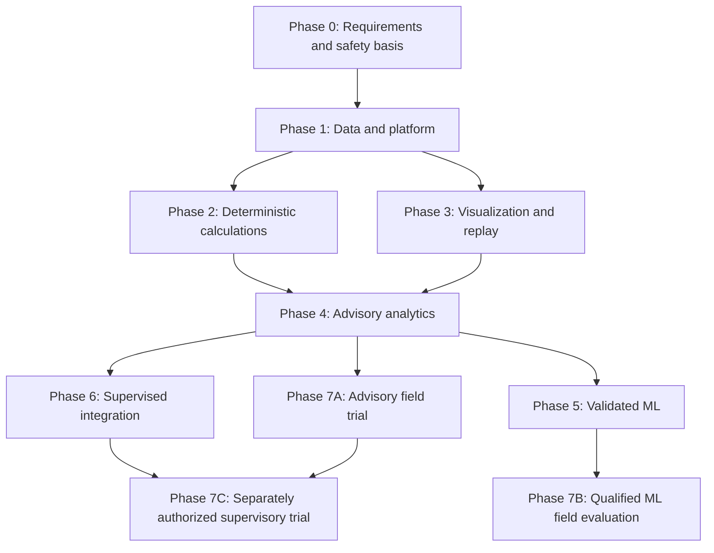

# Part 3 — GeoDrill Pro engineering review and development blueprint  
## Sections 10–13

**The recommended delivery strategy is to build and qualify a narrow engineering workstation first, add advisory capabilities only when their evidence is sufficient, and treat equipment control as a separate product and assurance programme.**

The roadmap, backlog, and risks below complete the review of all 17 modules. All schedules, staffing levels, and acceptance arrangements are **planning recommendations**, not commitments or demonstrated results.

---

## 10. Development Roadmap

### 10.1 Three distinct release paths

GeoDrill Pro should have three release paths with different authorization and evidence requirements.

| Release path | Intended use | Required evidence | Equipment authority |
|---|---|---|---|
| **Engineering workstation** | Data preparation, engineering calculations, visualization, historical investigation, and reporting | Contract verification, numerical verification, applicable physical validation, reproducibility, security, and usability | None |
| **Operational advisory platform** | Read-only monitoring and qualified recommendations for competent users | Workstation evidence plus live-data qualification, uncertainty assessment, alarm evaluation, human-factors validation, and controlled field evidence | None |
| **Supervisory integration product** | Narrowly scoped requests to an approved OEM control system | Separate hazard analysis, interface safety case, independent command validation, HIL testing, cybersecurity assessment, OEM acceptance, and operator authorization | Explicitly bounded supervisory authority |

“Field-ready” must always identify the approved path, well class, operating envelope, hardware, data interfaces, and module versions.

A successful advisory release does not automatically authorize supervisory control.

### 10.2 Phase dependencies

The phases are numbered for programme management, but they should not be interpreted as one compulsory sequence requiring every advanced module before a field trial.

Phase 6 does not require every ML module. A deterministic supervisory function may be preferable where it satisfies the intended use with less uncertainty.

### 10.3 Planning assumptions and indicative duration

**Planning assumptions:**

- One supported desktop operating-system baseline initially.
- One principal operator or field partner.
- One qualified live-data interface initially.
- One clearly bounded well/fluid/operation envelope.
- An approximately eight-to-ten-person core delivery team, with additional specialist and independent-review support.
- Access to representative engineering data and the relevant licensed technical references.
- No live equipment control in the initial product.
- No attempt to implement all advanced models concurrently.

| Phase | Indicative elapsed duration | Principal schedule dependency |
|---|---:|---|
| Phase 0 | 6–10 weeks | Agreement on intended use, hazards, data rights, and acceptance budgets |
| Phase 1 | 10–16 weeks | Source examples, interface access, and stable core contracts |
| Phase 2 | 12–20 weeks for the initial calculation set | Qualified equations, reference cases, and independent engineering review |
| Phase 3 | 8–12 weeks, partly overlapping Phase 2 | Stable result contracts and representative replay data |
| Phase 4 | 8–16 weeks for narrowly scoped advisories | Approved limits, alarm philosophy, and realistic user evaluation |
| Phase 5 | 4–12 months per narrowly defined ML capability | Label quality, independent wells, event counts, and external validity |
| Phase 6 | 6–18 months or more | OEM cooperation, test hardware, safety assessment, and interface qualification |
| Phase 7 | Site- and evidence-dependent; plan several months rather than a short demonstration | Well schedule, operating exposure, trial governance, and evidence sufficiency |

These ranges are preliminary engineering estimates. They should be replaced after Phase 0 by a resource-loaded plan.

A reasonable initial planning envelope is **approximately 9–15 months for a qualified desktop MVP**, with partial phase overlap. A narrowly scoped field-qualified advisory release may require **approximately 12–24 months**, depending heavily on data access and trial opportunities.

No credible completion date for all 17 modules can be assigned from the supplied specification. Rare-event validation and proprietary tool integration can dominate elapsed time.

---

### 10.4 Phase 0 — Requirement Validation and Safety Analysis

| Required item | Development blueprint |
|---|---|
| **Objectives** | Establish intended use, unsupported use, engineering authority, operational boundaries, safety responsibilities, data availability, and commercial feasibility |
| **Deliverables** | Approved product requirements; supported well/operation profile; initial hazard register; preliminary HAZID and appropriate follow-on analysis plan; standards applicability register; data inventory and rights assessment; architecture decisions; module dependency map; acceptance-parameter register; MVP business case |
| **Dependencies** | Named operator/product sponsor; access to representative engineers and users; source specification; preliminary vendor and dataset contacts |
| **Required specialists** | Drilling/well engineer, hydraulics specialist, well-control specialist, software architect, data engineer, cybersecurity specialist, product owner, and independent safety reviewer |
| **Exit criteria** | MVP use cases and exclusions approved; every MVP requirement has an owner and test method; critical assumptions identified; required data are obtainable or the affected capability is removed; no unresolved disagreement about equipment authority; acceptance budgets assigned for the next development gate |
| **Main risks** | Treating aspirations as requirements; omitting abnormal operations; inaccessible data; lack of accountable engineering authority; assuming standards references constitute compliance |
| **Explicitly excluded** | Production control code; autonomous well control; RL casing design; unsupported performance claims; commitments to deploy all 17 modules |

**Key decision:** approve the intended-use statement before choosing model sophistication.

The standards assessment must distinguish their scopes. For example, ISO 16530-1 addresses well-integrity lifecycle governance and excludes well control and borehole stability; it cannot serve as the sole governing reference for those functions. [ISO 16530-1 scope](https://www.iso.org/standard/63192.html)

---

### 10.5 Phase 1 — Data Ingestion and Foundational Platform

| Required item | Development blueprint |
|---|---|
| **Objectives** | Establish trustworthy data handling and a stable offline application foundation |
| **Deliverables** | Tauri/React shell; authenticated local API; project/well/wellbore registry; canonical contracts; unit/reference services; raw-source preservation; LAS/CSV import; staging and quarantine workflow; SQLite state; Parquet history; DuckDB queries; bounded telemetry pipeline; one read-only connector; initial audit and recovery support |
| **Dependencies** | Phase 0 intended use; approved contract conventions; representative files and channel definitions; agreed storage and hardware baseline |
| **Required specialists** | Software architect, backend/data engineers, Rust/Tauri engineer, frontend engineer, test engineer, survey/data-domain reviewer |
| **Exit criteria** | Imports preserve originals and provenance; invalid mappings cannot enter approved calculations; duplicate and out-of-order data are handled explicitly; quality and timestamps survive storage/retrieval; agreed workload fits resource budgets; offline authentication and recovery work; no equipment-write route exists |
| **Main risks** | Unit ambiguity; inconsistent identifiers; incorrect wellbore joins; timestamp errors; parser fragility; memory growth; silent data loss |
| **Explicitly excluded** | Advanced ML; operational parameter optimization; native EM inversion; coupled FEA; live commands |

**Key decision:** support a small number of sources well. A wide list of nominally supported formats is less useful than a few qualified import and mapping workflows.

---

### 10.6 Phase 2 — Deterministic Calculations

| Required item | Development blueprint |
|---|---|
| **Objectives** | Implement transparent, reproducible calculations for the initial operating envelope |
| **Deliverables** | M1 trajectory/geometry calculations; M2 programme records and explicitly limited checks; M6 single-phase steady-state hydraulics; M10 MSE with surface/downhole distinction; model registry; applicability checks; uncertainty/sensitivity support; independent numerical benchmark package |
| **Dependencies** | Stable units, coordinates, schemas, snapshots, and source-quality contracts; approved mathematical specifications and reference cases |
| **Required specialists** | Drilling engineer, hydraulics specialist, scientific-computing engineer, casing specialist for any tubular checks, independent numerical reviewer |
| **Exit criteria** | Selected models reproduce independent benchmarks; input and applicability failures are explicit; numerical tolerances are met; pressure references and locations are unambiguous; MSE rejects unsuitable drilling states; independent reviewers approve the restricted scope |
| **Main risks** | Correct implementation of an inappropriate model; omitted load cases; confusion between measured and estimated bit loads; excessive reliance on nominal geometry |
| **Explicitly excluded** | General-purpose casing optimization; coupled HPHT stability; multiphase well-control prediction; universal tripping limits; virtual vibration diagnosis |

**Key decision:** release each calculation independently. A failed advanced method should not delay a qualified basic calculation or be hidden behind it.

---

### 10.7 Phase 3 — Visualization and Historical Replay

| Required item | Development blueprint |
|---|---|
| **Objectives** | Make data, calculations, uncertainty, and historical knowledge understandable and reproducible |
| **Deliverables** | Well and section views; telemetry plots; calculation evidence panels; quality/age indicators; “as-known” replay; retrospective reconstruction mode; immutable reports; performance-tested visualization; user training scenarios |
| **Dependencies** | Stable data/result contracts; calculation manifests; source timing and historical revisions; representative user tasks |
| **Required specialists** | Frontend/visualization engineer, drilling-domain reviewer, human-factors/UX specialist, data engineer, test engineer |
| **Exit criteria** | Users can distinguish measured, estimated, simulated, stale, and invalid values; replay does not introduce future data; plot reduction preserves relevant excursions; reports reproduce the selected snapshot; agreed interaction and resource targets pass |
| **Main risks** | Visually implying precision; hiding gaps; rendering overload; confusing replay with live operation; retrospective leakage |
| **Explicitly excluded** | Actionable ML alarms; automated rig changes; high-priority alarms without a rationalized response; unsupported “digital twin” fidelity claims |

**Milestone:** Phases 0–3 can produce the initial engineering-workstation MVP.

---

### 10.8 Phase 4 — Advisory Analytics

| Required item | Development blueprint |
|---|---|
| **Objectives** | Add qualified, explainable advisory workflows without changing equipment authority |
| **Deliverables** | Approved limit sets; deterministic eligibility checks; rationalized alarms; recommendation workflow; acknowledgement/approval separation; expiry and invalidation rules; selected torque/drag or other justified deterministic extensions; operator-facing procedures |
| **Dependencies** | Qualified inputs and calculations; alarm philosophy; approved operating limits; competent reviewers; realistic replay and user evaluation |
| **Required specialists** | Drilling/well engineer, operations representative, alarm/human-factors specialist, software engineers, test lead |
| **Exit criteria** | Every advisory has a purpose, evidence, applicability, uncertainty treatment, and required role; stale or changed evidence invalidates affected recommendations; nuisance-alarm targets and workflow tests pass; existing independent rig systems remain unaffected |
| **Main risks** | Alarm floods; automation bias; advisory wording interpreted as an instruction; expired recommendations remaining visible as current |
| **Explicitly excluded** | Equipment writes; ML-dependent safety decisions; automatic kick response; claims of independent protective-layer credit without assessment |

Alarm rationalization should address consequence, response, priority, lifecycle, and performance monitoring, consistent with the applicable principles of IEC 62682. [IEC 62682](https://webstore.iec.ch/en/publication/65543)

---

### 10.9 Phase 5 — Validated ML Capabilities

| Required item | Development blueprint |
|---|---|
| **Objectives** | Determine whether a narrowly defined ML capability provides reliable value beyond simpler alternatives |
| **Deliverables** | Qualified dataset manifests; reviewed labels; causal feature pipeline; baseline models; grouped/time-aware evaluation; uncertainty calibration; blind-well results; model cards; ONNX parity evidence where used; abstention and rollback mechanisms |
| **Dependencies** | Sufficient licensed data; reliable context/labels; frozen evaluation protocol; operational baseline; reproducible feature pipeline |
| **Required specialists** | Applied ML scientist, data engineer, domain specialist for the target, independent validation statistician/reviewer, deployment engineer |
| **Exit criteria** | Model and thresholds frozen before blind evaluation; predefined metrics met; relevant subgroup results acceptable; abstention and availability reported; deployed model matches approved semantics; review supports the specific advisory claim |
| **Main risks** | Leakage; small effective sample size; weak labels; domain shift; inaccurate probabilities; impressive average performance hiding dangerous failures |
| **Explicitly excluded** | Online self-training in field operation; automatic expansion of applicability; direct ML actuator authority; fixed early-kick lead-time guarantees |

**Recommended first candidate:** M3 exploratory electrofacies assistance, if suitable logs and geological labels exist.

**Higher-evidence candidates:** M13 bit-condition prediction and M15 influx/loss analytics. These should not be selected merely because their apparent commercial value is high.

---

### 10.10 Phase 6 — Supervised Rig Integration

| Required item | Development blueprint |
|---|---|
| **Objectives** | Evaluate a separately authorized, narrowly bounded supervisory function using approved OEM interfaces |
| **Deliverables** | Interface control document; control-authority model; independent gateway design; permitted-command catalogue; safety requirements; cybersecurity zone/conduit design; test rig; software/model/HIL evidence; manual-override tests; OEM acceptance package |
| **Dependencies** | Separate funding and accountable control-system owner; OEM partnership; qualified sensors; approved hazard analysis; access to representative hardware and test facilities |
| **Required specialists** | Controls engineer, OEM automation engineer, functional-safety specialist, drilling/MPD specialist, OT cybersecurity engineer, integration test lead, independent assessor where required |
| **Exit criteria** | No unresolved hazardous authority transition; independent validation rejects stale/invalid requests; timing and actuator constraints demonstrated; manual override independent of desktop availability; faults produce the approved process-specific response; operator/OEM authorize the trial scope |
| **Main risks** | Incorrect tag semantics; conflicting controllers; uncertain command outcomes; latency; actuator saturation; unsafe fault response; cybersecurity compromise |
| **Explicitly excluded** | Generic direct Modbus writes from application code; autonomous well-control takeover; unbounded WOB/RPM optimization; replacing existing protective functions |

IEC 62443-3-2 provides a relevant structure for defining the system under consideration and assessing zones, conduits, and their security requirements. It does not itself establish control performance or process safety. [IEC 62443-3-2](https://webstore.iec.ch/en/publication/30727)

---

### 10.11 Phase 7 — Controlled Field Trial

| Required item | Development blueprint |
|---|---|
| **Objectives** | Establish operational evidence for the exact release path and scope under controlled governance |
| **Deliverables** | Approved trial protocol; installation qualification; operator training; shadow/advisory records; incident and near-miss records; independently adjudicated outcomes; performance and usability report; residual-risk decision; support and rollback plan |
| **Dependencies** | Applicable preceding release gates; site authorization; qualified hardware/interfaces; data rights; independent existing protection; approved stop conditions |
| **Required specialists** | Site drilling/operations personnel, field support engineer, domain specialists, test/validation lead, safety representative, independent reviewer; OEM/control specialists for a supervisory trial |
| **Exit criteria** | Required operating exposure obtained; acceptance criteria assessed without post-hoc relaxation; deviations resolved; users demonstrate correct understanding; support/recovery proven; accountable authorities approve only the demonstrated scope |
| **Main risks** | Insufficient events; changing well conditions; pressure to declare success after a demonstration; uncontrolled configuration changes; incomplete incident evidence |
| **Explicitly excluded** | Generalizing from one well to all wells; changing models during evaluation without restarting affected evidence; escalating from advisory to control through an informal field request |

A trial may finish with a valid conclusion that a capability is **not ready**, needs a narrower envelope, or lacks enough evidence. That is a legitimate engineering outcome.

### 10.12 Gate parameters that must be assigned

The following values must exist in the relevant release manifest before its acceptance testing begins.

| Parameter | Meaning | Unit | Accountable owner |
|---|---|---|---|
| `supported_channel_count` | Qualified concurrent channel workload | Count | Platform architect |
| `ingestion_rate` | Sustained and burst source workload | Observations/s | Data-platform lead |
| `memory_budget` | Maximum application/worker memory under defined workload | Bytes | Platform architect |
| `storage_reserve` | Minimum free space and retention thresholds | Bytes | Deployment lead |
| `recovery_time_limit` | Maximum acceptable recovery time for the intended use | s | Product/operations owner |
| `channel_staleness_limit` | Maximum useful age for each required channel | s | Responsible domain engineer |
| `latency_budget` | Allowed end-to-end latency distribution | s | Domain engineer and architect |
| `numerical_tolerance` | Calculation-specific absolute/relative bounds | Quantity unit / dimensionless | Numerical lead |
| `model_error_budget` | Allowed physical prediction error by regime | Quantity-specific | Domain authority |
| `alarm_false_rate_limit` | Acceptable nuisance-alarm burden | Episodes/operating hour | Operations/alarm authority |
| `event_detection_requirement` | Required event sensitivity and delay, with confidence treatment | Dimensionless / s | Well-control or relevant domain authority |
| `uncertainty_requirement` | Required coverage, width, and domain conditions | Target-specific | Validation lead |
| `field_exposure_requirement` | Operating coverage and independent-event evidence | Hours, runs, wells, events | Trial authority |

There is no defensible universal numerical value for these parameters across all 17 modules.

---

## 11. Prioritized Product Backlog

### 11.1 Backlog conventions

**Priority**

- **MVP:** Required for the first bounded engineering-workstation release.
- **Next:** Candidate for subsequent advisory releases.
- **Research:** Requires a feasibility/data gate before implementation commitment.
- **Separate:** Belongs to the separately authorized supervisory-control programme.

These priorities are backlog labels; they do not replace the module priorities in Part 1.

**Internal safety classification**

| Class | Meaning |
|---|---|
| **Q0 — Administrative** | Does not directly alter engineering evidence, results, or authority |
| **Q1 — Evidence/support** | Affects traceability, availability, storage, or supporting workflows |
| **Q2 — Engineering/advisory** | Can materially affect engineering interpretation, limits, alarms, or operational decisions |
| **Q3 — Equipment authority** | Can affect supervisory requests, control authority, or command execution |

These are internal review classes, **not SIL assignments, certifications, or risk-reduction claims**.

**Complexity**

- **S:** Localized, well-understood change.
- **M:** Several related components or moderate verification effort.
- **L:** Significant subsystem or specialist validation.
- **XL:** Multi-disciplinary, uncertain, or substantial qualification work; decompose before sprint commitment.

**Common acceptance conditions**

Every completed story also requires applicable contracts, authorization checks, explicit failure handling, meaningful tests, documentation, and traceable evidence. The story-specific criteria below are additional requirements.

---

### 11.2 Epic E0 — Requirements, Safety Basis, and Acceptance

**Accountable owner:** Product owner with the lead well engineer.

| ID | User story | Engineering rationale | Priority | Dependencies | Acceptance criteria | Safety | Complexity |
|---|---|---|---|---|---|---|---|
| **GD-001** | As a product owner, I can define the supported well, fluid, operation, and deployment envelope. | Prevents uncontrolled scope and unsupported use. | MVP | None | Intended-use profile lists supported/unsupported cases, users, authority, hardware, and interfaces; approved by accountable owners. | Q2 | M |
| **GD-002** | As a safety reviewer, I can trace hazards to requirements and independent barriers. | Advisory errors and common-cause failures need explicit treatment. | MVP | GD-001 | Hazard register covers normal, abnormal, transition, outage, and misuse cases; every material hazard has an owner and disposition. | Q2 | L |
| **GD-003** | As an engineering authority, I can maintain an applicability register for standards and jurisdictional requirements. | Prevents incorrect compliance assumptions. | MVP | GD-001 | Adopted editions, scope, applicable clauses, evidence needs, and unresolved items are recorded and reviewed. | Q2 | M |
| **GD-004** | As a validation lead, I can freeze acceptance budgets before final testing. | Prevents retrospective adjustment of success criteria. | MVP | GD-001–003 | Every MVP decision has numerical, data-quality, performance, and usability criteria with owners; no unresolved release-blocking threshold. | Q2 | L |

### 11.3 Epic E1 — Canonical Engineering Data

**Accountable owner:** Data-platform lead.

| ID | User story | Engineering rationale | Priority | Dependencies | Acceptance criteria | Safety | Complexity |
|---|---|---|---|---|---|---|---|
| **GD-005** | As a data engineer, I can validate canonical records across Python, Rust, and TypeScript. | Prevents inconsistent interpretation between components. | MVP | GD-001 | Shared valid/invalid fixtures produce consistent outcomes; unknown schema versions are rejected explicitly. | Q2 | L |
| **GD-006** | As an engineer, I can convert units without losing pressure, temperature, or concentration meaning. | Unit errors can invalidate otherwise correct calculations. | MVP | GD-005 | Independent conversion tests pass; gauge/absolute and mass/volume distinctions are enforced; original values remain traceable. | Q2 | L |
| **GD-007** | As a survey user, I can resolve depth, elevation, CRS, and azimuth references before calculation. | Prevents wrong geometry and hydrostatic head. | MVP | GD-005–006 | Unresolved references block affected calculations; verified coordinate and survey cases meet approved tolerances. | Q2 | L |
| **GD-008** | As an auditor, I can reproduce a result from immutable inputs and versions. | Supports incident review and trustworthy engineering. | MVP | GD-005 | Revisions preserve originals; snapshot digests detect changes; selected results reproduce within approved tolerances. | Q1 | L |
| **GD-009** | As a validation lead, I can approve a dataset for a specific use. | Availability does not establish suitability or rights. | MVP | GD-001, GD-005 | Manifest covers variables, timing, labels, quality, independence, rights, and permitted purpose; unsuitable uses remain blocked. | Q2 | M |

### 11.4 Epic E2 — Ingestion and Live Data Quality

**Accountable owner:** Data-platform lead.

| ID | User story | Engineering rationale | Priority | Dependencies | Acceptance criteria | Safety | Complexity |
|---|---|---|---|---|---|---|---|
| **GD-010** | As an analyst, I can import LAS/CSV files into a reviewed staging area. | Preserves evidence while isolating malformed data. | MVP | GD-005–008 | Originals retained; parsing failures and missing units reported; no silent coercion or replacement with zero. | Q2 | L |
| **GD-011** | As a qualified engineer, I can approve channel mappings before operational use. | Mnemonics alone do not define physical meaning. | MVP | GD-005–007 | Mapping records units, location, sign, reference, calibration, and source; changes invalidate affected approvals. | Q2 | M |
| **GD-012** | As a site engineer, I can connect read-only to one supported WITSML/ETP configuration. | Establishes a qualified interface rather than generic compatibility claims. | MVP | GD-011, GD-015, GD-046 | Actual server compatibility demonstrated; reconnect/gaps handled; no equipment-write capability or privileges. | Q2 | L |
| **GD-013** | As an analyst, I can preserve acquisition time, arrival time, sequence, and source resets. | Required for causal analytics and stale-data handling. | MVP | GD-005, GD-008 | Duplicate, late, reordered, and reset sequences produce explicit tested outcomes; timestamps are not silently replaced. | Q2 | L |
| **GD-014** | As an operator, I can see invalid, suspect, missing, and stale data propagated into results. | Prevents plausible-looking advice from invalid inputs. | MVP | GD-011, GD-013 | Required-input failure invalidates dependent advice; valid operating-limit excursions remain visible; recovery is explicit. | Q2 | L |

### 11.5 Epic E3 — Offline Platform and Durability

**Accountable owner:** Software architect.

| ID | User story | Engineering rationale | Priority | Dependencies | Acceptance criteria | Safety | Complexity |
|---|---|---|---|---|---|---|---|
| **GD-015** | As an authorized user, I can operate the desktop and local API offline with scoped permissions. | Offline operation still requires authentication and authority boundaries. | MVP | GD-001, GD-005 | Local authorization enforced server-side; administrative access does not automatically grant engineering approval. | Q2 | L |
| **GD-016** | As a data steward, I can retain durable state and atomically publish historical partitions. | Prevents incomplete records from appearing complete. | MVP | GD-008 | Interruption tests recover manifests and state; partially written files are not published; acknowledged durable records survive specified fault tests. | Q1 | L |
| **GD-017** | As an operator, I can retain responsive monitoring while analytical jobs run. | Heavy workloads must not starve qualified data handling. | MVP | GD-004, GD-013, GD-016 | Resource budgets pass under defined concurrency; overload triggers controlled degradation and explicit status. | Q2 | L |
| **GD-018** | As a site administrator, I can back up, restore, and update without corrupting engineering history. | Field maintainability requires tested recovery. | MVP | GD-015–016 | Offline restore and failed-migration recovery demonstrated; update signatures checked; incompatible rollback is detected. | Q1 | L |
| **GD-019** | As a release manager, I can reproduce and identify an installed release. | Prevents configuration and dependency drift. | MVP | GD-015, GD-018 | Release manifest includes application, schema, runtime, dependency, model, configuration, and hardware compatibility. | Q1 | M |

### 11.6 Epic E4 — Core Deterministic Engineering

**Accountable owner:** Lead well engineer.

| ID | User story | Engineering rationale | Priority | Dependencies | Acceptance criteria | Safety | Complexity |
|---|---|---|---|---|---|---|---|
| **GD-020** | As a well engineer, I can calculate and inspect a verified trajectory and section geometry. | M1 supports most downstream calculations. | MVP | GD-006–008 | Independent straight/build/turn/wrap cases pass; reference errors block calculation; uncertainty status is visible. | Q2 | L |
| **GD-021** | As a casing engineer, I can manage planned and installed casing/liner records. | M2 needs trustworthy geometry and component evidence before optimization. | MVP | GD-005, GD-020 | Pipe body, connections, state basis, material evidence, and missing ratings are distinguished; records do not imply design approval. | Q2 | M |
| **GD-022** | As a drilling engineer, I can calculate single-phase steady-state pressure profiles within a declared envelope. | Provides useful M6 capability without unsupported transient claims. | MVP | GD-004, GD-006–008, GD-020–021 | Independent cases pass; location/reference explicit; unsupported regimes abstain; approved physical error budget met. | Q2 | XL |
| **GD-023** | As a drilling engineer, I can calculate MSE with clear measurement provenance. | Prevents surface proxies being mistaken for bit energy. | MVP | GD-006, GD-013–014, GD-020 | Reference calculations pass; low-ROP/off-bottom gates work; surface/downhole and motor contributions are explicit. | Q2 | M |
| **GD-024** | As an engineer, I can inspect applicability, assumptions, and uncertainty before using a result. | Correct arithmetic alone is insufficient. | MVP | GD-004, GD-008, GD-020–023 | Every core result carries status, scope, versions, sensitivity/uncertainty treatment, and blocking reasons where applicable. | Q2 | L |

### 11.7 Epic E5 — Visualization, Replay, Alarms, and Review

**Accountable owner:** Product/UX lead with operations representatives.

| ID | User story | Engineering rationale | Priority | Dependencies | Acceptance criteria | Safety | Complexity |
|---|---|---|---|---|---|---|---|
| **GD-025** | As a user, I can distinguish measured, calculated, estimated, stale, and simulated values. | Reduces false confidence and mode confusion. | MVP | GD-014, GD-020, GD-024 | User tests correctly identify value origin and validity; plot reduction preserves tested excursions and gaps. | Q2 | L |
| **GD-026** | As an investigator, I can replay what was known at a historical time. | Enables causal validation and incident analysis. | MVP | GD-008, GD-013, GD-016 | Arrival delays and revisions reproduced; future observations cannot enter as-known feature windows. | Q2 | L |
| **GD-027** | As an engineer, I can export a reproducible calculation report. | Makes assumptions and limitations reviewable outside the application. | MVP | GD-008, GD-024 | Report binds inputs, models, limits, quality, mode, and timestamps; reproduction checks pass. | Q2 | M |
| **GD-028** | As an operator, I can receive rationalized data-quality and approved deterministic threshold alerts. | Avoids an unstructured collection of warning pop-ups. | MVP | GD-002, GD-004, GD-014, GD-024 | Activation/clearing/acknowledgement tested; active condition persists after acknowledgement; priority and response documented. | Q2 | L |
| **GD-029** | As an authorized engineer, I can approve or reject an exact recommendation and its evidence. | Separates review from acknowledgement and execution. | Next | GD-015, GD-024, GD-028, GD-047 | Approval binds scope/digest/expiry; changed evidence invalidates it; no equipment command follows automatically. | Q2 | L |
| **GD-030** | As an operations representative, I can validate critical workflows under realistic conditions. | Engineering usability is part of risk reduction. | MVP | GD-025–028 | Users identify stale/mode/reference issues; critical misunderstandings resolved; recovery and offline workflows completed. | Q2 | M |

### 11.8 Epic E6 — Extended Deterministic Engineering

**Accountable owner:** Relevant discipline lead for each module.

| ID | User story | Engineering rationale | Priority | Dependencies | Acceptance criteria | Safety | Complexity |
|---|---|---|---|---|---|---|---|
| **GD-031** | As a casing engineer, I can compare candidates against an approved load-case set. | Redesigns M2 around transparent feasibility. | Next | GD-021–022, GD-024, GD-048 | Mandatory loads and connections checked; incomplete evidence prevents approval; independent design comparison passes. | Q2 | XL |
| **GD-032** | As a drilling engineer, I can compare predicted and measured torque/drag by operating state. | Extends M10 with calibrated mechanics. | Next | GD-020, GD-023–024 | Reference mechanics pass; friction calibration separated from blind evaluation; state-specific errors meet budgets. | Q2 | L |
| **GD-033** | As a petrophysicist, I can evaluate qualified Thomas–Stieber interpretations. | Implements M4 without pretending topology is uniquely known. | Next | GD-009–010, GD-024 | Selected published formulations reproduced; porosity bases explicit; compatible independent evidence meets interpretation criteria. | Q2 | L |
| **GD-034** | As a geomechanics engineer, I can compare documented elastic and thermal scenarios. | Establishes M7 progressively. | Next | GD-020, GD-022, GD-024 | Kirsch/thermal benchmarks pass; unsupported coupling and rock classes remain excluded; specialist review complete. | Q2 | XL |
| **GD-035** | As a drilling engineer, I can assess qualified hole-cleaning indicators. | Provides bounded M8 value before predictive pack-off claims. | Next | GD-022, GD-024, GD-032 | Correlation domains enforced; solids balance tested; flow advice cannot bypass pressure constraints. | Q2 | XL |
| **GD-036** | As a well engineer, I can evaluate surge/swab scenarios for a specified motion profile. | Replaces universal tripping-speed claims in M9. | Next | GD-020, GD-022, GD-024 | Independent transient cases and motion/pressure data pass; peak errors and uncertainty meet approved budgets. | Q2 | XL |
| **GD-037** | As a mechanical engineer, I can assess model-specific buckling susceptibility. | Reframes M11 as conditional engineering analysis. | Next | GD-020, GD-024, GD-032 | Published cases reproduced; local compression distinguished from WOB; unsupported boundaries blocked. | Q2 | XL |
| **GD-038** | As an integrity engineer, I can track wear and fatigue as separate mechanisms. | Prevents conflation in M14. | Research | GD-021, GD-024, GD-032, GD-009 | Material-specific evidence available; wear and fatigue validated separately; residual-strength assessment independently reviewed. | Q2 | XL |

### 11.9 Epic E7 — ML Evidence and Advisory Models

**Accountable owner:** ML lead with independent domain validation.

| ID | User story | Engineering rationale | Priority | Dependencies | Acceptance criteria | Safety | Complexity |
|---|---|---|---|---|---|---|---|
| **GD-039** | As a model owner, I can release a model only with its features, evidence, calibration, and applicability. | Prevents model-file-only deployment. | Next | GD-009, GD-013, GD-019, GD-024 | Causal splits, frozen tests, model card, deployment parity, abstention, signature, and rollback evidence complete. | Q2 | XL |
| **GD-040** | As a geologist, I can review log clusters without treating them as confirmed facies. | Creates a defensible first M3 capability. | Next | GD-010, GD-020, GD-039 | Depth alignment and scaling verified; held-out interpretation evaluated; unknown/out-of-domain intervals remain explicit. | Q2 | L |
| **GD-041** | As a bit engineer, I can evaluate probabilistic bit-condition or survival estimates. | Replaces exact M13 life/trip claims. | Research | GD-009, GD-023, GD-039 | Inspected labels and censoring qualified; independent runs tested; calibration and baseline comparison pass. | Q2 | XL |
| **GD-042** | As a well-control specialist, I can evaluate influx/loss analytics in shadow mode. | Tests M15 without giving it control authority. | Research | GD-009, GD-013–014, GD-026, GD-028, GD-039 | Independent event adjudication; misses, nuisance alarms, delay, and availability reported; no fixed lead-time promise or actuation path. | Q2 | XL |

### 11.10 Epic E8 — Specialist Research Modules

**Accountable owner:** Named specialist programme lead.

| ID | User story | Engineering rationale | Priority | Dependencies | Acceptance criteria | Safety | Complexity |
|---|---|---|---|---|---|---|---|
| **GD-043** | As a geosteering specialist, I can invert supported EM measurements with identifiable tool physics. | Makes M5 conditional on actual instrumentation. | Research | GD-009, GD-020, GD-024; vendor agreement | Forward model and tool rights available; independent boundary evidence; uncertainty/nonuniqueness evaluated; distance claims bounded by evidence. | Q2 | XL |
| **GD-044** | As a dynamics engineer, I can validate BHA simulation against synchronized downhole measurements. | Establishes M12 observability and model validity. | Research | GD-009, GD-020, GD-032, GD-037 | Modal/contact benchmarks pass; actual bandwidth verified; blind BHA configurations evaluated; virtual values labelled. | Q2 | XL |
| **GD-045** | As a fluids specialist, I can model gas behaviour for a characterized mud/gas system. | Makes M16 a calibrated simulator. | Research | GD-009, GD-022, GD-036; PVT evidence | EOS/flash benchmarks pass; formulation-specific PVT and transient validation meet budgets; no exact flash-depth claim. | Q2 | XL |

### 11.11 Epic E9 — Security, Audit, and Independent Qualification

**Accountable owner:** Security and verification leads.

| ID | User story | Engineering rationale | Priority | Dependencies | Acceptance criteria | Safety | Complexity |
|---|---|---|---|---|---|---|---|
| **GD-046** | As a security reviewer, I can test the local, update, data-import, and network trust boundaries. | Offline systems remain exposed to malicious files, users, and media. | MVP | GD-002, GD-015; iterative thereafter | Threat model complete; relevant security tests pass; unresolved findings handled under approved release policy. | Q2 | L |
| **GD-047** | As an auditor, I can detect unauthorized changes to engineering evidence and decisions. | Supports accountability without falsely promising tamper-proof storage. | MVP | GD-008, GD-015–016 | Audit records are attributable; tampering scenarios detected; privileged limitations documented; backup evidence recoverable. | Q2 | L |
| **GD-048** | As an independent reviewer, I can assess a module without relying on its author’s assertions. | Reduces confirmation bias and common implementation errors. | MVP | GD-004, GD-009, relevant module stories | Requirement-to-evidence matrix complete; independent references used; unresolved deviations prevent affected release. | Q2 | L |

### 11.12 Epic E10 — Separately Governed Supervisory Integration

**Accountable owner:** Control-system authority.

| ID | User story | Engineering rationale | Priority | Dependencies | Acceptance criteria | Safety | Complexity |
|---|---|---|---|---|---|---|---|
| **GD-049** | As an integrator, I can define an OEM-approved interface and authority model. | Replaces generic direct PLC bridging in M17. | Separate | GD-002–004, GD-046; OEM agreement | Target identity, units, modes, permitted requests, timing, ownership, and failure behaviour approved. | Q3 | XL |
| **GD-050** | As a test engineer, I can exercise the supervisory path against representative hardware and faults. | Historical data cannot validate actuation semantics. | Separate | GD-049, GD-051 | Delays, resets, duplicates, saturation, override, and unknown outcomes tested; required response and timing demonstrated. | Q3 | XL |
| **GD-051** | As a control authority, I can independently reject unauthorized or stale supervisory requests. | Establishes a separate command-validation boundary. | Separate | GD-029, GD-047, GD-049 | Allowlist, expiry, evidence binding, authority lease, rate limits, and idempotency verified; no stale reconnect execution. | Q3 | XL |
| **GD-052** | As an operator/OEM authority, I can approve a bounded integration release from complete evidence. | Prevents implementation completion from being mistaken for authorization. | Separate | GD-048–051 | Hazard, cybersecurity, HIL, procedures, competence, and independent-protection evidence accepted for exact scope. | Q3 | L |

### 11.13 Epic E11 — Field Trial and Sustained Operation

**Accountable owner:** Operator trial authority.

| ID | User story | Engineering rationale | Priority | Dependencies | Acceptance criteria | Safety | Complexity |
|---|---|---|---|---|---|---|---|
| **GD-053** | As a trial owner, I can define scope, evidence, stop conditions, and responsibilities before installation. | Prevents an informal demonstration becoming an uncontrolled trial. | MVP | GD-001–004, GD-009 | Protocol approved; baseline and independent systems identified; data rights, training, incident handling, and stop criteria complete. | Q2 | M |
| **GD-054** | As a field engineer, I can qualify a read-only installation in shadow operation. | Tests actual site data and deployment assumptions. | Next | GD-012–019, GD-025–028, GD-046–048, GD-053 | Mappings, timing, recovery, workload, and user understanding verified; deviations recorded and resolved. | Q2 | L |
| **GD-055** | As an operations authority, I can decide whether the advisory product is ready for its specific scope. | Ties release to observed evidence. | Next | GD-029–030, GD-048, GD-054; released modules | Predeclared criteria assessed; limitations retained; no unsupported expansion beyond demonstrated scope. | Q2 | L |
| **GD-056** | As a support owner, I can manage incidents, compatibility, and field configuration changes. | Qualification must survive maintenance. | Next | GD-018–019, GD-047, GD-055 | Support procedures exercised; changes classified; affected evidence rerun; rollback and configuration inventory maintained. | Q2 | M |
| **GD-057** | As a control-system owner, I can conduct a separately authorized supervisory trial. | Preserves the boundary between advisory and control. | Separate | GD-052–055; control-specific trial protocol | Exact scope authorized; independent protection remains active; stop/override procedures demonstrated; results independently reviewed. | Q3 | XL |

### 11.14 Recommended initial execution order

Start the backlog in this order:

1. **GD-001–004:** intended use, hazards, applicability, acceptance.
2. **GD-005–009:** contracts, units, references, snapshots, data qualification.
3. **GD-015–016 and GD-046:** secure local foundation and durable storage.
4. **GD-010–014:** reviewed ingestion and telemetry semantics.
5. **GD-020–024:** core geometry, hydraulics, MSE, and result validity.
6. **GD-025–028:** visualization, replay, reports, and rationalized basic alerts.
7. **GD-017–019, GD-030, GD-047–048:** workload, recovery, usability, and independent release evidence.
8. **GD-053:** trial planning before any site installation.

Several workstreams can overlap after their inputs stabilize. The engineering model specifications and acceptance criteria must lead implementation rather than follow it.

---

## 12. Risk Register

### 12.1 Rating and ownership conventions

The ratings below are **preliminary qualitative engineering judgments**, not calculated probabilities.

**Likelihood**

- **L:** Uncommon under the stated assumptions.
- **M:** Credible and needs explicit treatment.
- **H:** Likely to be encountered without deliberate mitigation.

**Impact**

- **Moderate:** Recoverable disruption or limited rework.
- **Major:** Material engineering error, operational disruption, data loss, or commercial harm.
- **Critical:** Could contribute to serious equipment damage, a well-control/barrier failure, major environmental harm, or injury.

A critical impact remains critical even when likelihood is reduced.

**Residual risk** describes what remains after the proposed mitigation. Because the controls have not been implemented and verified, residual risk is **not yet accepted**. Each risk needs a named individual assigned to the accountable role before execution.

### 12.2 Technical, data, and numerical risks

| ID | Risk and category | Likelihood | Impact | Detection method | Mitigation | Accountable owner | Residual risk / disposition |
|---|---|---:|---|---|---|---|---|
| **R01** | All 17 modules expand simultaneously; technical/commercial scope becomes unmanageable | H | Major | Milestone slippage, excessive work in progress, unresolved cross-module dependencies | Freeze MVP; independent module gates; fund research separately | Product owner | Expansion pressure remains; review scope at every funding gate |
| **R02** | Incorrect units or pressure basis corrupt calculations | M | Critical | Dimensional tests, independent conversion fixtures, source reconciliation | Central unit service; explicit references; reject ambiguity; preserve raw values | Data-platform lead | Plausible source mislabelling remains possible; require source qualification |
| **R03** | Datum, azimuth, MD/TVD, or sidetrack mismatch | M | Critical | Geometry consistency checks and independent survey comparison | Explicit coordinate contracts; immutable wellbore identity; no unresolved-reference calculation | Survey/trajectory lead | Survey uncertainty remains; no geometric guarantee |
| **R04** | Clock drift and transport lag make stale data appear current | H | Critical | Clock diagnostics, event/arrival-time comparison, replay fault tests | Preserve both times; channel age limits; uncertainty-aware synchronization; abstention | Data-platform lead | Source timing may remain uncertain; affected live advice must be unavailable |
| **R05** | Sensor bias or common calibration error passes plausibility checks | H | Critical | Redundant measurements, calibration review, balance residuals, controlled checks | Qualified sensors; independent checks; calibration history; uncertainty propagation | Instrumentation lead | Correlated failures remain credible; software quality checks are not independent protection |
| **R06** | Missing context or poor event labels invalidate model evaluation | H | Major | Dataset audit, label disagreement, impossible timelines | Explicit labeling protocol; independent adjudication; exclude unsupported claims | Validation lead | Some events remain ambiguous; disclose limits and defer affected model release |
| **R07** | Dataset/vendor rights do not permit intended commercial use | M | Major | Contract and licence review | Use-specific rights register; vendor agreements; controlled distribution | Commercial/legal owner | Rights can change by asset/version; recheck before release or redistribution |
| **R08** | Calculation runs outside physical applicability | H | Critical | Applicability checks, adverse benchmark cases, field residuals | Machine-readable domains; unsupported-state abstention; visible assumptions | Relevant discipline lead | Boundary cases remain uncertain; restrict release envelope |
| **R09** | Numerical nonconvergence or instability produces plausible output | M | Critical | Convergence diagnostics, conservation checks, independent benchmarks | Explicit solver status; mesh/time-step studies; no publication of failed results as valid | Numerical lead | Ill-conditioned cases may remain unavailable |
| **R10** | Empirical correlations transfer poorly between fluids, geometry, or formations | H | Major/Critical | Stratified validation and residual monitoring | Correlation catalogue; calibration provenance; domain-specific validation | Relevant discipline lead | Calibration does not establish broad transferability; constrain use |
| **R11** | Multiple modules share the same incorrect input or model assumption | M | Critical | Common-cause analysis, dependency review, independent measurements | Do not count correlated outputs as separate barriers; independent protection and review | Safety lead | Shared engineering uncertainty remains; no automatic safety credit |
| **R12** | Pore-pressure/fracture/loss bounds are poorly constrained | H | Critical | Comparison with tests, offsets, observations, and uncertainty sensitivity | Store evidence type and uncertainty; distinguish FIT/LOT interpretations; approved margins | Geomechanics/well engineer | Formation uncertainty persists; pressure-window advice remains conditional |
| **R13** | Casing or string evaluation omits a governing load or connection limitation | M | Critical | Load-case checklist, independent design review, manufacturer comparison | Approved load catalogue; connection checks; material/environment qualification | Casing/mechanical lead | Unforeseen loading remains possible; final design approval remains with responsible engineer |
| **R14** | Virtual sensing claims exceed physical observability | H | Major/Critical | Surface/downhole comparison, identifiability analysis, held-out configurations | Instrumented validation; show estimates as estimates; suppress unsupported modes | Dynamics/geosteering lead | Some states may remain unobservable; reject diagnostic claims where evidence is insufficient |

### 12.3 ML and human-factors risks

| ID | Risk and category | Likelihood | Impact | Detection method | Mitigation | Accountable owner | Residual risk / disposition |
|---|---|---:|---|---|---|---|---|
| **R15** | Training/test leakage inflates ML performance | H | Major | Split audit, feature-timestamp review, duplicate detection | Grouped and causal splits; frozen blind wells; independent evaluation | ML lead | Hidden relationships may remain; report dataset structure and uncertainty |
| **R16** | Domain shift causes failure on new wells or equipment | H | Critical for operational advice | Subgroup validation, drift/applicability checks, field residuals | Narrow intended use; abstention; requalification before expansion | ML/domain lead | Drift detectors are imperfect; retain independent procedures and restrict authority |
| **R17** | Confidence score or interval is miscalibrated | M | Critical | Reliability/coverage analysis by subgroup and regime | Separate scores from probabilities; independent calibration; width/usefulness tests | Validation lead | Calibration can degrade; monitor and withdraw unsupported claims |
| **R18** | Precise-looking displays create automation bias | H | Critical | Observed user tasks, misunderstanding reports, field review | Display uncertainty, origin, age, assumptions, and authority; training; conservative wording | Human-factors lead | Human overreliance cannot be eliminated; operational governance remains necessary |
| **R19** | Alarm flooding or chattering overwhelms users | H | Major/Critical | Alarm-rate, repeat, duration, shelving, and response analysis | Rationalization; persistence/deadband; state-aware design; nuisance targets | Alarm/operations lead | Rare combinations can still flood; test stress scenarios and retain established alarms |
| **R20** | User mistakes acknowledgement for approval or resolution | M | Critical | Workflow tests and audit review | Separate actions, terminology, permissions, and state transitions | Product/operations lead | Training and interface discipline remain necessary |
| **R21** | Users apply historical/simulation results to current operation | M | Critical | Scenario-based UAT, mode-transition tests | Persistent mode identification; separate sessions; expired-result labels; no simulation-to-control path | Product/QA lead | Screenshots and exports can lose context; embed mode and timestamp in artefacts |

### 12.4 Well-control and automation risks

| ID | Risk and category | Likelihood | Impact | Detection method | Mitigation | Accountable owner | Residual risk / disposition |
|---|---|---:|---|---|---|---|---|
| **R22** | An ML influx detector misses an event or delays established response | M | Critical | Independent event adjudication, missed-event analysis, operator scenarios | Shadow first; retain existing detection/procedures; no takeover; evaluate total availability | Well-control authority | Residual detection uncertainty remains high until adequate evidence; no protective credit by default |
| **R23** | False influx diagnosis prompts an inappropriate pressure action | M | Critical | Confounder testing, advisory review, HAZOP | No automatic well-control action; explicit procedural authority and evidence | Well-control authority | Human interpretation risk remains; restrict recommendation wording and scope |
| **R24** | Wrong equipment, register, scale, or direction receives a request | M | Critical | Interface conformance, HIL, identity binding | OEM-approved mappings; independent gateway; allowlists; configuration control | Controls integrator | Hardware/configuration changes require requalification; no live path in MVP |
| **R25** | Duplicate, stale, or replayed request executes | M | Critical | Replay/disconnect/restart tests; sequence audit | Expiry, leases, idempotency, digest binding, reconciliation | Controls lead | Exactly-once physical outcomes cannot be assumed; ambiguous outcomes require controlled handling |
| **R26** | Conflicting authorities or unstable control interactions | M | Critical | Authority-transition tests, closed-loop analysis, HIL disturbance tests | Explicit control ownership; OEM inner loops; qualified transfer; bounded supervisory scope | Control-system authority | Plant variation persists; separate control safety case required |
| **R27** | Generic “fail-safe” action worsens the process | M | Critical | Hazard analysis and process-specific fault scenarios | Define failure response per operation; independent manual/OEM control | Safety and controls authority | No universal fallback exists; unresolved cases block supervisory release |

### 12.5 Cybersecurity, deployment, and maintainability risks

| ID | Risk and category | Likelihood | Impact | Detection method | Mitigation | Accountable owner | Residual risk / disposition |
|---|---|---:|---|---|---|---|---|
| **R28** | Malicious file or local API access alters evidence or limits | M | Critical | Parser fuzzing, authorization tests, audit anomaly detection | Sandboxed parsing where appropriate; least privilege; authenticated local API; strict schemas | Security lead | Local privileged compromise remains a threat; do not claim tamper-proof operation |
| **R29** | OT interface compromise enables unauthorized access | M | Critical | Zone/conduit tests, access review, protocol testing | Read-only mirror; network segmentation; approved secure interfaces; separate gateway | OT security lead | Legacy device limitations may prevent acceptable integration; defer rather than bypass |
| **R30** | Compromised dependency, model, or update enters the field | M | Major/Critical | Signature checks, dependency review, build provenance, model manifest validation | Pinned dependencies; signed bundles; controlled media; release verification | Release/security lead | Supply-chain risk remains; maintain incident and revocation capability |
| **R31** | Offline certificate, account, or licence expiry disables useful operation unexpectedly | M | Major | Offline longevity tests and expiry inventory | Documented offline validity and renewal process; advance warnings; tested maintenance path | Deployment lead | Offline revocation and continuity require explicit tradeoffs and operator agreement |
| **R32** | Resource exhaustion delays monitoring or alarms | H | Major/Critical | Load/soak tests, queue/memory/disk diagnostics | Bounded workers/queues; reserved resources; shed optional work; explicit degraded mode | Platform architect | Workloads beyond qualification remain unsupported |
| **R33** | Power loss, disk failure, or synchronization corrupts state/history | M | Major | Fault injection, restore drills, integrity checks | Local storage; atomic publication; consistent backups; journal/recovery design | Storage/deployment lead | Physical device loss remains possible; define retention and recovery limits |
| **R34** | Runtime/OS/vendor changes invalidate qualification | H | Major | Compatibility tests, version inventory, release change review | Pinned field baseline; controlled updates; supported-version policy; regression evidence | Release manager | Long-term support has continuing cost; qualification is not permanent |
| **R35** | Specialist knowledge becomes concentrated in one person | H | Major | Bus-factor review, incomplete model specifications, review bottlenecks | Model documentation; independent implementation review; cross-training; named deputies | Engineering manager | Rare specialist skills remain a staffing dependency |
| **R36** | Uncontrolled configuration/model changes bypass evidence | M | Critical | Digest/version checks, audit review, deployment inventory | Approval-bound immutable releases; change-impact assessment; activation controls | Configuration authority | Emergency changes still require governed handling |
| **R37** | Standards or jurisdictional requirements are misunderstood or change | M | Major/Critical | Periodic applicability review and external assessment | Versioned standards register; competent review; change-management process | Compliance/engineering authority | Jurisdiction-specific interpretation remains; no generic global compliance claim |
| **R38** | A short field demonstration is treated as general validation | H | Critical | Trial-protocol review, exposure/event-count analysis | Predeclared evidence requirements; independent review; scope-limited release | Trial authority | Some rare conditions may remain unobserved; preserve exclusions and residual-risk disclosure |

The cybersecurity programme should account for OT availability, reliability, and safety constraints, rather than applying ordinary office-IT practices without adaptation. [NIST SP 800-82, Guide to OT Security](https://www.nist.gov/publications/guide-operational-technology-ot-security)

### 12.6 Risk acceptance rules

**Proposed project policy:**

1. No risk is closed merely because a mitigation is listed.
2. Closure requires implementation evidence and verification.
3. The accountable owner proposes disposition; the designated authority accepts residual risk.
4. Critical-consequence scenarios require explicit review even where likelihood is believed low.
5. Unknown likelihood is not equivalent to low likelihood.
6. A disclaimer does not replace a feasible technical or operational control.
7. Removing a capability from scope is an acceptable mitigation.
8. Residual risks and exclusions must accompany the release.
9. New data sources, well classes, models, or equipment interfaces trigger change-impact review.
10. Any future claim of protective-layer credit or functional safety requires its own substantiated assessment.

---

## 13. Final Recommendation

### 13.1 Recommended MVP

Build **GeoDrill Pro Engineering Workstation** as the first product.

Its value proposition should be:

> A reliable offline workspace that converts qualified well data into reproducible engineering calculations, clear visualizations, and auditable decisions.

#### Included engineering capabilities

| Capability | MVP implementation |
|---|---|
| **M1 — Well geometry and stratigraphy** | Qualified survey calculations; casing/hole overlays; formation interpretations with provenance and uncertainty |
| **M2 — Casing/liner information** | Programme and component records; completeness checks; only specifically qualified deterministic checks, without presenting a complete automated casing design |
| **M6 — Hydraulics** | Single-phase, steady-state pressure profiles within a declared fluid/geometry envelope |
| **M10 — MSE** | Transparent energy calculations with clear surface-proxy versus downhole-measurement distinction |
| **Foundational data** | LAS/CSV import, reviewed mappings, canonical units/references, source preservation, quality and timing |
| **Historical analysis** | As-known replay, immutable snapshots, calculation reports |
| **Read-only monitoring** | One qualified live interface, after source and deployment qualification |
| **Basic advisory presentation** | Approved threshold comparisons, data-quality alerts, explicit validity and uncertainty |
| **Assurance** | Access control, audit, offline recovery, signed releases, independent calculation review |

The first release should not rely on ML to justify its commercial value.

### 13.2 Capabilities to defer

| Capability | Reason for deferral | Evidence or prerequisite for reconsideration |
|---|---|---|
| **M3 — Interpreted electrofacies** | Useful, but needs qualified logs and geological evidence | Suitable labelled wells and blind evaluation |
| **M4 — Advanced shaly-sand interpretation** | Specialist definitions and endmember uncertainty matter | Reviewed model formulations and compatible core/log validation |
| **M7 — Coupled thermal/poroelastic stability** | High parameter uncertainty and model complexity | Rock properties, stress evidence, boundary conditions, coupled benchmarks |
| **M8 — Transport/pack-off prediction** | Strong dependence on empirical closures and operating history | Flow-loop and defensible field-event validation |
| **M9 — Operational surge/swab envelopes** | Requires qualified transient inputs and pressure evidence | Synchronized motion/downhole pressure validation |
| **M11 — Advanced buckling/load transfer** | Idealized thresholds do not establish universal WOB limits | Applicable formulations, contact modelling, experimental/field evidence |
| **M14 — Wear/fatigue prediction** | Requires material-specific calibration and inspections | Qualified wear/fatigue data and independent residual-strength review |
| **M5 — Native EM inversion** | Instrument access and forward-model rights are essential | Vendor partnership, actual measurements, calibration, independent boundary evidence |
| **M12 — Virtual BHA dynamics** | Observability and bandwidth are unresolved | Synchronized downhole measurements and independent BHA validation |
| **M13 — Bit-condition forecasts** | Reliable labels and censoring-aware evaluation are needed | Multiple inspected runs and held-out wells |
| **M15 — ML influx/loss advisory** | Rare events and serious consequences demand substantial evidence | Independently adjudicated events, confounders, coverage, nuisance/miss analysis |
| **M16 — Gas-solubility transients** | Actual mud/gas characterization is missing | Formulation-specific PVT and multiphase validation |
| **M17 — Supervisory integration** | Different authority, liability, hardware, and assurance requirements | Separate programme with operator/OEM sponsorship and complete safety case |

Deferral is not a finding that these capabilities are impossible. It means the specification has not supplied the prerequisites needed to promise them.

### 13.3 Capabilities to reject or redesign

| Original proposition | Decision | Replacement |
|---|---|---|
| “Zero-mistake” operation | **Reject** | Measured performance, explicit limitations, and residual-risk management |
| Zero-latency inference | **Reject** | Hardware- and workload-specific latency/freshness budgets |
| Exact downhole state or future-event prediction | **Reject** | Conditional estimates with validation, uncertainty, and abstention |
| RL as the primary casing-design authority | **Redesign** | Deterministic load checking and constrained candidate comparison |
| Software alone predicting conductivity a fixed distance ahead | **Redesign** | Tool-specific inversion with demonstrated observability |
| Surface-only FEA as a guaranteed vibration detector | **Redesign** | Instrument-validated virtual estimation for supported states |
| Ten-minute early-kick detection as a general promise | **Reject** | Event-level performance distributions against a defined baseline |
| Direct application-to-PLC actuation | **Reject** | Independently validated supervisory gateway and OEM control boundary |
| Autonomous pressure-step/choke takeover after inferred kick | **Reject** | Established approved well-control procedures and independent systems |
| Modules 1–16 collectively guaranteeing safe Module 17 control | **Reject** | Explicit control safety case and independent protection |

### 13.4 Recommended team composition

#### Core delivery team

| Role | Suggested initial allocation | Main accountability |
|---|---:|---|
| Product owner with drilling-domain experience | 1 | Intended use, scope, workflow value, stakeholder decisions |
| Lead drilling/well engineer | 1 | Engineering requirements, operating envelope, domain acceptance |
| Software architect / technical lead | 1 | Process boundaries, contracts, performance, maintainability |
| Backend/data engineer | 1–2 | Ingestion, storage, APIs, snapshots, data quality |
| Scientific-computing engineer | 1 | Numerical implementations, benchmarks, solver quality |
| Frontend/Tauri engineer | 1–2 | Desktop integration, visualization, usable evidence display |
| Verification/automation test engineer | 1 | Traceability, integration, regression, recovery, evidence |
| Deployment/security engineer | 0.5–1 initially | Offline packaging, update/recovery, local and network security |

This is approximately **8–10 full-time equivalents**, depending on combined responsibilities and scope.

#### Specialist support

| Specialist | When needed |
|---|---|
| Hydraulics/mud specialist | From Phase 0 through M6 qualification |
| Casing/structural specialist | For every released tubular or connection assessment |
| Survey/positioning specialist | Coordinate and survey-uncertainty design |
| Geomechanics specialist | M7 and pressure/stability interpretations |
| Petrophysicist/geologist | M3–M5 |
| Drilling-dynamics specialist | M11–M14 |
| PVT/multiphase specialist | M16 |
| Well-control/MPD specialist | Hazard analysis, M15 evaluation, and any M17 work |
| ML scientist and validation statistician | When a specific Phase 5 use case is authorized |
| Human-factors/alarm specialist | Operational displays, alarms, and advisory workflows |
| Functional-safety and OT cybersecurity specialists | Before supervisory integration |
| OEM controls/integration engineer | All future equipment-interface work |
| Independent engineering reviewer | Numerical/model release and field-readiness decisions |

Do not expect one “multidisciplinary principal engineer” to provide credible independent assurance for all these disciplines. One person may coordinate the programme, but implementation and review must have adequate specialist depth and independence.

### 13.5 Required engineering reviews

| Review | Timing | Required decision |
|---|---|---|
| **Intended-use and commercial-scope review** | Before implementation commitment | Is the initial product narrow enough to build and valuable enough to deploy? |
| **Hazard and authority review** | Phase 0 and major scope changes | What can fail, what are the consequences, and who retains operational authority? |
| **Data/measurement review** | Before accepting each source for engineering use | Are semantics, timing, calibration, context, and rights adequate? |
| **Mathematical model review** | Before coding a new engineering method | Are equations, assumptions, closures, boundaries, and units complete? |
| **Numerical implementation review** | Before model release | Does the code correctly implement the approved model? |
| **Physical validation review** | Before an operational accuracy claim | Does independent evidence support the intended use and error budget? |
| **Human-factors and alarm review** | Before operational advisory trial | Can users understand validity, uncertainty, priority, and authority? |
| **Cybersecurity architecture review** | Before site installation and interface changes | Are trust boundaries and recovery arrangements adequate? |
| **Deployment/recovery review** | Before a field release | Can the qualified configuration be installed, maintained, and recovered offline? |
| **ML validation review** | For each model/version | Are generalization, calibration, deployment parity, and abstention defensible? |
| **Control safety/OEM review** | Before any future live request capability | Is the exact supervisory function authorized and independently protected? |
| **Field-trial readiness review** | Before trial start | Are prerequisites, stop conditions, evidence collection, and responsibilities complete? |
| **Release and residual-risk review** | After trial and before expansion | What precise scope has been demonstrated, and what remains excluded? |

### 13.6 Most important next five actions

| Order | Action | Concrete output | Accountable owner | Completion criterion |
|---:|---|---|---|---|
| **1** | Freeze the initial intended use and exclusions | A signed MVP scope identifying well class, fluid regime, operations, users, hardware, interfaces, and absence of equipment authority | Product owner + lead well engineer | Stakeholders agree on the same product and supported decisions |
| **2** | Establish the hazard, standards, and authority basis | Hazard register, standards applicability register, responsibility matrix, and preliminary safety requirements | Safety lead + engineering authority | Every material MVP hazard has an owner, mitigation plan, and release disposition |
| **3** | Secure and qualify representative data | Source inventory, sample files, channel mappings, timing/calibration assessment, labels where needed, and rights register | Data lead + field partner | At least one realistic end-to-end MVP workflow has adequate data and permitted use |
| **4** | Write and independently review the first model specifications | Complete M1, restricted M6, and M10 specifications with equations, units, applicability, reference cases, and error budgets | Domain leads + numerical lead | Reviewers can determine expected outputs and failure behaviour before implementation |
| **5** | Build a read-only vertical slice and qualify its evidence path | Import → normalize → validate → calculate → visualize → replay → report, including one deliberate unit error, stale-data case, and recovery case | Software lead + verification lead | The slice reproduces approved benchmarks, blocks invalid use, and preserves auditable provenance |

The fifth action should be a small but complete workflow. It should demonstrate the product’s engineering discipline before the team adds additional modules.

### 13.7 Stakeholder decision statement

> **Proceed with a revised GeoDrill Pro programme focused on an offline engineering workstation and progressively validated advisory capabilities. Fund the data foundation, trajectory handling, restricted single-phase hydraulics, MSE, replay, and auditability first. Defer advanced inversion, virtual sensing, rare-event ML, and multiphase prediction until their data and validation prerequisites are secured. Reject error-free, zero-latency, exact-prediction, and autonomous well-control claims. Authorize no equipment control through the initial product; consider any later supervisory integration only through a separate OEM-supported safety and qualification programme.**

This completes Sections 1–13 of the requested review. The result is a development and assurance blueprint; operational readiness remains contingent on implementing it and obtaining the specified evidence and approvals.
